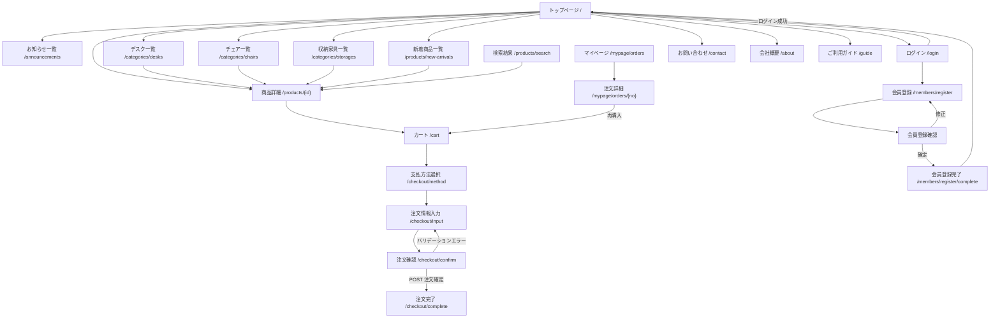
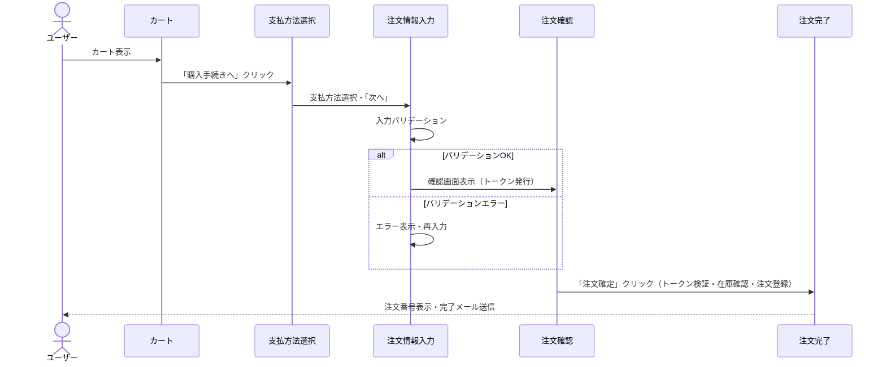
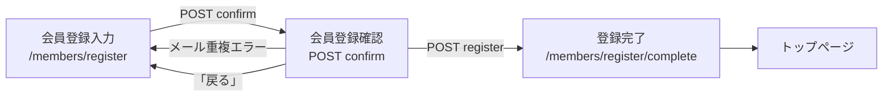
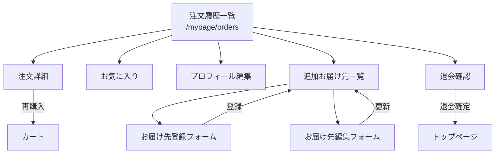
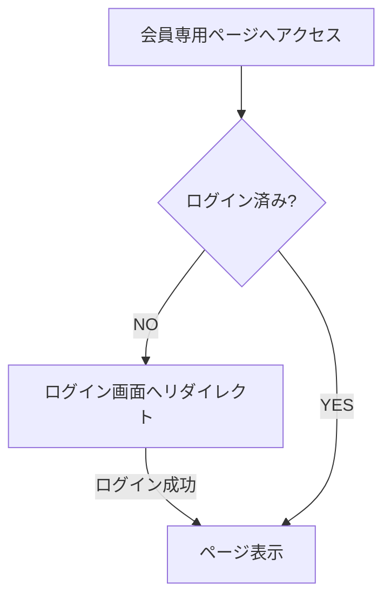

# 画面遷移図

## 1. 全体遷移図

```mermaid
graph TD
    TOP["トップページ /"]
    ANN["お知らせ一覧 /announcements"]
    CAT_DESK["デスク一覧 /categories/desks"]
    CAT_CHAIR["チェア一覧 /categories/chairs"]
    CAT_STORAGE["収納家具一覧 /categories/storages"]
    CAT_NEW["新着商品一覧 /products/new-arrivals"]
    CAT_SEARCH["検索結果 /products/search"]
    DTL["商品詳細 /products/{id}"]
    CRT["カート /cart"]
    CO01["支払方法選択 /checkout/method"]
    CO02["注文情報入力 /checkout/input"]
    CO03["注文確認 /checkout/confirm"]
    CO04["注文完了 /checkout/complete"]
    LGN["ログイン /login"]
    REG01["会員登録 /members/register"]
    REG02["会員登録確認"]
    REG03["会員登録完了 /members/register/complete"]
    MY["マイページ /mypage/orders"]
    MY_ORD["注文詳細 /mypage/orders/{no}"]
    CNT["お問い合わせ /contact"]
    ABT["会社概要 /about"]
    GDE["ご利用ガイド /guide"]

    TOP --> ANN
    TOP --> CAT_DESK
    TOP --> CAT_CHAIR
    TOP --> CAT_STORAGE
    TOP --> CAT_NEW
    TOP --> DTL
    TOP --> LGN
    TOP --> CNT
    TOP --> ABT
    TOP --> GDE

    CAT_DESK --> DTL
    CAT_CHAIR --> DTL
    CAT_STORAGE --> DTL
    CAT_NEW --> DTL
    CAT_SEARCH --> DTL

    DTL --> CRT
    CRT --> CO01
    CO01 --> CO02
    CO02 --> CO03
    CO03 -->|POST 注文確定| CO04
    CO03 -->|バリデーションエラー| CO02

    LGN -->|ログイン成功| TOP
    LGN --> REG01
    REG01 --> REG02
    REG02 -->|確定| REG03
    REG02 -->|修正| REG01
    REG03 --> TOP

    MY --> MY_ORD
    MY_ORD -->|再購入| CRT
```

---

## 2. チェックアウトフロー詳細

```mermaid
sequenceDiagram
    actor U as ユーザー
    participant CRT as カート
    participant CO1 as 支払方法選択
    participant CO2 as 注文情報入力
    participant CO3 as 注文確認
    participant CO4 as 注文完了

    U->>CRT: カート表示
    CRT->>CO1: 「購入手続きへ」クリック
    CO1->>CO2: 支払方法選択・「次へ」
    CO2->>CO2: 入力バリデーション
    alt バリデーションOK
        CO2->>CO3: 確認画面表示（トークン発行）
    else バリデーションエラー
        CO2->>CO2: エラー表示・再入力
    end
    CO3->>CO4: 「注文確定」クリック（トークン検証・在庫確認・注文登録）
    CO4-->>U: 注文番号表示・完了メール送信
```

---

## 3. 会員登録フロー

```mermaid
graph LR
    REG01[会員登録入力<br>/members/register]
    REG02[会員登録確認<br>POST confirm]
    REG03[登録完了<br>/members/register/complete]
    TOP[トップページ]

    REG01 -->|POST confirm| REG02
    REG02 -->|メール重複エラー| REG01
    REG02 -->|「戻る」| REG01
    REG02 -->|POST register| REG03
    REG03 --> TOP
```

---

## 4. マイページフロー

```mermaid
graph TD
    MY[注文履歴一覧<br>/mypage/orders]
    MY_ORD[注文詳細]
    MY_FAV[お気に入り]
    MY_PRF[プロフィール編集]
    MY_ADR[追加お届け先一覧]
    MY_ADR_NEW[お届け先登録フォーム]
    MY_ADR_EDIT[お届け先編集フォーム]
    MY_WDR[退会確認]
    CRT[カート]

    MY --> MY_ORD
    MY_ORD -->|再購入| CRT
    MY --> MY_FAV
    MY --> MY_PRF
    MY --> MY_ADR
    MY_ADR --> MY_ADR_NEW & MY_ADR_EDIT
    MY_ADR_NEW -->|登録| MY_ADR
    MY_ADR_EDIT -->|更新| MY_ADR
    MY --> MY_WDR
    MY_WDR -->|退会確定| TOP[トップページ]
```

---

## 5. 認証・認可フロー

```mermaid
graph TD
    A[会員専用ページへアクセス]
    B{ログイン済み?}
    C[ログイン画面へリダイレクト]
    D[ページ表示]

    A --> B
    B -->|NO| C
    C -->|ログイン成功| D
    B -->|YES| D
```
