# ER図

## 1. 全体ER図

```mermaid
erDiagram
    %% 会員
    members {
        bigint member_id PK
        varchar personal_or_corporate
        varchar last_name
        varchar first_name
        varchar last_name_kana
        varchar first_name_kana
        varchar company_name
        varchar department_name
        varchar email
        varchar gender
        date anniversary_date
        varchar password_hash
        boolean newsletter_opt_in
        char postal_code
        varchar prefecture
        varchar city
        varchar address_line
        integer delivery_floor
        boolean has_elevator
        varchar daytime_phone
        varchar fax
        varchar member_status
        timestamptz withdrawn_at
        timestamptz created_at
        timestamptz updated_at
    }
    member_additional_addresses {
        bigint member_address_id PK
        bigint member_id FK
        varchar last_name
        varchar first_name
        varchar last_name_kana
        varchar first_name_kana
        varchar company_name
        varchar department_name
        char postal_code
        varchar prefecture
        varchar city
        varchar address_line
        integer delivery_floor
        boolean has_elevator
        varchar daytime_phone
        varchar fax
        timestamptz created_at
        timestamptz updated_at
    }
    member_favorites {
        bigint member_id PK
        bigint product_id PK
        timestamptz created_at
        timestamptz updated_at
    }

    %% 商品
    products {
        bigint product_id PK
        varchar product_name
        varchar category_id
        text description
        boolean assembly_available
        numeric assembly_fee
        boolean has_variation
        bigint variation_group_id
        varchar variation_name
        timestamptz sale_start_at
        timestamptz sale_end_at
        timestamptz created_at
        timestamptz updated_at
    }
    product_variants {
        bigint product_variant_id PK
        bigint product_id FK
        varchar product_code
        bigint color_id FK
        numeric unit_price
        integer stock_quantity
        timestamptz created_at
        timestamptz updated_at
    }
    colors {
        bigint color_id PK
        varchar color_name
        char color_code
        varchar swatch_type
        integer sort_order
        boolean is_active
        timestamptz created_at
        timestamptz updated_at
    }
    product_desk_attributes {
        bigint product_id PK
        bigint top_shape_id FK
        integer width_mm
        integer depth_mm
        integer height_mm
        bigint taste_id FK
        timestamptz created_at
        timestamptz updated_at
    }
    product_chair_attributes {
        bigint product_id PK
        bigint function_id FK
        bigint material_id FK
        bigint taste_id FK
        timestamptz created_at
        timestamptz updated_at
    }
    product_storage_attributes {
        bigint product_id PK
        bigint usage_id FK
        bigint taste_id FK
        timestamptz created_at
        timestamptz updated_at
    }

    %% マスタ
    desk_top_shapes {
        bigint top_shape_id PK
        varchar shape_name
    }
    desk_tastes {
        bigint taste_id PK
        varchar taste_name
    }
    chair_functions {
        bigint function_id PK
        varchar function_name
    }
    chair_materials {
        bigint material_id PK
        varchar material_name
    }
    chair_tastes {
        bigint taste_id PK
        varchar taste_name
    }
    storage_usages {
        bigint usage_id PK
        varchar usage_name
    }
    storage_tastes {
        bigint taste_id PK
        varchar taste_name
    }

    %% カート
    shopping_cart {
        bigint cart_id PK
        bigint member_id FK
        timestamptz created_at
        timestamptz updated_at
    }
    cart_lines {
        bigint cart_line_id PK
        bigint cart_id FK
        bigint product_variant_id FK
        integer quantity
        timestamptz created_at
        timestamptz updated_at
    }

    %% 注文
    orders {
        bigint order_id PK
        varchar order_number
        timestamptz order_datetime
        varchar order_status
        varchar customer_type
        varchar personal_or_corporate
        bigint member_id FK
        varchar customer_last_name
        varchar customer_first_name
        varchar customer_email
        varchar daytime_phone
        char shipping_postal_code
        varchar shipping_prefecture
        varchar shipping_city
        varchar shipping_address_line
        integer shipping_floor
        boolean shipping_has_elevator
        varchar payment_method
        jsonb payment_instruction
        varchar shipping_method
        numeric shipping_fee
        numeric assembly_fee_total
        numeric subtotal_amount
        numeric tax_amount
        numeric total_amount
        timestamptz created_at
        timestamptz updated_at
    }
    order_items {
        bigint order_item_id PK
        bigint order_id FK
        varchar product_code
        varchar product_name
        varchar color_name
        numeric unit_price
        integer quantity
        numeric line_subtotal
        numeric line_tax_amount
        numeric line_total_amount
        boolean assembly_available
        numeric assembly_fee
        timestamptz created_at
        timestamptz updated_at
    }
    order_number_counters {
        date order_date PK
        integer last_sequence
        timestamptz created_at
        timestamptz updated_at
    }
    order_status_histories {
        bigint history_id PK
        bigint order_id FK
        varchar order_status
        timestamptz changed_at
    }

    %% コンテンツ
    announcements {
        bigint announcement_id PK
        varchar title
        text body
        timestamptz publish_start_at
        timestamptz publish_end_at
        timestamptz created_at
        timestamptz updated_at
    }
    inquiries {
        bigint inquiry_id PK
        varchar inquiry_type
        varchar order_phase
        varchar last_name
        varchar first_name
        varchar email
        varchar product_name
        varchar product_code
        text message
        timestamptz created_at
        timestamptz updated_at
    }

    %% バッチ
    tax_rates {
        bigint tax_rate_id PK
        numeric rate
        date effective_from
        date effective_to
        timestamptz created_at
        timestamptz updated_at
    }
    popular_product_rankings {
        date ranking_date PK
        integer rank PK
        bigint product_id FK
        integer sales_count
        timestamptz created_at
        timestamptz updated_at
    }
    recommended_related_products {
        bigint product_id PK
        bigint related_product_id PK
        numeric similarity_score
        integer rank
        timestamptz created_at
        timestamptz updated_at
    }

    %% リレーション
    members ||--o{ member_additional_addresses : "1対多"
    members ||--o{ member_favorites : "1対多"
    members ||--o{ orders : "1対多"
    members ||--o| shopping_cart : "1対1"
    shopping_cart ||--o{ cart_lines : "1対多"
    cart_lines }o--|| product_variants : "多対1"
    products ||--o{ member_favorites : "1対多"
    products ||--o{ product_variants : "1対多"
    products ||--o| product_desk_attributes : "1対1"
    products ||--o| product_chair_attributes : "1対1"
    products ||--o| product_storage_attributes : "1対1"
    colors ||--o{ product_variants : "1対多"
    product_desk_attributes }o--|| desk_top_shapes : "多対1"
    product_desk_attributes }o--|| desk_tastes : "多対1"
    product_chair_attributes }o--|| chair_functions : "多対1"
    product_chair_attributes }o--|| chair_materials : "多対1"
    product_chair_attributes }o--|| chair_tastes : "多対1"
    product_storage_attributes }o--|| storage_usages : "多対1"
    product_storage_attributes }o--|| storage_tastes : "多対1"
    orders ||--o{ order_items : "1対多"
    orders ||--o{ order_status_histories : "1対多"
    products ||--o{ popular_product_rankings : "1対多"
    products ||--o{ recommended_related_products : "1対多"
```

---

## 2. テーブルグループ一覧

| グループ | テーブル数 | テーブル名 |
|---|---|---|
| 会員 | 3 | members, member_additional_addresses, member_favorites |
| 商品 | 6 | products, product_variants, colors, product_desk_attributes, product_chair_attributes, product_storage_attributes |
| 注文 | 4 | orders, order_items, order_number_counters, order_status_histories |
| マスタ | 7 | desk_top_shapes, desk_tastes, chair_functions, chair_materials, chair_tastes, storage_usages, storage_tastes |
| コンテンツ | 2 | announcements, inquiries |
| バッチ | 3 | tax_rates, popular_product_rankings, recommended_related_products |
| Spring Batch | 6 | batch_job_instance, batch_job_execution 等（フレームワーク管理） |
| **合計** | **31** | |
