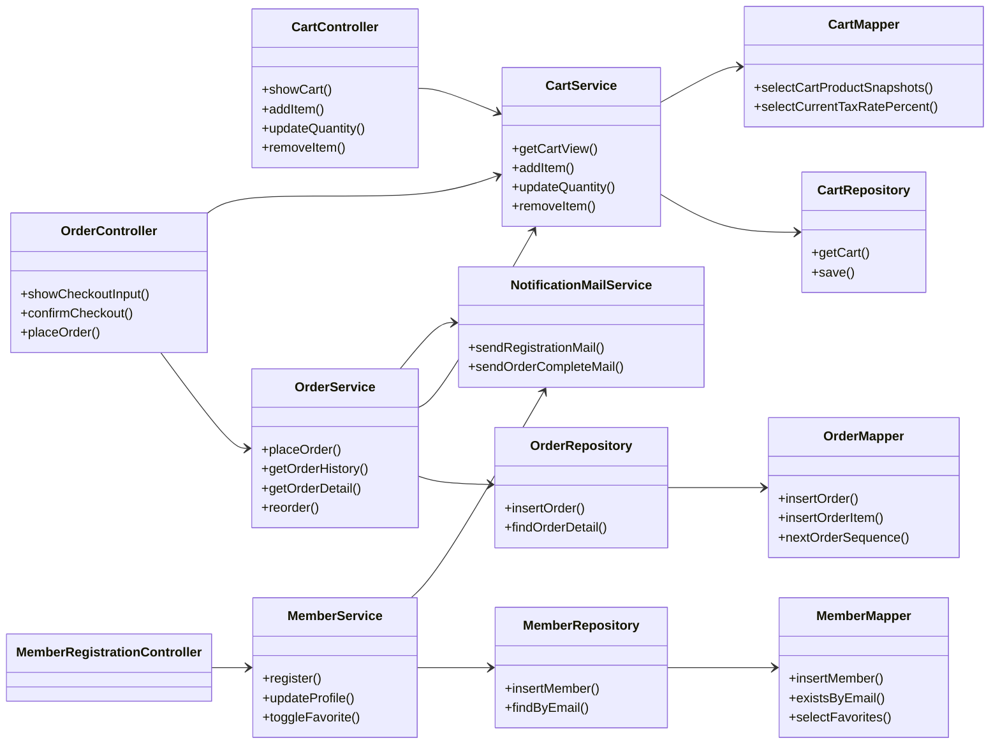
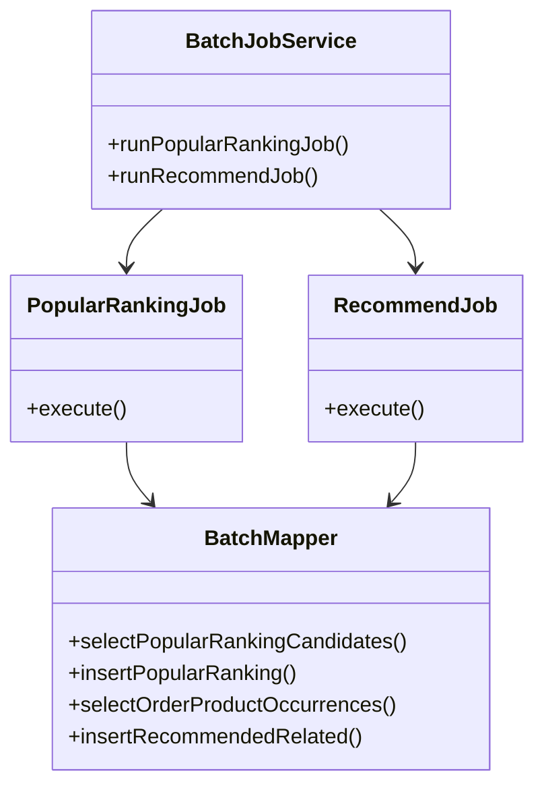
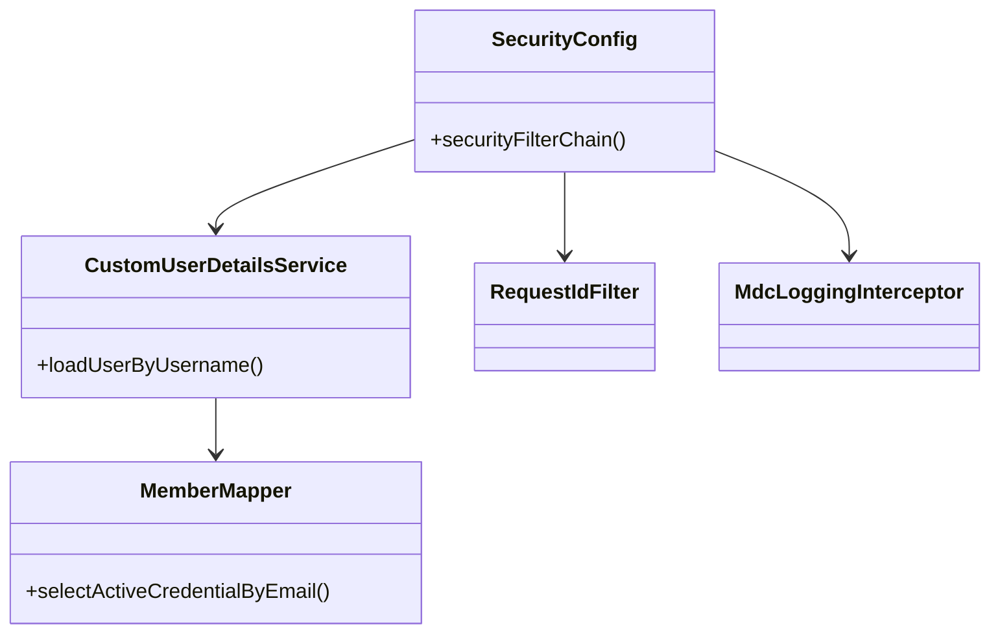

# クラス図

## 1. 概要

主要コンポーネント間の依存関係を示す。全クラス列挙は `01_package-structure.md` を参照。

---

## 2. コントローラー―サービス―リポジトリ依存関係

```mermaid
classDiagram
    direction LR

    class CartController {
        +showCart()
        +addItem()
        +updateQuantity()
        +removeItem()
    }
    class CartService {
        +getCartView()
        +addItem()
        +updateQuantity()
        +removeItem()
    }
    class CartRepository {
        +getCart()
        +save()
    }
    class CartMapper {
        +selectCartProductSnapshots()
        +selectCurrentTaxRatePercent()
    }

    CartController --> CartService
    CartService --> CartRepository
    CartService --> CartMapper

    class OrderController {
        +showCheckoutInput()
        +confirmCheckout()
        +placeOrder()
    }
    class OrderService {
        +placeOrder()
        +getOrderHistory()
        +getOrderDetail()
        +reorder()
    }
    class OrderRepository {
        +insertOrder()
        +findOrderDetail()
    }
    class OrderMapper {
        +insertOrder()
        +insertOrderItem()
        +nextOrderSequence()
    }

    OrderController --> OrderService
    OrderController --> CartService
    OrderService --> OrderRepository
    OrderService --> CartService
    OrderRepository --> OrderMapper

    class MemberRegistrationController
    class MemberService {
        +register()
        +updateProfile()
        +toggleFavorite()
    }
    class MemberRepository {
        +insertMember()
        +findByEmail()
    }
    class MemberMapper {
        +insertMember()
        +existsByEmail()
        +selectFavorites()
    }

    MemberRegistrationController --> MemberService
    MemberService --> MemberRepository
    MemberRepository --> MemberMapper

    class NotificationMailService {
        +sendRegistrationMail()
        +sendOrderCompleteMail()
    }

    MemberService --> NotificationMailService
    OrderService --> NotificationMailService
```

---

## 3. バッチジョブ間の関係

```mermaid
classDiagram
    direction TB

    class BatchJobService {
        +runPopularRankingJob()
        +runRecommendJob()
    }
    class PopularRankingJob {
        +execute()
    }
    class RecommendJob {
        +execute()
    }
    class BatchMapper {
        +selectPopularRankingCandidates()
        +insertPopularRanking()
        +selectOrderProductOccurrences()
        +insertRecommendedRelated()
    }

    BatchJobService --> PopularRankingJob
    BatchJobService --> RecommendJob
    PopularRankingJob --> BatchMapper
    RecommendJob --> BatchMapper
```

---

## 4. 認証・セキュリティ関連

```mermaid
classDiagram
    direction TB

    class SecurityConfig {
        +securityFilterChain()
    }
    class CustomUserDetailsService {
        +loadUserByUsername()
    }
    class MemberMapper {
        +selectActiveCredentialByEmail()
    }
    class RequestIdFilter
    class MdcLoggingInterceptor

    SecurityConfig --> CustomUserDetailsService
    CustomUserDetailsService --> MemberMapper
    SecurityConfig --> RequestIdFilter
    SecurityConfig --> MdcLoggingInterceptor
```
