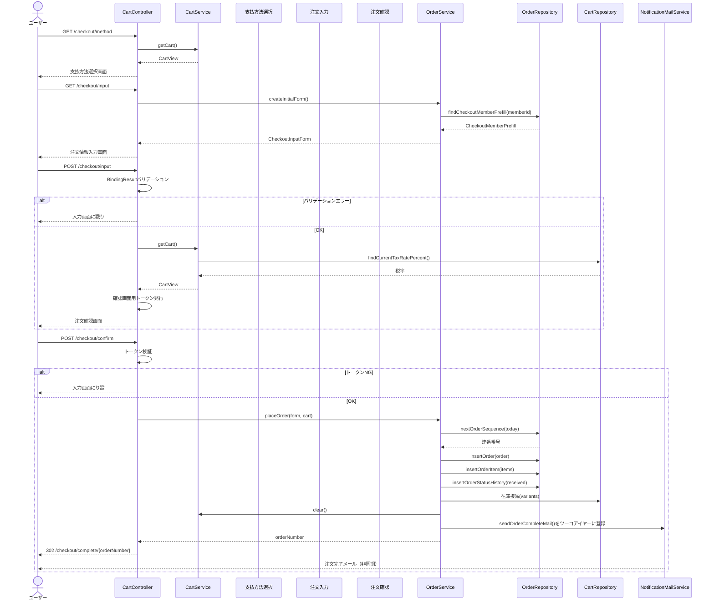

# チェックアウトシーケンス図

## 1. 全体フロー（4ステップ）



---

## 2. 注文番号採番詳細

```
ルール: YYYYMMDD + 4桁ゼロ埋め連番
例: 20260320-0001

1. order_number_counters WHERE order_date = today FOR UPDATE
2. レコードなし → INSERT (last_sequence = 1)
   レコードあり → UPDATE last_sequence = last_sequence + 1
3. 返却値で注文番号組み立て
```

## 3. メール送信タイミング

メール送信はトランザクションコミット後に実行される。  
`TransactionSynchronizationManager`で登録し、DBコミット成功時のみ送信。  
送信失敗時はリトライ（`MailRetryConfig`で設定）。

## 4. ゲスト/会員の違い

| 項目 | ゲスト | 会員 |
|---|---|---|
| カート管理 | Cookie | DB (shopping_cart + cart_lines) |
| 注文情報初期値 | 空白 | 登録済み会員情報をプリフィル |
| member_id | NULL | 設定 |
| customer_type | 'guest' | 'member' |
