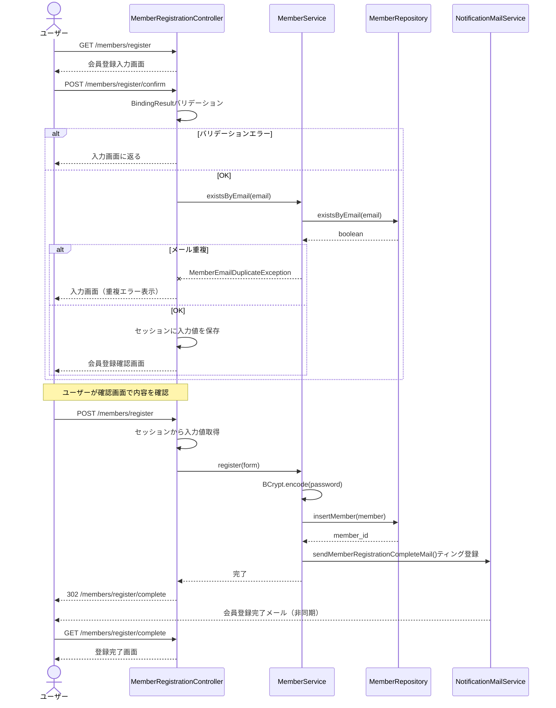

# 会員登録シーケンス図

## 1. 会員登録フロー

---

## 2. バリデーションルール

| フィールド | ルール |
|---|---|
| `email` | `@Email`, UNIQUE確認（サービス層） |
| `password` | 8桁以上 |
| `password_confirm` | `password`と一致 |
| `last_name`, `first_name` | `@NotBlank`, 50文字以内 |
| `postal_code` | `@Pattern(7桁数字)` |
| `daytime_phone` | `@Pattern(10〜12桁数字)` |

## 3. 確認画面のセッション管理

- POST /confirm 時、入力内容をセッションに保存
- POST /register 時、セッションから内容を取得しDB保存
- 登録完了後にセッションデータをクリア
