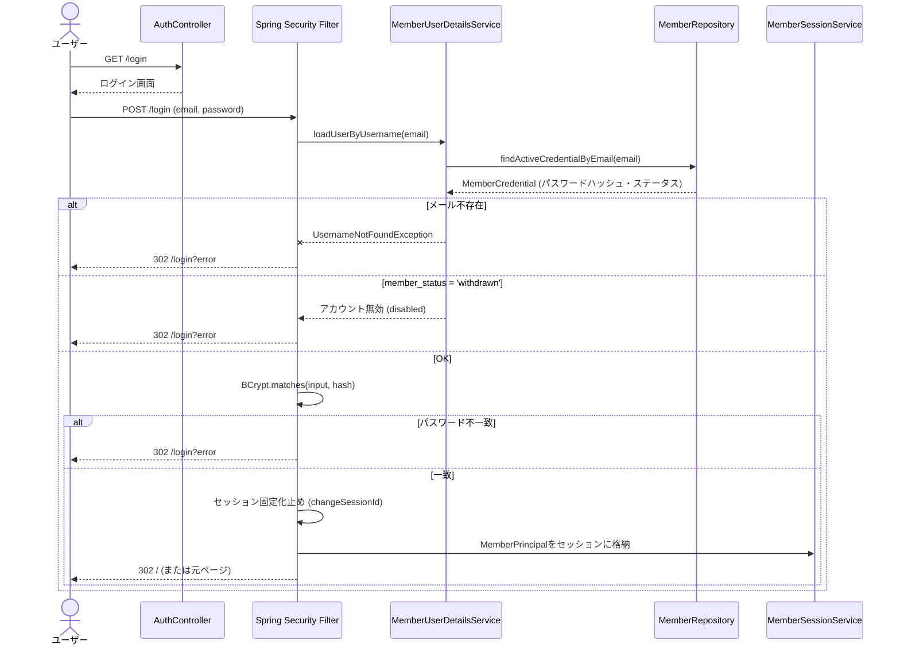

# ログインシーケンス図

## 1. ログインフロー



---

## 2. ログイン後のリダイレクト

| ケース | リダイレクト先 |
|---|---|
| 通常ログイン | `POST /login` 前にアクセスしたページ（保存された場合） |
| `redirect`パラメータあり | 検証済みの相対パスにリダイレクト |
| デフォルト | `/` |

## 3. ログアウトフロー

```
1. POST /logout (CSRFトークン付き)
2. Spring Securityがセッションを無効化
3. SecurityContextをクリア
4. 302 /login へリダイレクト
```

## 4. エラーメッセージ

| ケース | メッセージ |
|---|---|
| メールまたはパスワード誤り | 「メールアドレスまたはパスワードが正しくありません」 |
| 退会済みアカウント | 同上（内部的に判定するがユーザーには区別しない） |
