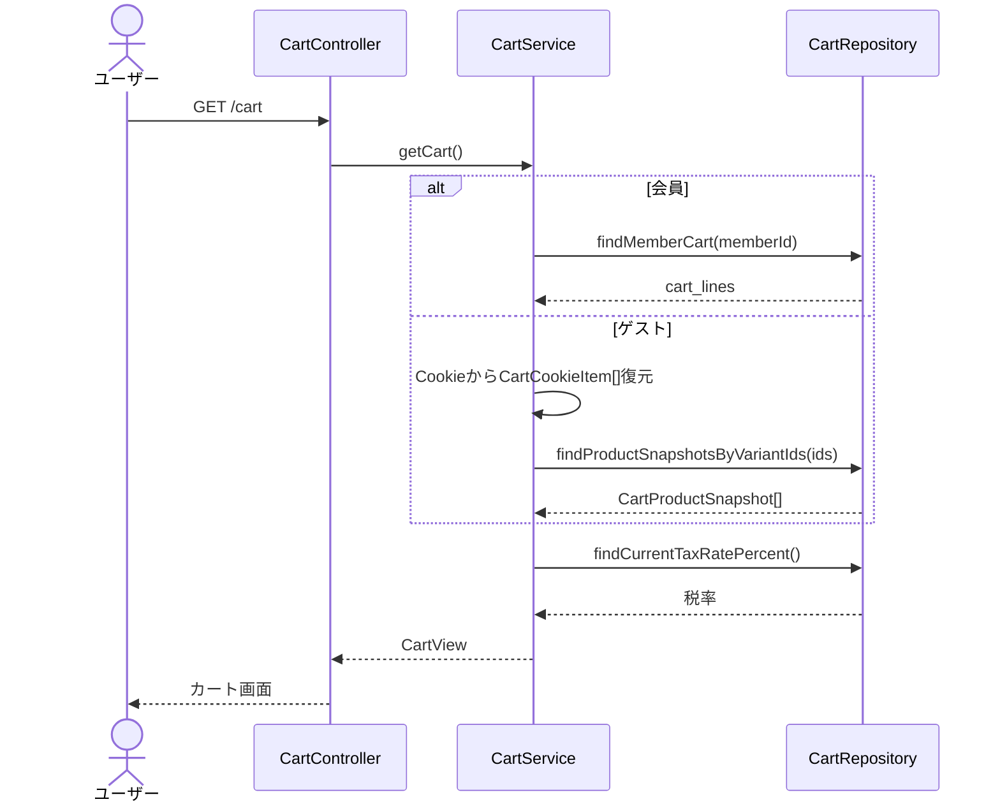
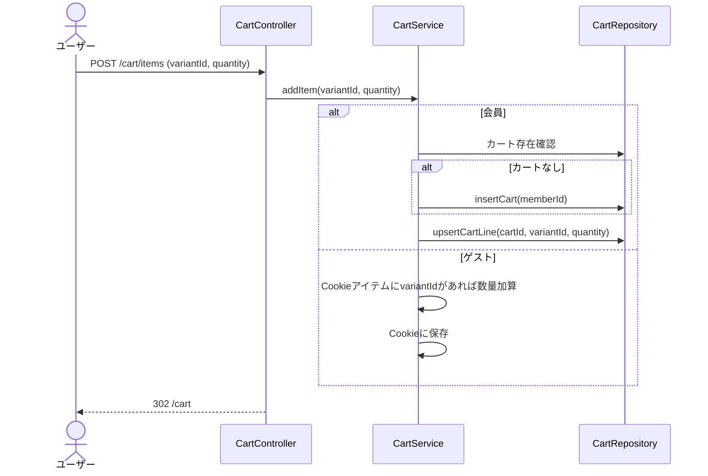
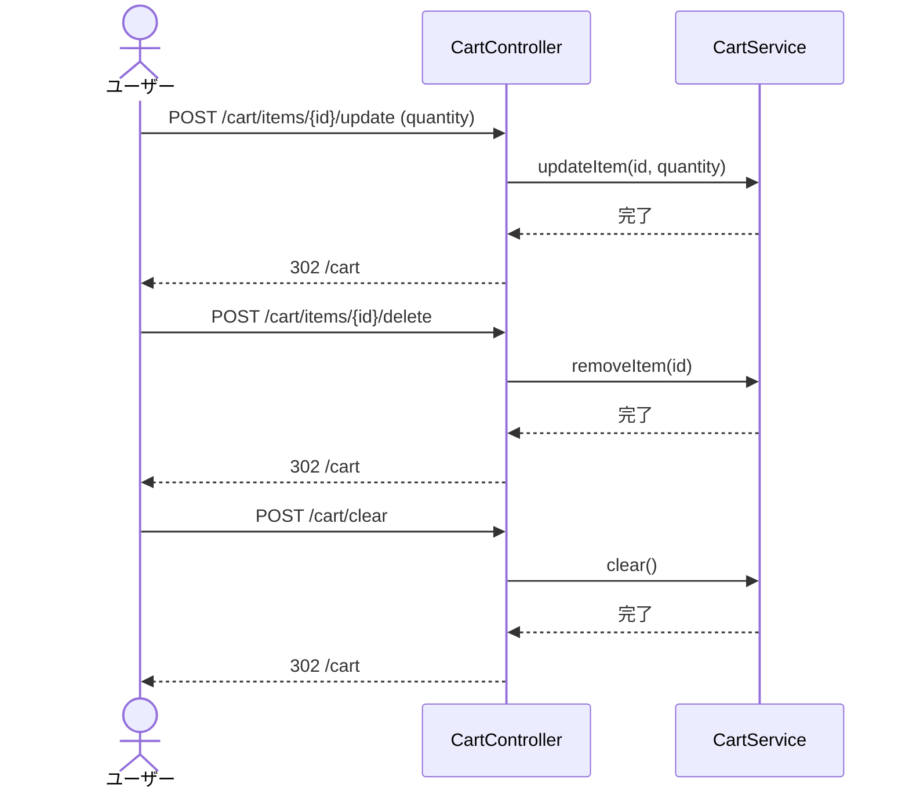

# カート操作シーケンス図

## 1. カート表示

---

## 2. 商品をカートに追加

---

## 3. 数量変更・商品削除・全削除

---

## 4. ゲスト/会員のカート実装差分

| 項目 | ゲスト | 会員 |
|---|---|---|
| データ保存先 | Cookie (`CartCookieStore`) | DB (`shopping_cart`, `cart_lines`) |
| 永続化 | ブラウザを閉じると消なる場合あり | セッションを跨いて永続 |
| 制限件数 | 99数量ぐらい | 99数量ぐらい |
| ログイン時 | Cookieカート → DBカートにマージ | - |
