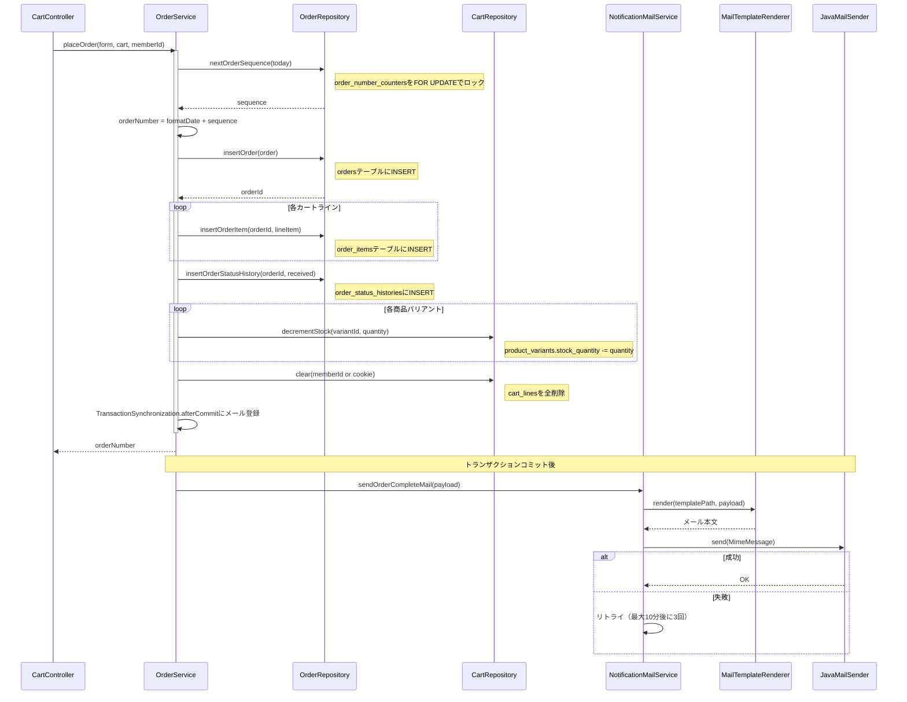
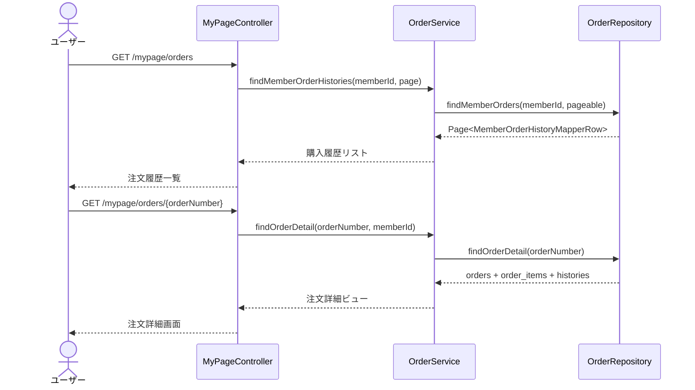
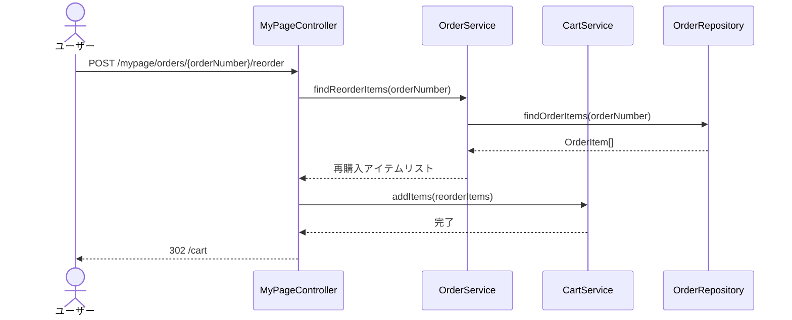

# 注文処理シーケンス図

## 1. 注文登録・メール送信フロー

```mermaid
sequenceDiagram
    participant CC as CartController
    participant OS as OrderService
    participant OR as OrderRepository
    participant CR as CartRepository
    participant NS as NotificationMailService
    participant MT as MailTemplateRenderer
    participant SM as JavaMailSender

    CC->>OS: placeOrder(form, cart, memberId)
    activate OS

    OS->>OR: nextOrderSequence(today)
    note right of OR: order_number_countersをFOR UPDATEでロック
    OR-->>OS: sequence
    OS->>OS: orderNumber = formatDate + sequence

    OS->>OR: insertOrder(order)
    note right of OR: ordersテーブルにINSERT
    OR-->>OS: orderId

    loop 各カートライン
        OS->>OR: insertOrderItem(orderId, lineItem)
        note right of OR: order_itemsテーブルにINSERT
    end

    OS->>OR: insertOrderStatusHistory(orderId, received)
    note right of OR: order_status_historiesにINSERT

    loop 各商品バリアント
        OS->>CR: decrementStock(variantId, quantity)
        note right of CR: product_variants.stock_quantity -= quantity
    end

    OS->>CR: clear(memberId or cookie)
    note right of CR: cart_linesを全削除

    OS->>OS: TransactionSynchronization.afterCommitにメール登録

    deactivate OS
    OS-->>CC: orderNumber

    note over OS,SM: トランザクションコミット後
    OS->>NS: sendOrderCompleteMail(payload)
    NS->>MT: render(templatePath, payload)
    MT-->>NS: メール本文
    NS->>SM: send(MimeMessage)
    alt 成功
        SM-->>NS: OK
    else 失敗
        NS->>NS: リトライ（最大10分後に3回）
    end
```

---

## 2. 注文履歴取得フロー

```mermaid
sequenceDiagram
    actor U as ユーザー
    participant MC as MyPageController
    participant OS as OrderService
    participant OR as OrderRepository

    U->>MC: GET /mypage/orders
    MC->>OS: findMemberOrderHistories(memberId, page)
    OS->>OR: findMemberOrders(memberId, pageable)
    OR-->>OS: Page<MemberOrderHistoryMapperRow>
    OS-->>MC: 購入履歴リスト
    MC-->>U: 注文履歴一覧

    U->>MC: GET /mypage/orders/{orderNumber}
    MC->>OS: findOrderDetail(orderNumber, memberId)
    OS->>OR: findOrderDetail(orderNumber)
    OR-->>OS: orders + order_items + histories
    OS-->>MC: 注文詳細ビュー
    MC-->>U: 注文詳細画面
```

---

## 3. 再購入フロー

```mermaid
sequenceDiagram
    actor U as ユーザー
    participant MC as MyPageController
    participant OS as OrderService
    participant CS as CartService
    participant OR as OrderRepository

    U->>MC: POST /mypage/orders/{orderNumber}/reorder
    MC->>OS: findReorderItems(orderNumber)
    OS->>OR: findOrderItems(orderNumber)
    OR-->>OS: OrderItem[]
    OS-->>MC: 再購入アイテムリスト
    MC->>CS: addItems(reorderItems)
    CS-->>MC: 完了
    MC-->>U: 302 /cart
```
