# 処理フロー

| 項目 | 内容 |
|------|------|
| ドキュメント種別 | 基本設計書 |
| 対象システム | office-order （オフィス家具ECサイト） |
| 作成日 | 2026-03-16 |
| バージョン | 1.0 |

---

## 1. 商品検索・閲覧フロー

### 1.1 キーワード検索

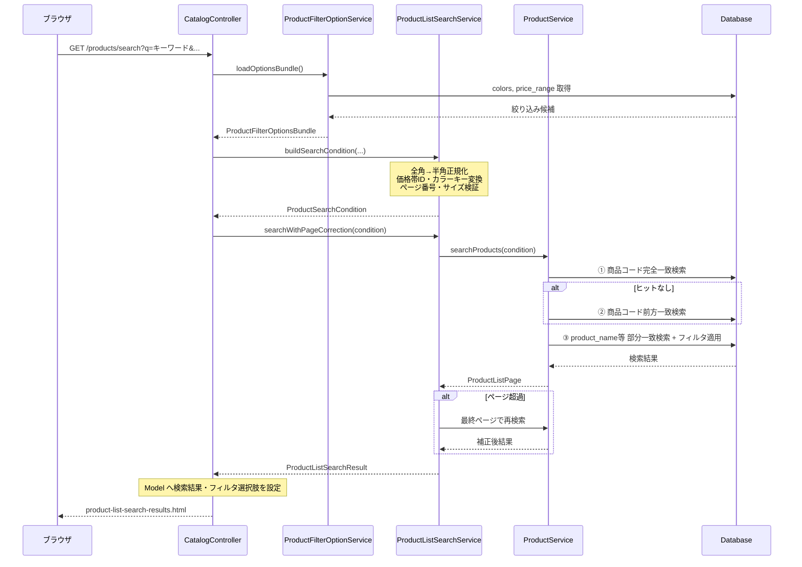

### 1.2 商品詳細表示

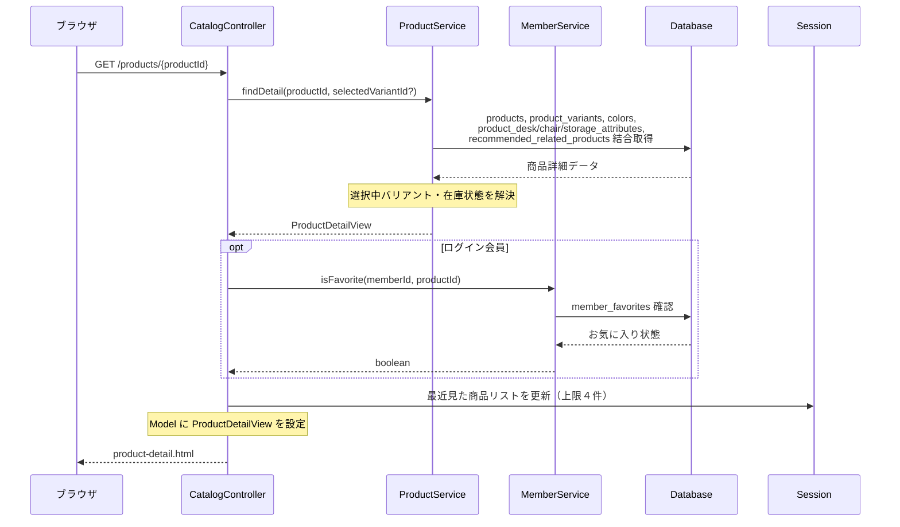

---

## 2. 購入フロー

### 2.1 カート追加

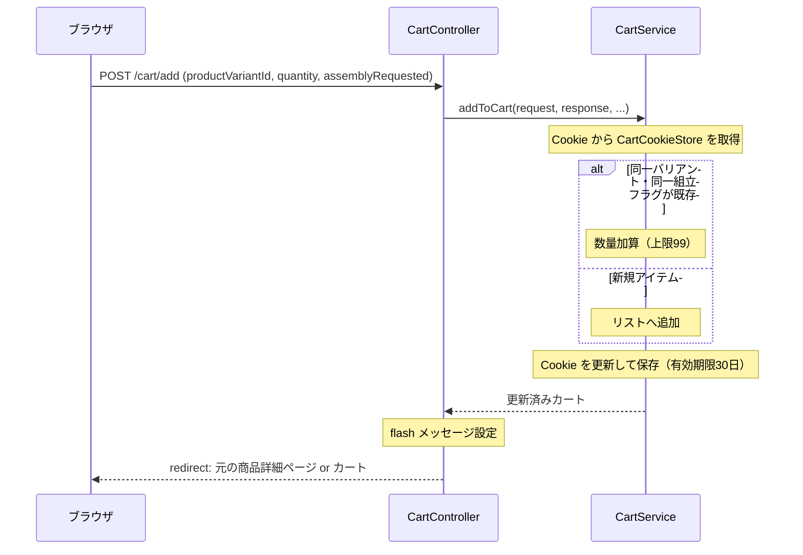

### 2.2 購入フロー（注文確定まで）

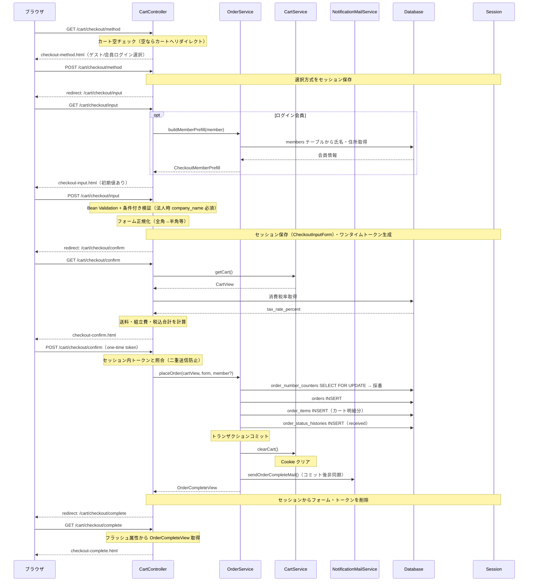

---

## 3. 会員登録フロー

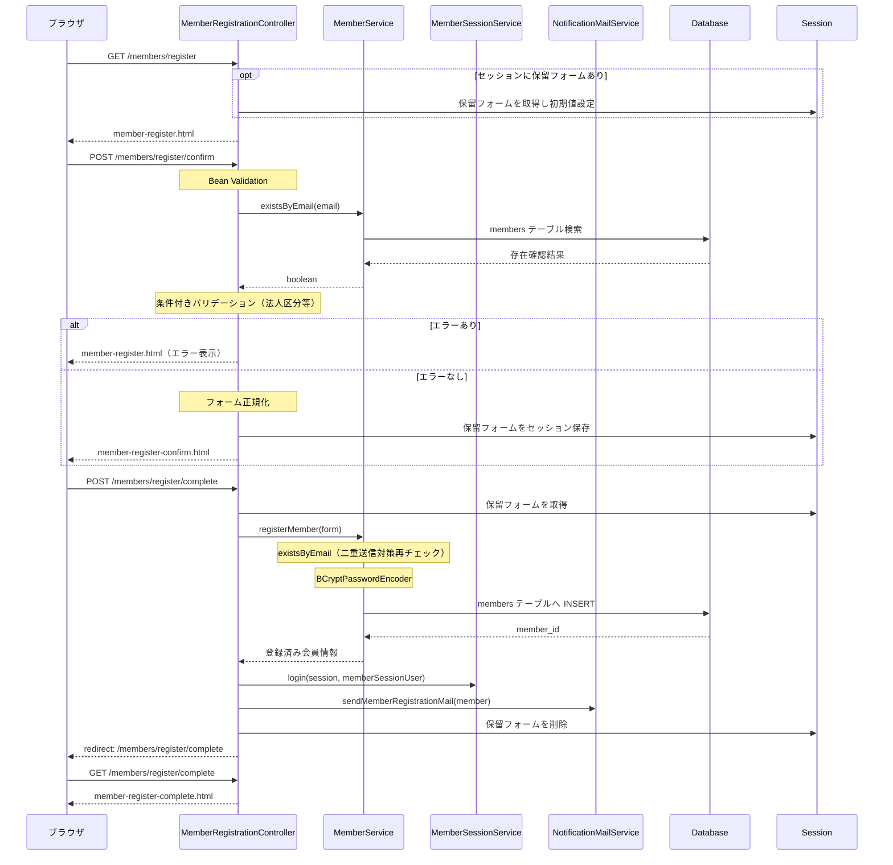

---

## 4. 認証フロー

### 4.1 ログイン

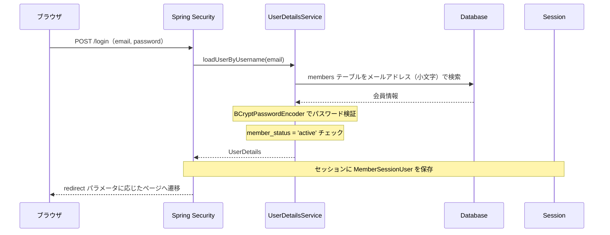

### 4.2 ログアウト

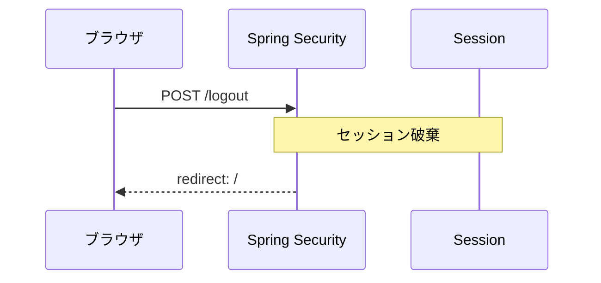

---

## 5. マイページフロー

### 5.1 購入履歴・再注文

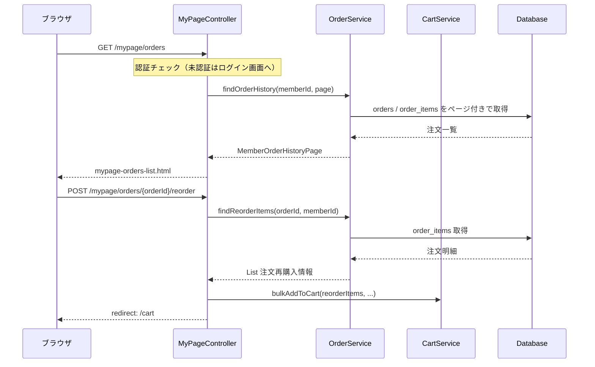

### 5.2 お気に入り

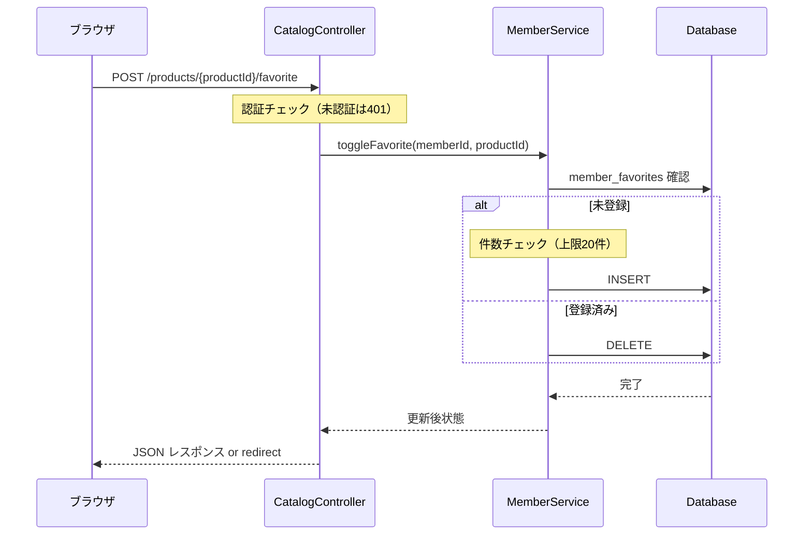

---

## 6. バッチ処理フロー

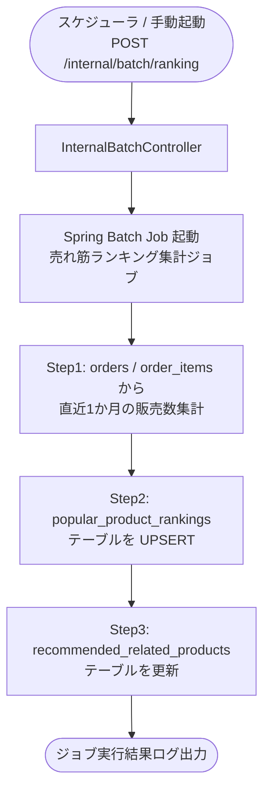

---

## 7. お問い合わせフロー

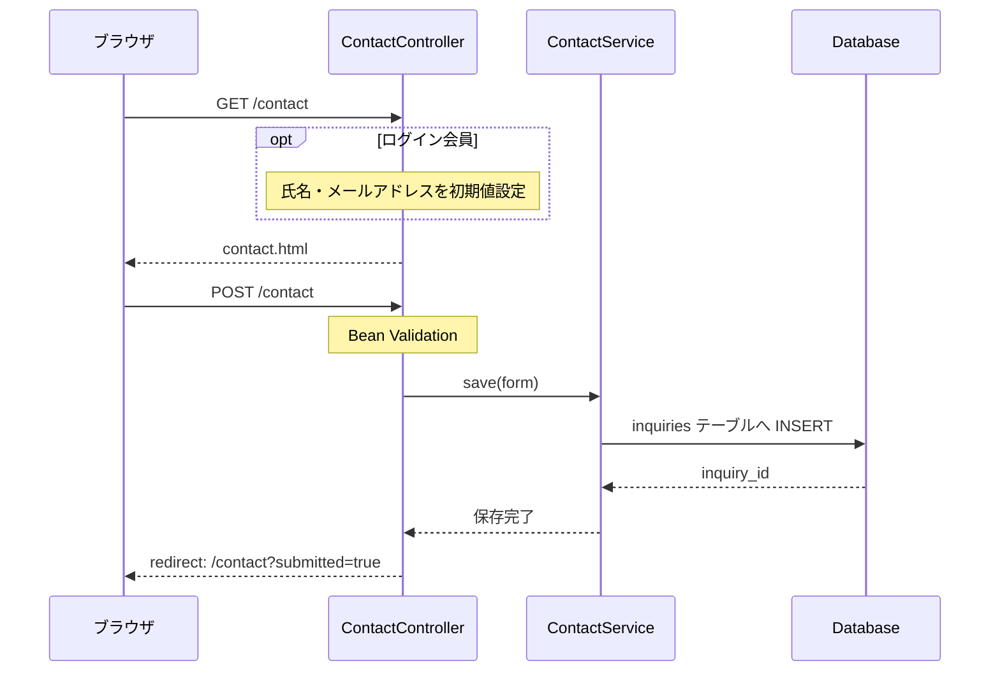
