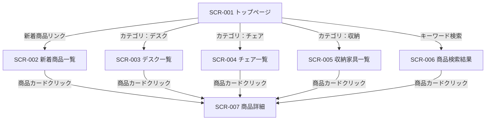
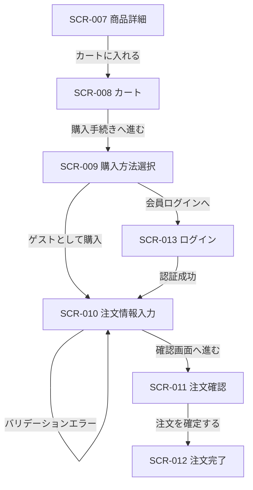
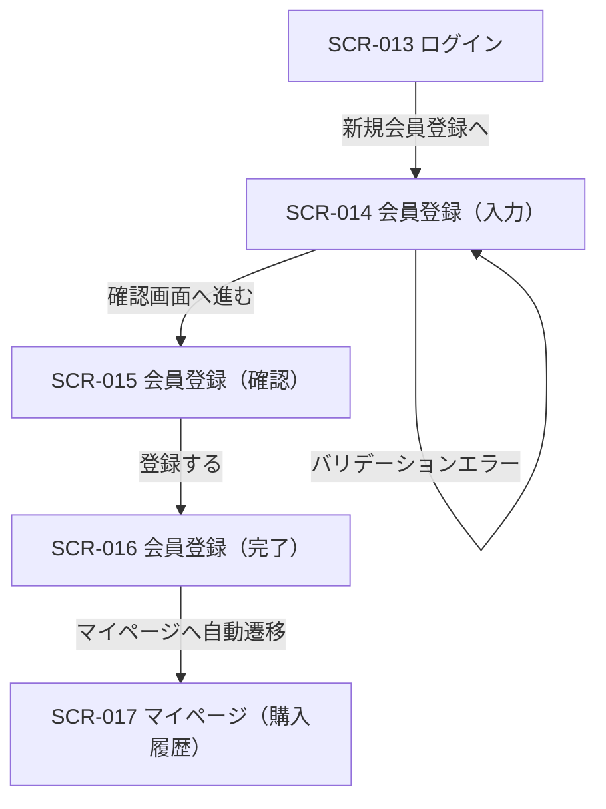
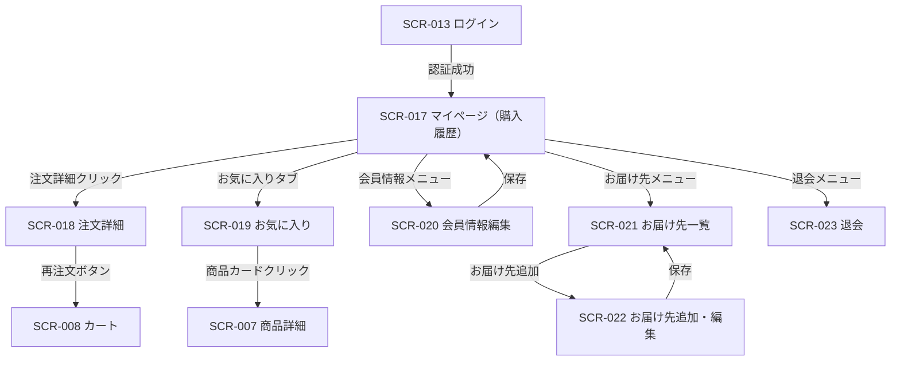

# 画面遷移図

| 項目 | 内容 |
|------|------|
| ドキュメント種別 | 基本設計書 |
| 対象システム | office-order （オフィス家具ECサイト） |
| 作成日 | 2026-03-16 |
| バージョン | 1.0 |

---

## 1. 画面一覧

| 画面ID | 画面名 | URL | テンプレート | 認証要否 |
|--------|--------|-----|------------|---------|
| SCR-001 | トップページ | `/` | `pages/top.html` | 不要 |
| SCR-002 | 新着商品一覧 | `/products/new-arrivals` | `pages/product-list-new-arrivals.html` | 不要 |
| SCR-003 | デスク一覧 | `/products/category/desk` | `pages/product-list-category-desk.html` | 不要 |
| SCR-004 | チェア一覧 | `/products/category/chair` | `pages/product-list-category-chair.html` | 不要 |
| SCR-005 | 収納家具一覧 | `/products/category/storage` | `pages/product-list-category-storage.html` | 不要 |
| SCR-006 | 商品検索結果 | `/products/search` | `pages/product-list-search-results.html` | 不要 |
| SCR-007 | 商品詳細 | `/products/{productId}` | `pages/product-detail.html` | 不要 |
| SCR-008 | カート | `/cart` | `pages/cart.html` | 不要 |
| SCR-009 | 購入方法選択 | `/cart/checkout/method` | `pages/checkout-method.html` | 不要 |
| SCR-010 | 注文情報入力 | `/cart/checkout/input` | `pages/checkout-input.html` | 不要 |
| SCR-011 | 注文確認 | `/cart/checkout/confirm` | `pages/checkout-confirm.html` | 不要 |
| SCR-012 | 注文完了 | `/cart/checkout/complete` | `pages/checkout-complete.html` | 不要 |
| SCR-013 | ログイン | `/login` | `pages/login.html` | 不要 |
| SCR-014 | 会員登録 | `/members/register` | `pages/member-register.html` | 不要 |
| SCR-015 | 会員登録確認 | `/members/register/confirm` | `pages/member-register-confirm.html` | 不要 |
| SCR-016 | 会員登録完了 | `/members/register/complete` | `pages/member-register-complete.html` | 不要 |
| SCR-017 | マイページ（購入履歴） | `/mypage/orders` | `pages/mypage-orders-list.html` | 要 |
| SCR-018 | 注文詳細 | `/mypage/orders/{orderId}` | `pages/mypage-order-detail.html` | 要 |
| SCR-019 | お気に入り | `/mypage/favorites` | `pages/mypage-favorites.html` | 要 |
| SCR-020 | 会員情報編集 | `/mypage/profile/edit` | `pages/mypage-profile-edit.html` | 要 |
| SCR-021 | お届け先一覧 | `/mypage/addresses` | `pages/mypage-addresses.html` | 要 |
| SCR-022 | お届け先追加・編集 | `/mypage/addresses/new` 他 | `pages/mypage-address-form.html` | 要 |
| SCR-023 | 退会 | `/mypage/withdraw` | `pages/mypage-withdraw.html` | 要 |
| SCR-024 | お問い合わせ | `/contact` | `pages/contact.html` | 不要 |
| SCR-025 | お知らせ一覧 | `/announcements` | `pages/announcements.html` | 不要 |
| SCR-026 | ガイド | `/guide` | `pages/guide.html` | 不要 |
| SCR-027 | 特定商取引法 | `/legal/tokusho` | `pages/legal-tokusho.html` | 不要 |
| SCR-028 | 利用規約 | `/legal/terms` | `pages/legal-terms.html` | 不要 |
| SCR-029 | プライバシーポリシー | `/legal/privacy` | `pages/legal-privacy.html` | 不要 |
| SCR-030 | 会社概要 | `/about` | `pages/about.html` | 不要 |
| SCR-031 | エラー（汎用） | ― | `error/error.html` | 不要 |
| SCR-032 | エラー（500） | ― | `error/500.html` | 不要 |

---

## 2. 画面遷移図

### 2.1 商品閲覧フロー

### 2.2 購入フロー（ゲスト / 会員共通）

### 2.3 会員登録フロー

### 2.4 マイページフロー

---

## 3. 認証ガード仕様

| 条件 | 挙動 |
|------|------|
| 未認証ユーザーがマイページ系URL（`/mypage/**`）へアクセス | `/login?redirect={元URL}` へリダイレクト |
| 既ログイン状態で `/login` へアクセス | `/mypage/orders` へリダイレクト |
| セッション切れ | `/login?expired=true` へリダイレクト |

---

## 4. エラー遷移

| 状況 | 遷移先 |
|------|--------|
| 存在しない商品 ID アクセス | 404 エラーページ |
| 注文確認画面でのCORF不正 / トークン不一致 | 400 エラーページ |
| サーバーエラー（非ハンドリング例外） | 500 エラーページ（`error/500.html`） |
