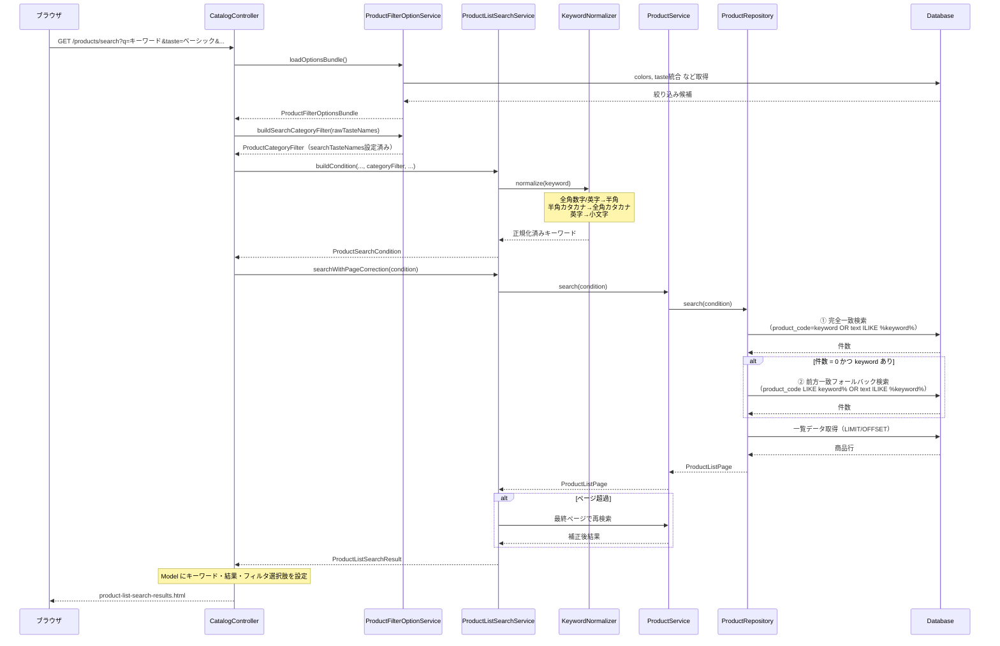

# FEAT-001 商品検索機能強化 基本設計書

| 項目 | 内容 |
|------|------|
| ドキュメント種別 | 基本設計書 |
| 機能ID | FEAT-001 |
| 対象システム | office-order（オフィス家具ECサイト） |
| 作成日 | 2026-03-24 |
| バージョン | 1.0 |
| 関連要件 | [FEAT-001-requirements.md](../issues/FEAT-001-requirements.md) |

---

## 1. 変更概要

### 1.1 目的と変更方針

既存の商品検索機能に対して、以下3点の機能強化を行う。

| # | 変更テーマ | 概要 |
|---|-----------|------|
| 1 | **キーワード正規化** | 入力キーワードの全角→半角変換・大文字→小文字変換をアプリ層で実施。DB側は無変更。 |
| 2 | **商品コード検索ロジック変更** | 現行の中間一致（`ILIKE %keyword%`）から、完全一致優先・前方一致フォールバック方式へ変更。テキストフィールドは引き続き部分一致。 |
| 3 | **テイスト絞り込み追加** | 検索結果画面にテイスト絞り込み条件を追加。3カテゴリのテイストマスタを名称で統合し、OR 条件で横断検索する。 |

### 1.2 変更対象コンポーネント

| レイヤー | クラス / ファイル | 変更種別 |
|---------|-----------------|---------|
| Utility | `KeywordNormalizer`（新規） | 追加 |
| Model | `ProductFilterOptionsBundle` | フィールド追加 |
| Model | `ProductCategoryFilter` | フィールド追加 |
| Repository | `ProductFilterOptionRepository` | メソッド追加 |
| Service | `ProductFilterOptionService` | メソッド追加・変更 |
| Service | `ProductListSearchService` | メソッドシグネチャ変更 |
| Repository | `ProductRepository` | 検索ロジック変更 |
| Mapper IF | `ProductMapper` | メソッド追加 |
| Mapper XML | `ProductMapper.xml` | SQL フラグメント追加・変更 |
| Controller | `CatalogController` | リクエストパラメータ追加 |
| Template | `product-list-search-results.html` | テイストフィルタ UI 追加 |

---

## 2. 検索処理フロー（変更後）

### 2.1 キーワード検索シーケンス



### 2.2 検索条件の組み合わせロジック

```
keyword が null または空白:
  → テキスト検索・商品コード検索ともにスキップ（全件対象）

keyword がある場合（1パス目：完全一致優先）:
  WHERE (
      LOWER(p.product_name) LIKE lower('%keyword%')
      OR p.variation_name ILIKE '%keyword%'
      OR p.description ILIKE '%keyword%'
      OR EXISTS (
          SELECT 1 FROM product_variants pvk
          WHERE pvk.product_id = p.product_id
          AND LOWER(pvk.product_code) = '<normalized_keyword>'   -- 完全一致
      )
  )

件数 = 0 の場合（2パス目：前方一致フォールバック）:
  WHERE (
      同上テキスト検索
      OR EXISTS (
          SELECT 1 FROM product_variants pvk
          WHERE pvk.product_id = p.product_id
          AND LOWER(pvk.product_code) LIKE '<normalized_keyword>%'  -- 前方一致
      )
  )
```

### 2.3 テイスト絞り込みロジック

```
taste パラメータが空: テイストフィルタなし（全商品対象）

taste パラメータあり（例: ["ベーシック", "モダン"]）:
  WHERE (
      EXISTS (
          SELECT 1 FROM product_desk_attributes da
          JOIN desk_tastes dt ON da.taste_id = dt.taste_id
          WHERE da.product_id = p.product_id
          AND dt.display_name IN ('ベーシック', 'モダン')
      )
      OR EXISTS (
          SELECT 1 FROM product_chair_attributes ca
          JOIN chair_tastes ct ON ca.taste_id = ct.taste_id
          WHERE ca.product_id = p.product_id
          AND ct.display_name IN ('ベーシック', 'モダン')
      )
      OR EXISTS (
          SELECT 1 FROM product_storage_attributes sa
          JOIN storage_tastes st ON sa.taste_id = st.taste_id
          WHERE sa.product_id = p.product_id
          AND st.display_name IN ('ベーシック', 'モダン')
      )
  )
```

---

## 3. キーワード正規化方針

### 3.1 正規化ルール

| 対象文字 | 変換前 | 変換後 |
|---------|--------|--------|
| 全角 ASCII 数字 | `０`〜`９` | `0`〜`9` |
| 全角 ASCII 大文字 | `Ａ`〜`Ｚ` | `a`〜`z` |
| 全角 ASCII 小文字 | `ａ`〜`ｚ` | `a`〜`z` |
| 半角カタカナ | `ｦ`〜`ﾟ`（濁点・半濁点含む） | 全角カタカナ `ヲ`〜`゜` |
| 半角カタカナ濁音（2文字） | `ｶﾞ`→`ガ` など | 結合後の全角カタカナ |
| 半角英字 | `A`〜`Z` | `a`〜`z` |

### 3.2 正規化対象外

- ひらがな
- 漢字
- 記号（`!`, `　`（全角スペース）等）

### 3.3 実装場所

- クラス：`jp.co.skig.officeorder.util.KeywordNormalizer`（新規）
- 呼び出し元：`ProductListSearchService.buildCondition()` 内

---

## 4. テイスト絞り込み選択肢の取得方針

### 4.1 統合テイスト名称の取得

3テーブル（`desk_tastes`, `chair_tastes`, `storage_tastes`）の `display_name` を DISTINCT UNION して一覧を構築する。

```sql
SELECT DISTINCT display_name
FROM (
    SELECT display_name FROM desk_tastes    WHERE is_active = TRUE
    UNION ALL
    SELECT display_name FROM chair_tastes   WHERE is_active = TRUE
    UNION ALL
    SELECT display_name FROM storage_tastes WHERE is_active = TRUE
) t
ORDER BY display_name
```

- 選択肢の値（`value`）は `display_name` 文字列そのものを使用する。
- ID を使わないことで、カテゴリをまたいだ名称一致の絞り込みをシンプルに実現する。

### 4.2 リクエストパラメータ

| パラメータ名 | 型 | 説明 |
|-----------|------|------|
| `taste` | `List<String>` | 選択されたテイスト名称（複数可）、例：`taste=ベーシック&taste=モダン` |

---

## 5. 画面変更概要

### 5.1 検索結果画面（`product-list-search-results.html`）

**追加項目：テイスト絞り込み**

- 位置：価格帯・カラーフィルタの後（絞り込みフォーム末尾の「検索」ボタンの前）
- スタイル：デスク一覧・チェア一覧・収納家具一覧と同一の `checklist` 形式
- 動作：チェックボックス複数選択可。「絞り込む」ボタン押下で送信。

**変更項目：ページネーションリンク**

- テイストパラメータ（`taste`）をページネーションリンクの `th:href` に追加する。

**変更項目：ツールバーフォーム（並び順・件数切り替え）**

- テイストの選択値を `<input type="hidden">` として追加し、並び順変更時に選択状態を維持する。

**変更項目：絞り込みモーダル（モバイル用）**

- サイドバーと同様の内容で `modal-filters-search` モーダル内にも追加する。

---

## 6. 性能考慮事項

| 項目 | 考慮内容 |
|-----|---------|
| 商品コード検索2パス | 完全一致ヒット時は1クエリで完結。前方一致フォールバックは「ヒットなし」時のみ追加クエリが発生。商品数1,000件規模では影響は軽微と判断。 |
| テイスト絞り込み的 EXISTS | `product_desk_attributes`, `product_chair_attributes`, `product_storage_attributes` に対して JOIN + EXISTS が追加。各テーブルは `product_id` に PK インデックスがあり、1,000件規模では許容範囲内。 |
| テイスト名称 IN 句 | テイスト種類は現行5件程度（ベーシック/カジュアル/シンプル/モダン/ナチュラル）で IN 句の肥大化リスクなし。 |
| テイスト統合取得クエリ | `loadOptionsBundle()` で1回のみ実行。結果はリクエストスコープで使い回すため追加コストは最小限。 |
