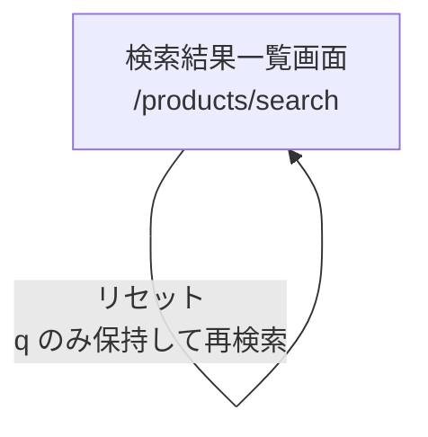

# FEAT-001 商品検索機能強化 画面遷移図

## 1. 文書情報

| 項目 | 内容 |
|------|------|
| 課題ID | FEAT-001 |
| タイトル | 商品検索機能強化 画面遷移図 |
| 作成日 | 2026-04-02 |
| 対応要件 | ../issues/FEAT-001-requirements.md |

---

## 2. 対象画面

| 画面ID | 画面名 | パス | 備考 |
|--------|--------|------|------|
| SCR-HDR | 共通ヘッダ検索ボックス | 各画面共通 | 検索開始点 |
| SCR-SR | 検索結果一覧画面 | `/products/search` | 本課題の主対象 |
| SCR-PD | 商品詳細画面 | `/products/{productId}` | 一覧から遷移 |

対象外だが遷移元となる画面:

- トップ画面
- カテゴリ一覧画面
- 新着一覧画面
- 各静的ページ

---

## 3. 画面遷移図

### 3.1 全体遷移図

```mermaid
flowchart LR
    TOP[トップ画面]
    CAT[カテゴリ一覧画面]
    NEW[新着一覧画面]
    ETC[静的ページ群]
    SR[検索結果一覧画面<br/>/products/search]
    PD[商品詳細画面<br/>/products/{productId}]

    TOP -->|ヘッダ検索 q 入力| SR
    CAT -->|ヘッダ検索 q 入力| SR
    NEW -->|ヘッダ検索 q 入力| SR
    ETC -->|ヘッダ検索 q 入力| SR

    SR -->|商品カード選択| PD
    PD -. ブラウザバック .-> SR
```

### 3.2 検索結果一覧画面内遷移図



---

## 4. 遷移説明

### 4.1 検索開始

- 利用者は任意画面の共通ヘッダ検索ボックスにキーワードを入力する。
- 検索実行時は GET `/products/search?q={keyword}` へ遷移する。
- キーワードが空白のみの場合は、キーワード未入力として検索結果一覧へ遷移する。

### 4.2 検索結果一覧内の自己遷移

検索結果一覧画面は以下の操作で同一画面に再遷移する。

| 操作 | 遷移先 | 備考 |
|------|--------|------|
| 在庫有のみ変更 | `/products/search` | 条件更新後 1 ページ目へ遷移 |
| 価格帯変更 | `/products/search` | 条件更新後 1 ページ目へ遷移 |
| カラー変更 | `/products/search` | 条件更新後 1 ページ目へ遷移 |
| テイスト変更 | `/products/search` | 条件更新後 1 ページ目へ遷移 |
| 並び順変更 | `/products/search` | 現在条件を保持したまま 1 ページ目へ遷移 |
| 表示件数変更 | `/products/search` | 現在条件を保持したまま 1 ページ目へ遷移 |
| ページネーション | `/products/search` | 現在条件を保持したまま指定ページへ遷移 |
| リセット | `/products/search?q={keyword}` | `q` のみ保持し、絞込条件を解除 |

### 4.3 商品詳細画面への遷移

- 検索結果一覧の各商品カードから商品詳細画面へ遷移する。
- 遷移先は既存の商品詳細画面を使用する。
- 検索結果一覧へ戻る導線はブラウザバックを前提とし、本課題で新規追加しない。

---

## 5. パラメータ引継ぎ方針

### 5.1 共通引継ぎ対象

| パラメータ | 内容 |
|-----------|------|
| `q` | 検索キーワード |
| `inStockOnly` | 在庫有のみ |
| `priceBand` | 価格帯 |
| `color` | カラー |
| `taste` | テイスト |
| `sort` | 並び順 |
| `size` | 表示件数 |
| `page` | 現在ページ |

### 5.2 操作別引継ぎルール

| 操作 | 引継ぐパラメータ | 更新するパラメータ |
|------|------------------|----------------------|
| 条件絞込フォーム送信 | `q`, `sort`, `size` | `inStockOnly`, `priceBand`, `color`, `taste`, `page=1` |
| 並び順変更 | `q`, `inStockOnly`, `priceBand`, `color`, `taste`, `size` | `sort`, `page=1` |
| 表示件数変更 | `q`, `inStockOnly`, `priceBand`, `color`, `taste`, `sort` | `size`, `page=1` |
| ページネーション | `q`, `inStockOnly`, `priceBand`, `color`, `taste`, `sort`, `size` | `page` |
| リセット | `q` | 他は未指定 |

---

## 6. URL 例

### 6.1 初回検索

```text
/products/search?q=モダン%20デスク
```

### 6.2 テイスト絞込あり

```text
/products/search?q=モダン%20デスク&taste=モダン&inStockOnly=true&sort=recommended&size=15&page=1
```

### 6.3 複数テイスト選択

```text
/products/search?q=デスク&taste=モダン&taste=ナチュラル&priceBand=3&color=1&page=1
```

---

## 7. 遷移時の表示仕様

### 7.1 検索結果一覧画面

- 画面上部に検索キーワードを表示する。
- 検索条件が未入力の場合は `（未入力）` を表示する。
- テイスト選択状態はチェックボックスに反映する。
- 絞込条件変更時は再検索後も他の条件を保持する。

### 7.2 ページネーション

- ページネーション操作時も `taste` を含む全絞込条件を引き継ぐ。
- 存在しないページが指定された場合は既存仕様どおり最終ページへ補正する。

---

## 8. 実装時の確認ポイント

- 検索結果一覧内のすべてのフォーム・リンクで `taste` が引き継がれていること
- 並び順変更と表示件数変更の hidden 項目に `taste` が追加されていること
- ページネーションリンクに `taste` が追加されていること
- リセットリンクでは `taste` を含む絞込条件が除去されること
- モバイルモーダルに不要な遷移追加が入らないこと
