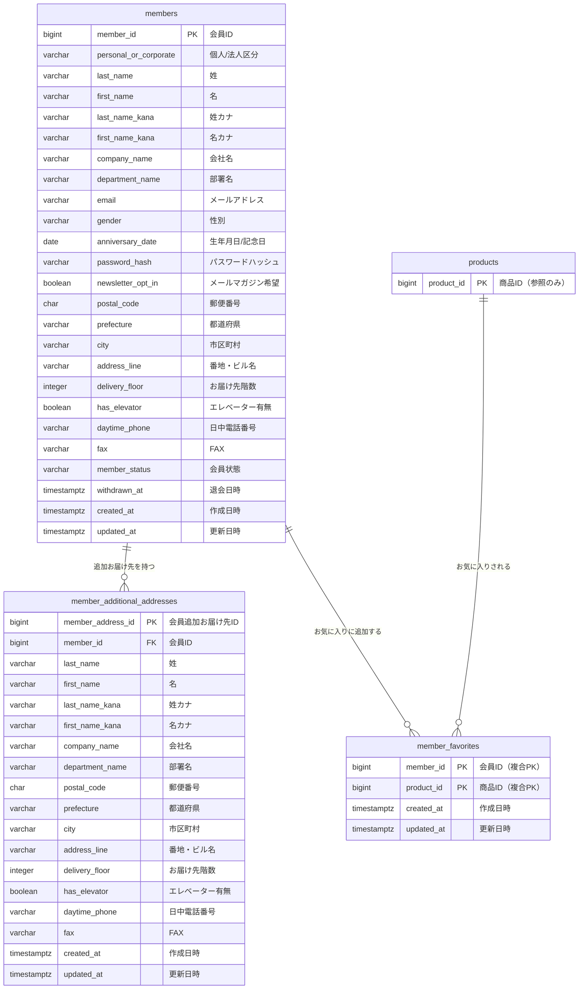
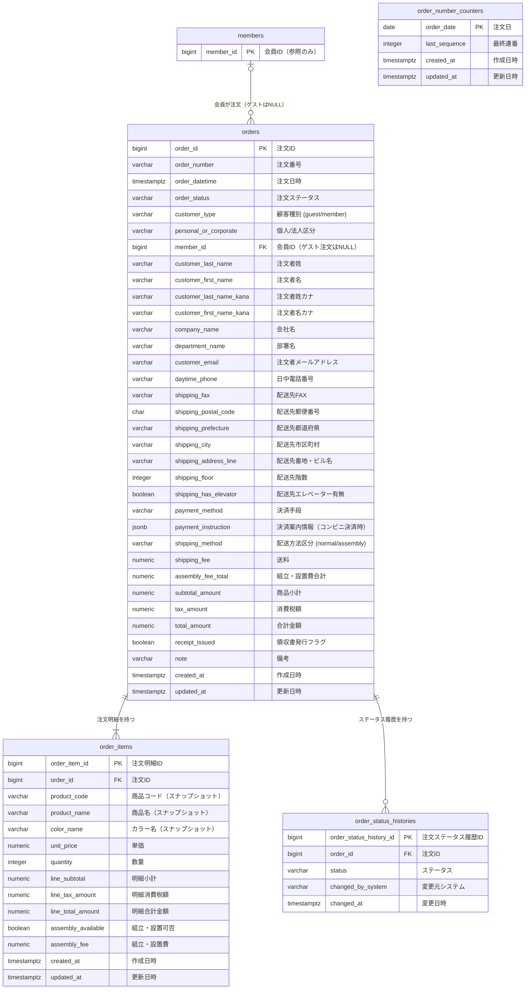
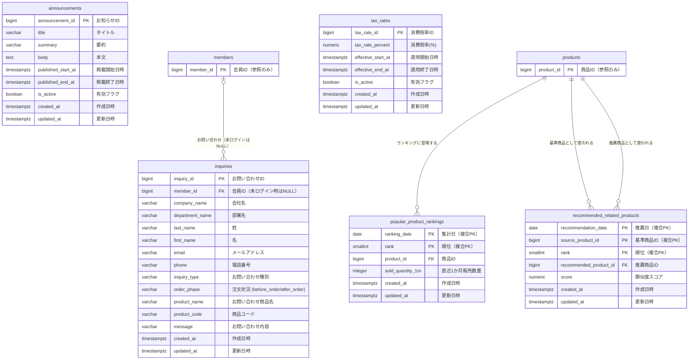
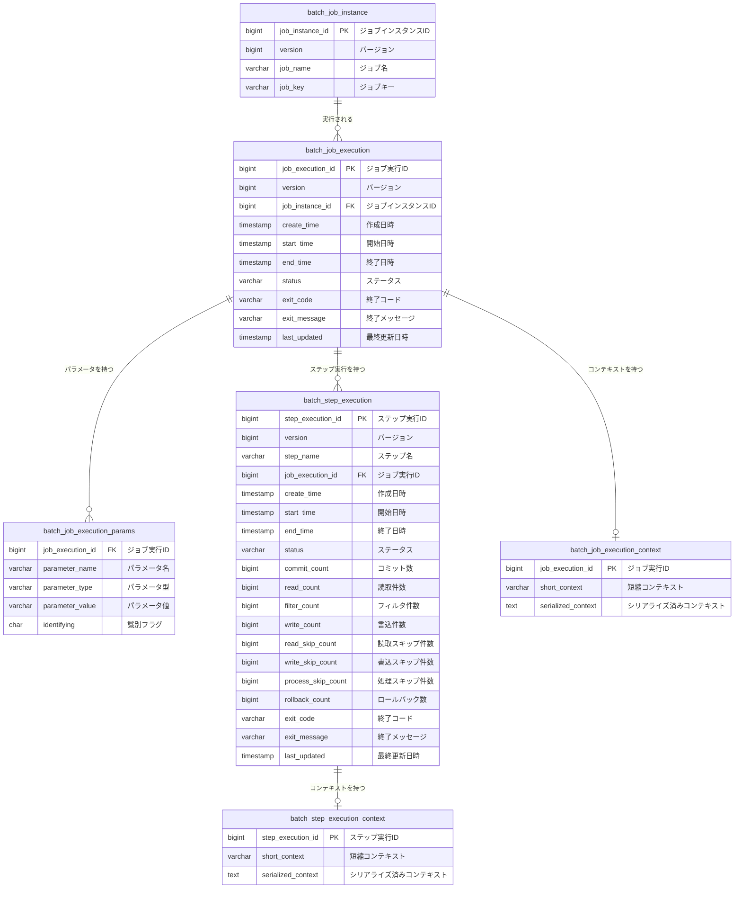

# ER 図

最終更新: 2026-03-10

---

## テーブル一覧

| グループ | テーブル名 | 論理名 |
|---------|-----------|--------|
| 会員 | members | 会員 |
| 会員 | member_additional_addresses | 会員追加お届け先 |
| 会員 | member_favorites | 会員お気に入り |
| 商品 | products | 商品 |
| 商品 | product_variants | 商品バリアント |
| 商品 | colors | カラーマスタ |
| 商品 | product_desk_attributes | 商品デスク属性 |
| 商品 | product_chair_attributes | 商品チェア属性 |
| 商品 | product_storage_attributes | 商品収納家具属性 |
| 商品マスタ | desk_top_shapes | デスク天板形状マスタ |
| 商品マスタ | desk_tastes | デスクテイストマスタ |
| 商品マスタ | chair_functions | チェア機能マスタ |
| 商品マスタ | chair_materials | チェア素材マスタ |
| 商品マスタ | chair_tastes | チェアテイストマスタ |
| 商品マスタ | storage_usages | 収納家具用途マスタ |
| 商品マスタ | storage_tastes | 収納家具テイストマスタ |
| 注文 | orders | 注文 |
| 注文 | order_items | 注文明細 |
| 注文 | order_status_histories | 注文ステータス履歴 |
| 注文 | order_number_counters | 注文番号採番カウンタ |
| コンテンツ | announcements | お知らせ |
| コンテンツ | inquiries | お問い合わせ |
| バッチ・システム | tax_rates | 消費税率 |
| バッチ・システム | popular_product_rankings | 売れ筋ランキング |
| バッチ・システム | recommended_related_products | おすすめ関連商品 |
| Spring Batch メタデータ | batch_job_instance | ジョブインスタンス |
| Spring Batch メタデータ | batch_job_execution | ジョブ実行 |
| Spring Batch メタデータ | batch_job_execution_params | ジョブ実行パラメータ |
| Spring Batch メタデータ | batch_step_execution | ステップ実行 |
| Spring Batch メタデータ | batch_step_execution_context | ステップ実行コンテキスト |
| Spring Batch メタデータ | batch_job_execution_context | ジョブ実行コンテキスト |

---

## 1. 全体リレーション概要図

テーブル間のリレーションを一覧化した簡略図です（カラム定義は省略）。

```mermaid
erDiagram
    members ||--o{ member_additional_addresses : "追加お届け先"
    members ||--o{ member_favorites : "お気に入り"
    members |o--o{ orders : "会員注文（ゲストはNULL）"
    members |o--o{ inquiries : "お問い合わせ（未ログインはNULL）"

    products ||--o{ member_favorites : "お気に入りされる"
    products ||--o{ product_variants : "バリアント"
    products ||--o| product_desk_attributes : "デスク属性(1対1)"
    products ||--o| product_chair_attributes : "チェア属性(1対1)"
    products ||--o| product_storage_attributes : "収納家具属性(1対1)"
    products ||--o{ popular_product_rankings : "ランキング"
    products ||--o{ recommended_related_products : "基準商品"
    products ||--o{ recommended_related_products : "推薦商品"

    colors ||--o{ product_variants : "カラー"

    desk_top_shapes ||--o{ product_desk_attributes : "天板形状"
    desk_tastes ||--o{ product_desk_attributes : "テイスト"
    chair_functions ||--o{ product_chair_attributes : "機能"
    chair_materials ||--o{ product_chair_attributes : "素材"
    chair_tastes ||--o{ product_chair_attributes : "テイスト"
    storage_usages ||--o{ product_storage_attributes : "用途"
    storage_tastes ||--o{ product_storage_attributes : "テイスト"

    orders ||--|{ order_items : "注文明細"
    orders ||--o{ order_status_histories : "ステータス履歴"

    batch_job_instance ||--o{ batch_job_execution : "実行"
    batch_job_execution ||--o{ batch_job_execution_params : "パラメータ"
    batch_job_execution ||--o{ batch_step_execution : "ステップ実行"
    batch_step_execution ||--o| batch_step_execution_context : "コンテキスト"
    batch_job_execution ||--o| batch_job_execution_context : "コンテキスト"
```

---

## 2. 業務テーブル詳細 ER 図

### 2-1. 会員ドメイン

### 2-2. 商品ドメイン

```mermaid
erDiagram
    products {
        bigint product_id PK "商品ID"
        varchar product_name "商品名"
        varchar category_id "商品カテゴリID (desk/chair/storage)"
        text description "商品紹介文"
        boolean assembly_available "組立・設置可否"
        numeric assembly_fee "組立・設置費"
        boolean has_variation "シリーズバリエーション有無"
        bigint variation_group_id "バリエーショングループID"
        varchar variation_name "バリエーション名"
        timestamptz sale_start_at "販売開始日時"
        timestamptz sale_end_at "販売終了日時"
        timestamptz created_at "作成日時"
        timestamptz updated_at "更新日時"
    }

    colors {
        bigint color_id PK "カラーID"
        varchar color_name "カラー名"
        char color_code "カラーコード (#RRGGBB)"
        varchar swatch_type "色見本表示種別"
        integer sort_order "表示順"
        boolean is_active "有効フラグ"
        timestamptz created_at "作成日時"
        timestamptz updated_at "更新日時"
    }

    product_variants {
        bigint product_variant_id PK "商品バリアントID"
        bigint product_id FK "商品ID"
        varchar product_code "商品コード"
        bigint color_id FK "カラーID"
        numeric unit_price "販売価格"
        integer stock_quantity "在庫数"
        timestamptz created_at "作成日時"
        timestamptz updated_at "更新日時"
    }

    product_desk_attributes {
        bigint product_id PK "商品ID（1対1）"
        bigint top_shape_id FK "天板形状ID"
        integer width_mm "幅(mm)"
        integer depth_mm "奥行(mm)"
        integer height_mm "高さ(mm)"
        bigint taste_id FK "テイストID"
        timestamptz created_at "作成日時"
        timestamptz updated_at "更新日時"
    }

    product_chair_attributes {
        bigint product_id PK "商品ID（1対1）"
        bigint function_id FK "機能ID"
        bigint material_id FK "素材ID"
        bigint taste_id FK "テイストID"
        timestamptz created_at "作成日時"
        timestamptz updated_at "更新日時"
    }

    product_storage_attributes {
        bigint product_id PK "商品ID（1対1）"
        bigint usage_id FK "用途ID"
        bigint taste_id FK "テイストID"
        timestamptz created_at "作成日時"
        timestamptz updated_at "更新日時"
    }

    desk_top_shapes {
        bigint top_shape_id PK "天板形状ID"
        varchar display_name "天板形状名"
        integer sort_order "表示順"
        boolean is_active "有効フラグ"
        timestamptz created_at "作成日時"
        timestamptz updated_at "更新日時"
    }

    desk_tastes {
        bigint taste_id PK "テイストID"
        varchar display_name "テイスト名"
        integer sort_order "表示順"
        boolean is_active "有効フラグ"
        timestamptz created_at "作成日時"
        timestamptz updated_at "更新日時"
    }

    chair_functions {
        bigint function_id PK "機能ID"
        varchar display_name "機能名"
        integer sort_order "表示順"
        boolean is_active "有効フラグ"
        timestamptz created_at "作成日時"
        timestamptz updated_at "更新日時"
    }

    chair_materials {
        bigint material_id PK "素材ID"
        varchar display_name "素材名"
        integer sort_order "表示順"
        boolean is_active "有効フラグ"
        timestamptz created_at "作成日時"
        timestamptz updated_at "更新日時"
    }

    chair_tastes {
        bigint taste_id PK "テイストID"
        varchar display_name "テイスト名"
        integer sort_order "表示順"
        boolean is_active "有効フラグ"
        timestamptz created_at "作成日時"
        timestamptz updated_at "更新日時"
    }

    storage_usages {
        bigint usage_id PK "用途ID"
        varchar display_name "用途名"
        integer sort_order "表示順"
        boolean is_active "有効フラグ"
        timestamptz created_at "作成日時"
        timestamptz updated_at "更新日時"
    }

    storage_tastes {
        bigint taste_id PK "テイストID"
        varchar display_name "テイスト名"
        integer sort_order "表示順"
        boolean is_active "有効フラグ"
        timestamptz created_at "作成日時"
        timestamptz updated_at "更新日時"
    }

    products ||--o{ product_variants : "バリアントを持つ"
    colors ||--o{ product_variants : "カラーが使われる"
    products ||--o| product_desk_attributes : "デスク属性（1対1）"
    products ||--o| product_chair_attributes : "チェア属性（1対1）"
    products ||--o| product_storage_attributes : "収納家具属性（1対1）"
    desk_top_shapes ||--o{ product_desk_attributes : "天板形状"
    desk_tastes ||--o{ product_desk_attributes : "テイスト"
    chair_functions ||--o{ product_chair_attributes : "機能"
    chair_materials ||--o{ product_chair_attributes : "素材"
    chair_tastes ||--o{ product_chair_attributes : "テイスト"
    storage_usages ||--o{ product_storage_attributes : "用途"
    storage_tastes ||--o{ product_storage_attributes : "テイスト"
```

### 2-3. 注文ドメイン

### 2-4. コンテンツ・バッチドメイン

---

## 3. Spring Batch メタデータ ER 図

Spring Framework が Job / Step 実行状態の管理に使用するシステムテーブルです。

---

## 備考

| 項目 | 内容 |
|------|------|
| DB | PostgreSQL |
| 主キー | 基本的に `BIGINT GENERATED ALWAYS AS IDENTITY`（自動採番）。複合PKはその都度記載 |
| 外部キー | ON DELETE CASCADE（子テーブル連鎖削除）または ON DELETE SET NULL（NULLクリア）を使い分け |
| 注文明細 | 注文時点の商品情報をスナップショットとして保持（商品テーブルの変更に影響されない） |
| ゲスト注文 | `orders.member_id` は NULL 許容（ゲスト購入対応） |
| バリエーション | 同一シリーズの色違い商品は `products.variation_group_id` で紐付け |
| カテゴリ別属性 | デスク・チェア・収納家具はそれぞれ専用の属性テーブルを持つ（TPT設計） |
