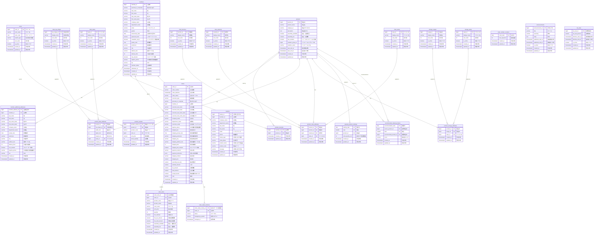

# ER図

```mermaid
erDiagram

    %% ───────────────────────────────────────────
    %% 会員
    %% ───────────────────────────────────────────
    members {
        bigint member_id PK "会員ID"
        varchar personal_or_corporate "個人/法人区分"
        varchar last_name "姓"
        varchar first_name "名"
        varchar last_name_kana "姓カナ"
        varchar first_name_kana "名カナ"
        varchar company_name "会社名"
        varchar department_name "部署名"
        varchar email "メールアドレス"
        varchar gender "性別"
        date anniversary_date "生年月日/記念日"
        varchar password_hash "パスワードハッシュ"
        boolean newsletter_opt_in "メールマガジン希望有無"
        char postal_code "郵便番号"
        varchar prefecture "都道府県"
        varchar city "市区町村"
        varchar address_line "番地・ビル名"
        int delivery_floor "お届け先階数"
        boolean has_elevator "エレベーター有無"
        varchar daytime_phone "日中連絡可能電話番号"
        varchar fax "FAX"
        varchar member_status "会員状態"
        timestamptz withdrawn_at "退会日時"
        timestamptz created_at "作成日時"
        timestamptz updated_at "更新日時"
    }

    member_additional_addresses {
        bigint member_address_id PK "追加住所ID"
        bigint member_id FK "会員ID"
        varchar last_name "姓"
        varchar first_name "名"
        varchar last_name_kana "姓カナ"
        varchar first_name_kana "名カナ"
        varchar company_name "会社名"
        varchar department_name "部署名"
        char postal_code "郵便番号"
        varchar prefecture "都道府県"
        varchar city "市区町村"
        varchar address_line "番地・ビル名"
        int delivery_floor "お届け先階数"
        boolean has_elevator "エレベーター有無"
        varchar daytime_phone "日中連絡可能電話番号"
        varchar fax "FAX"
        timestamptz created_at "作成日時"
        timestamptz updated_at "更新日時"
    }

    member_favorites {
        bigint member_id PK "会員ID"
        bigint product_id PK "商品ID"
        timestamptz created_at "作成日時"
        timestamptz updated_at "更新日時"
    }

    %% ───────────────────────────────────────────
    %% 商品
    %% ───────────────────────────────────────────
    products {
        bigint product_id PK "商品ID"
        varchar product_name "商品名"
        varchar category_id "商品カテゴリID"
        text description "商品紹介文"
        boolean assembly_available "組立・設置可否"
        numeric assembly_fee "組立・設置費"
        boolean has_variation "シリーズバリエーション有無"
        bigint variation_group_id "バリエーショングループID"
        varchar variation_name "バリエーション名"
        timestamptz sale_start_at "販売開始日時"
        timestamptz sale_end_at "販売終了日時"
        timestamptz created_at "作成日時"
        timestamptz updated_at "更新日時"
    }

    colors {
        bigint color_id PK "カラーID"
        varchar color_name "カラー名"
        char color_code "カラーコード"
        varchar swatch_type "色見本表示種別"
        int sort_order "表示順"
        boolean is_active "有効フラグ"
        timestamptz created_at "作成日時"
        timestamptz updated_at "更新日時"
    }

    product_variants {
        bigint product_variant_id PK "商品バリアントID"
        bigint product_id FK "商品ID"
        varchar product_code "商品コード"
        bigint color_id FK "カラーID"
        numeric unit_price "販売価格"
        int stock_quantity "在庫数"
        timestamptz created_at "作成日時"
        timestamptz updated_at "更新日時"
    }

    product_desk_attributes {
        bigint product_id PK "商品ID"
        bigint top_shape_id FK "天板形状ID"
        int width_mm "幅(mm)"
        int depth_mm "奥行(mm)"
        int height_mm "高さ(mm)"
        bigint taste_id FK "テイストID"
        timestamptz created_at "作成日時"
        timestamptz updated_at "更新日時"
    }

    product_chair_attributes {
        bigint product_id PK "商品ID"
        bigint function_id FK "機能ID"
        bigint material_id FK "素材ID"
        bigint taste_id FK "テイストID"
        timestamptz created_at "作成日時"
        timestamptz updated_at "更新日時"
    }

    product_storage_attributes {
        bigint product_id PK "商品ID"
        bigint usage_id FK "用途ID"
        bigint taste_id FK "テイストID"
        timestamptz created_at "作成日時"
        timestamptz updated_at "更新日時"
    }

    %% ───────────────────────────────────────────
    %% マスタ
    %% ───────────────────────────────────────────
    desk_top_shapes {
        bigint top_shape_id PK "天板形状ID"
        varchar display_name "天板形状名"
        int sort_order "表示順"
        boolean is_active "有効フラグ"
        timestamptz created_at "作成日時"
        timestamptz updated_at "更新日時"
    }

    desk_tastes {
        bigint taste_id PK "テイストID"
        varchar display_name "テイスト名"
        int sort_order "表示順"
        boolean is_active "有効フラグ"
        timestamptz created_at "作成日時"
        timestamptz updated_at "更新日時"
    }

    chair_functions {
        bigint function_id PK "機能ID"
        varchar display_name "機能名"
        int sort_order "表示順"
        boolean is_active "有効フラグ"
        timestamptz created_at "作成日時"
        timestamptz updated_at "更新日時"
    }

    chair_materials {
        bigint material_id PK "素材ID"
        varchar display_name "素材名"
        int sort_order "表示順"
        boolean is_active "有効フラグ"
        timestamptz created_at "作成日時"
        timestamptz updated_at "更新日時"
    }

    chair_tastes {
        bigint taste_id PK "テイストID"
        varchar display_name "テイスト名"
        int sort_order "表示順"
        boolean is_active "有効フラグ"
        timestamptz created_at "作成日時"
        timestamptz updated_at "更新日時"
    }

    storage_usages {
        bigint usage_id PK "用途ID"
        varchar display_name "用途名"
        int sort_order "表示順"
        boolean is_active "有効フラグ"
        timestamptz created_at "作成日時"
        timestamptz updated_at "更新日時"
    }

    storage_tastes {
        bigint taste_id PK "テイストID"
        varchar display_name "テイスト名"
        int sort_order "表示順"
        boolean is_active "有効フラグ"
        timestamptz created_at "作成日時"
        timestamptz updated_at "更新日時"
    }

    %% ───────────────────────────────────────────
    %% 注文
    %% ───────────────────────────────────────────
    orders {
        bigint order_id PK "注文ID"
        varchar order_number "注文番号"
        timestamptz order_datetime "注文日時"
        varchar order_status "注文ステータス"
        varchar customer_type "顧客種別"
        varchar personal_or_corporate "個人/法人区分"
        bigint member_id FK "会員ID"
        varchar customer_last_name "注文者姓"
        varchar customer_first_name "注文者名"
        varchar customer_last_name_kana "注文者姓カナ"
        varchar customer_first_name_kana "注文者名カナ"
        varchar company_name "会社名"
        varchar department_name "部署名"
        varchar customer_email "注文者メールアドレス"
        varchar daytime_phone "日中連絡可能電話番号"
        varchar shipping_fax "配送先FAX"
        char shipping_postal_code "配送先郵便番号"
        varchar shipping_prefecture "配送先都道府県"
        varchar shipping_city "配送先市区町村"
        varchar shipping_address_line "配送先番地・ビル名"
        int shipping_floor "配送先階数"
        boolean shipping_has_elevator "エレベーター有無"
        varchar payment_method "支払方法"
        jsonb payment_instruction "支払い案内情報"
        varchar shipping_method "配送方法"
        numeric shipping_fee "配送料"
        numeric assembly_fee_total "組立費合計"
        numeric subtotal_amount "小計"
        numeric tax_amount "消費税額"
        numeric total_amount "合計金額"
        boolean receipt_issued "領収書発行済フラグ"
        varchar note "備考"
        timestamptz created_at "作成日時"
        timestamptz updated_at "更新日時"
    }

    order_items {
        bigint order_item_id PK "注文明細ID"
        bigint order_id FK "注文ID"
        varchar product_code "商品コード"
        varchar product_name "商品名"
        varchar color_name "カラー名"
        numeric unit_price "販売価格"
        int quantity "数量"
        numeric line_subtotal "明細小計"
        numeric line_tax_amount "明細消費税額"
        numeric line_total_amount "明細合計金額"
        boolean assembly_available "組立・設置可否"
        numeric assembly_fee "組立・設置費"
        timestamptz created_at "作成日時"
        timestamptz updated_at "更新日時"
    }

    order_status_histories {
        bigint order_status_history_id PK "注文ステータス履歴ID"
        bigint order_id FK "注文ID"
        varchar status "ステータス"
        varchar changed_by_system "変更システム"
        timestamptz changed_at "変更日時"
    }

    order_number_counters {
        date order_date PK "注文日"
        int last_sequence "最終連番"
        timestamptz created_at "作成日時"
        timestamptz updated_at "更新日時"
    }

    %% ───────────────────────────────────────────
    %% コンテンツ
    %% ───────────────────────────────────────────
    announcements {
        bigint announcement_id PK "お知らせID"
        varchar title "タイトル"
        varchar summary "要約"
        text body "本文"
        timestamptz published_start_at "掲載開始日時"
        timestamptz published_end_at "掲載終了日時"
        boolean is_active "有効フラグ"
        timestamptz created_at "作成日時"
        timestamptz updated_at "更新日時"
    }

    inquiries {
        bigint inquiry_id PK "お問い合わせID"
        bigint member_id FK "会員ID"
        varchar company_name "会社名"
        varchar department_name "部署名"
        varchar last_name "姓"
        varchar first_name "名"
        varchar email "メールアドレス"
        varchar phone "電話番号"
        varchar inquiry_type "お問い合わせ種別"
        varchar order_phase "注文状況"
        varchar product_name "お問い合わせ商品名"
        varchar product_code "商品コード"
        varchar message "お問い合わせ内容"
        timestamptz created_at "作成日時"
        timestamptz updated_at "更新日時"
    }

    %% ───────────────────────────────────────────
    %% バッチ
    %% ───────────────────────────────────────────
    tax_rates {
        bigint tax_rate_id PK "消費税率ID"
        numeric tax_rate_percent "消費税率"
        timestamptz effective_start_at "適用開始日時"
        timestamptz effective_end_at "適用終了日時"
        boolean is_active "有効フラグ"
        timestamptz created_at "作成日時"
        timestamptz updated_at "更新日時"
    }

    popular_product_rankings {
        date ranking_date PK "集計日"
        smallint rank PK "順位"
        bigint product_id FK "商品ID"
        int sold_quantity_1m "直近1か月販売数量"
        timestamptz created_at "作成日時"
        timestamptz updated_at "更新日時"
    }

    recommended_related_products {
        date recommendation_date PK "推薦日"
        bigint source_product_id PK "基準商品ID"
        smallint rank PK "順位"
        bigint recommended_product_id FK "推薦商品ID"
        numeric score "類似度スコア"
        timestamptz created_at "作成日時"
        timestamptz updated_at "更新日時"
    }

    %% ───────────────────────────────────────────
    %% リレーションシップ
    %% ───────────────────────────────────────────

    %% 会員
    members ||--o{ member_additional_addresses : "has"
    members ||--o{ member_favorites : "favorites"
    members ||--o{ orders : "places"
    members ||--o{ inquiries : "submits"

    %% 商品
    products ||--o{ member_favorites : "liked by"
    products ||--o{ product_variants : "has"
    products ||--o| product_desk_attributes : "has"
    products ||--o| product_chair_attributes : "has"
    products ||--o| product_storage_attributes : "has"
    products ||--o{ popular_product_rankings : "ranked in"
    products ||--o{ recommended_related_products : "source of"
    products ||--o{ recommended_related_products : "recommended as"

    %% 商品バリアント
    colors ||--o{ product_variants : "used in"

    %% デスクマスタ
    desk_top_shapes ||--o{ product_desk_attributes : "applied to"
    desk_tastes ||--o{ product_desk_attributes : "applied to"

    %% チェアマスタ
    chair_functions ||--o{ product_chair_attributes : "applied to"
    chair_materials ||--o{ product_chair_attributes : "applied to"
    chair_tastes ||--o{ product_chair_attributes : "applied to"

    %% 収納家具マスタ
    storage_usages ||--o{ product_storage_attributes : "applied to"
    storage_tastes ||--o{ product_storage_attributes : "applied to"

    %% 注文
    orders ||--|{ order_items : "contains"
    orders ||--|{ order_status_histories : "has"
```
