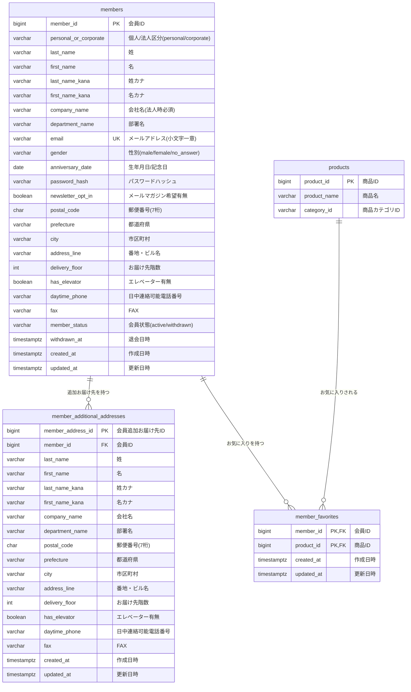
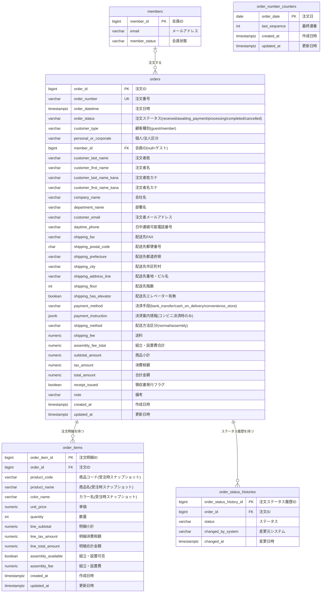
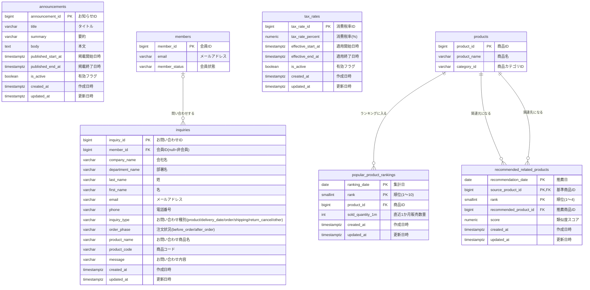

# ER 図

## テーブル一覧

| ドメイン | テーブル名 | 論理名 |
|---|---|---|
| マスタ | `desk_top_shapes` | デスク天板形状マスタ |
| マスタ | `tastes` | テイスト統合マスタ |
| マスタ | `chair_functions` | チェア機能マスタ |
| マスタ | `chair_materials` | チェア素材マスタ |
| マスタ | `storage_usages` | 収納家具用途マスタ |
| 商品 | `colors` | カラーマスタ |
| 商品 | `products` | 商品 |
| 商品 | `product_variants` | 商品バリアント |
| 商品 | `product_desk_attributes` | 商品デスク属性 |
| 商品 | `product_chair_attributes` | 商品チェア属性 |
| 商品 | `product_storage_attributes` | 商品収納家具属性 |
| 会員 | `members` | 会員 |
| 会員 | `member_additional_addresses` | 会員追加お届け先 |
| 会員 | `member_favorites` | 会員お気に入り |
| 注文 | `orders` | 注文 |
| 注文 | `order_items` | 注文明細 |
| 注文 | `order_number_counters` | 注文番号採番カウンタ |
| 注文 | `order_status_histories` | 注文ステータス履歴 |
| コンテンツ | `announcements` | お知らせ |
| コンテンツ | `inquiries` | お問い合わせ |
| バッチ | `tax_rates` | 消費税率 |
| バッチ | `popular_product_rankings` | 売れ筋ランキング |
| バッチ | `recommended_related_products` | おすすめ関連商品 |

---

## 全体 ER 図（概要）

主キー・外部キーと主要カラムのみ表示。詳細は各ドメイン図を参照。

```mermaid
erDiagram
    %% ── マスタ系 ──────────────────────────────────────
    desk_top_shapes {
        bigint  top_shape_id  PK  "天板形状ID"
        varchar display_name      "天板形状名"
    }
    tastes {
        bigint  taste_id      PK  "テイストID"
        varchar display_name      "テイスト名"
    }
    chair_functions {
        bigint  function_id   PK  "機能ID"
        varchar display_name      "機能名"
    }
    chair_materials {
        bigint  material_id   PK  "素材ID"
        varchar display_name      "素材名"
    }
    storage_usages {
        bigint  usage_id      PK  "用途ID"
        varchar display_name      "用途名"
    }
    colors {
        bigint  color_id      PK  "カラーID"
        varchar color_name        "カラー名"
        char    color_code        "カラーコード(#RRGGBB)"
    }
    tax_rates {
        bigint  tax_rate_id   PK  "消費税率ID"
        numeric tax_rate_percent  "消費税率(%)"
    }

    %% ── 商品系 ──────────────────────────────────────
    products {
        bigint  product_id    PK  "商品ID"
        varchar product_name      "商品名"
        varchar category_id       "カテゴリ(desk/chair/storage)"
    }
    product_variants {
        bigint  product_variant_id  PK    "商品バリアントID"
        bigint  product_id          FK    "商品ID"
        bigint  color_id            FK    "カラーID"
        varchar product_code        UK    "商品コード"
        numeric unit_price              "販売価格"
        int     stock_quantity          "在庫数"
    }
    product_desk_attributes {
        bigint  product_id    PK,FK  "商品ID"
        bigint  top_shape_id  FK     "天板形状ID"
        bigint  taste_id      FK     "テイストID"
    }
    product_chair_attributes {
        bigint  product_id    PK,FK  "商品ID"
        bigint  function_id   FK     "機能ID"
        bigint  material_id   FK     "素材ID"
        bigint  taste_id      FK     "テイストID"
    }
    product_storage_attributes {
        bigint  product_id    PK,FK  "商品ID"
        bigint  usage_id      FK     "用途ID"
        bigint  taste_id      FK     "テイストID"
    }

    %% ── 会員系 ──────────────────────────────────────
    members {
        bigint  member_id     PK  "会員ID"
        varchar email             "メールアドレス"
        varchar member_status     "会員状態(active/withdrawn)"
    }
    member_additional_addresses {
        bigint  member_address_id  PK  "会員追加お届け先ID"
        bigint  member_id          FK  "会員ID"
    }
    member_favorites {
        bigint  member_id   PK,FK  "会員ID"
        bigint  product_id  PK,FK  "商品ID"
    }

    %% ── 注文系 ──────────────────────────────────────
    orders {
        bigint  order_id       PK  "注文ID"
        varchar order_number   UK  "注文番号"
        bigint  member_id      FK  "会員ID(null=ゲスト)"
        varchar order_status       "注文ステータス"
        varchar customer_type      "顧客種別(guest/member)"
        numeric total_amount       "合計金額"
    }
    order_items {
        bigint  order_item_id  PK  "注文明細ID"
        bigint  order_id       FK  "注文ID"
        varchar product_code       "商品コード(スナップショット)"
        int     quantity           "数量"
    }
    order_number_counters {
        date    order_date     PK  "注文日"
        int     last_sequence      "最終連番"
    }
    order_status_histories {
        bigint  order_status_history_id  PK  "注文ステータス履歴ID"
        bigint  order_id                 FK  "注文ID"
        varchar status                       "ステータス"
        varchar changed_by_system            "変更元システム"
    }

    %% ── コンテンツ系 ──────────────────────────────────
    announcements {
        bigint  announcement_id  PK  "お知らせID"
        varchar title                "タイトル"
        boolean is_active            "有効フラグ"
    }
    inquiries {
        bigint  inquiry_id   PK  "お問い合わせID"
        bigint  member_id    FK  "会員ID(null=非会員)"
        varchar inquiry_type     "お問い合わせ種別"
    }

    %% ── バッチ系 ──────────────────────────────────────
    popular_product_rankings {
        date      ranking_date  PK    "集計日"
        smallint  rank          PK    "順位"
        bigint    product_id    FK    "商品ID"
        int       sold_quantity_1m     "直近1か月販売数量"
    }
    recommended_related_products {
        date      recommendation_date  PK    "推薦日"
        bigint    source_product_id    PK,FK "基準商品ID"
        smallint  rank                 PK    "順位"
        bigint    recommended_product_id FK  "推薦商品ID"
        numeric   score                      "類似度スコア"
    }

    %% ── リレーション ────────────────────────────────────
    products             ||--o{ product_variants              : "バリアントを持つ"
    products             ||--o| product_desk_attributes       : "デスク属性を持つ"
    products             ||--o| product_chair_attributes      : "チェア属性を持つ"
    products             ||--o| product_storage_attributes    : "収納属性を持つ"
    colors               ||--o{ product_variants              : "カラーが使われる"
    desk_top_shapes      ||--o{ product_desk_attributes       : "天板形状が使われる"
    tastes               ||--o{ product_desk_attributes       : "テイストが使われる"
    tastes               ||--o{ product_chair_attributes      : "テイストが使われる"
    tastes               ||--o{ product_storage_attributes    : "テイストが使われる"
    chair_functions      ||--o{ product_chair_attributes      : "機能が使われる"
    chair_materials      ||--o{ product_chair_attributes      : "素材が使われる"
    storage_usages       ||--o{ product_storage_attributes    : "用途が使われる"
    members              ||--o{ member_additional_addresses   : "追加お届け先を持つ"
    members              ||--o{ member_favorites              : "お気に入りを持つ"
    products             ||--o{ member_favorites              : "お気に入りされる"
    members              |o--o{ orders                        : "注文する"
    orders               ||--o{ order_items                   : "注文明細を持つ"
    orders               ||--o{ order_status_histories        : "ステータス履歴を持つ"
    members              |o--o{ inquiries                     : "問い合わせする"
    products             ||--o{ popular_product_rankings      : "ランキングに入る"
    products             ||--o{ recommended_related_products  : "関連元になる"
    products             ||--o{ recommended_related_products  : "関連先になる"
```

---

## 商品・マスタドメイン 詳細

```mermaid
erDiagram
    desk_top_shapes {
        bigint   top_shape_id  PK  "天板形状ID"
        varchar  display_name      "天板形状名"
        int      sort_order        "表示順"
        boolean  is_active         "有効フラグ"
        timestamptz created_at     "作成日時"
        timestamptz updated_at     "更新日時"
    }
    tastes {
        bigint   taste_id      PK  "テイストID"
        varchar  display_name      "テイスト名"
        int      sort_order        "表示順"
        boolean  is_active         "有効フラグ"
        timestamptz created_at     "作成日時"
        timestamptz updated_at     "更新日時"
    }
    chair_functions {
        bigint   function_id   PK  "機能ID"
        varchar  display_name      "機能名"
        int      sort_order        "表示順"
        boolean  is_active         "有効フラグ"
        timestamptz created_at     "作成日時"
        timestamptz updated_at     "更新日時"
    }
    chair_materials {
        bigint   material_id   PK  "素材ID"
        varchar  display_name      "素材名"
        int      sort_order        "表示順"
        boolean  is_active         "有効フラグ"
        timestamptz created_at     "作成日時"
        timestamptz updated_at     "更新日時"
    }
    storage_usages {
        bigint   usage_id      PK  "用途ID"
        varchar  display_name      "用途名"
        int      sort_order        "表示順"
        boolean  is_active         "有効フラグ"
        timestamptz created_at     "作成日時"
        timestamptz updated_at     "更新日時"
    }
    colors {
        bigint   color_id      PK  "カラーID"
        varchar  color_name    UK  "カラー名"
        char     color_code    UK  "カラーコード(#RRGGBB)"
        varchar  swatch_type       "色見本表示種別(solid/transparent_pattern)"
        int      sort_order        "表示順"
        boolean  is_active         "有効フラグ"
        timestamptz created_at     "作成日時"
        timestamptz updated_at     "更新日時"
    }
    products {
        bigint   product_id        PK  "商品ID"
        varchar  product_name          "商品名"
        varchar  category_id           "商品カテゴリID(desk/chair/storage)"
        text     description            "商品紹介文"
        boolean  assembly_available    "組立・設置可否"
        numeric  assembly_fee          "組立・設置費"
        boolean  has_variation         "シリーズバリエーション有無"
        bigint   variation_group_id    "バリエーショングループID"
        varchar  variation_name        "バリエーション名"
        timestamptz sale_start_at      "販売開始日時"
        timestamptz sale_end_at        "販売終了日時"
        timestamptz created_at         "作成日時"
        timestamptz updated_at         "更新日時"
    }
    product_variants {
        bigint   product_variant_id  PK    "商品バリアントID"
        bigint   product_id          FK    "商品ID"
        bigint   color_id            FK    "カラーID"
        varchar  product_code        UK    "商品コード"
        numeric  unit_price              "販売価格"
        int      stock_quantity          "在庫数"
        timestamptz created_at           "作成日時"
        timestamptz updated_at           "更新日時"
    }
    product_desk_attributes {
        bigint   product_id    PK,FK  "商品ID"
        bigint   top_shape_id  FK     "天板形状ID"
        bigint   taste_id      FK     "テイストID"
        int      width_mm              "幅(mm)"
        int      depth_mm              "奥行(mm)"
        int      height_mm             "高さ(mm)"
        timestamptz created_at         "作成日時"
        timestamptz updated_at         "更新日時"
    }
    product_chair_attributes {
        bigint   product_id    PK,FK  "商品ID"
        bigint   function_id   FK     "機能ID"
        bigint   material_id   FK     "素材ID"
        bigint   taste_id      FK     "テイストID"
        timestamptz created_at         "作成日時"
        timestamptz updated_at         "更新日時"
    }
    product_storage_attributes {
        bigint   product_id    PK,FK  "商品ID"
        bigint   usage_id      FK     "用途ID"
        bigint   taste_id      FK     "テイストID"
        timestamptz created_at         "作成日時"
        timestamptz updated_at         "更新日時"
    }

    products             ||--o{ product_variants              : "バリアントを持つ"
    products             ||--o| product_desk_attributes       : "デスク属性を持つ"
    products             ||--o| product_chair_attributes      : "チェア属性を持つ"
    products             ||--o| product_storage_attributes    : "収納属性を持つ"
    colors               ||--o{ product_variants              : "カラーが使われる"
    desk_top_shapes      ||--o{ product_desk_attributes       : "天板形状が使われる"
    tastes               ||--o{ product_desk_attributes       : "テイストが使われる"
    tastes               ||--o{ product_chair_attributes      : "テイストが使われる"
    tastes               ||--o{ product_storage_attributes    : "テイストが使われる"
    chair_functions      ||--o{ product_chair_attributes      : "機能が使われる"
    chair_materials      ||--o{ product_chair_attributes      : "素材が使われる"
    storage_usages       ||--o{ product_storage_attributes    : "用途が使われる"
```

---

## 会員ドメイン 詳細

---

## 注文ドメイン 詳細

---

## コンテンツ・バッチドメイン 詳細

