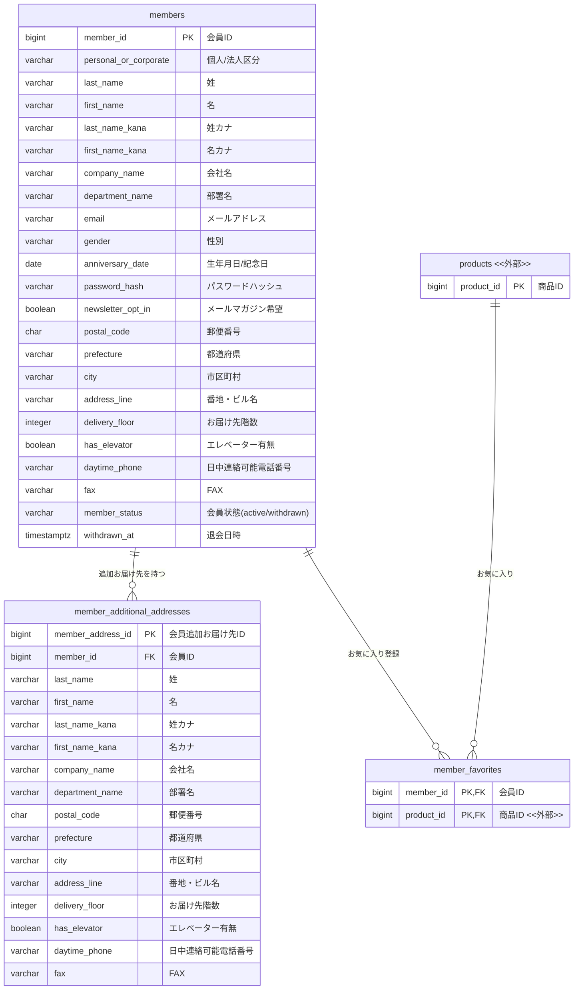
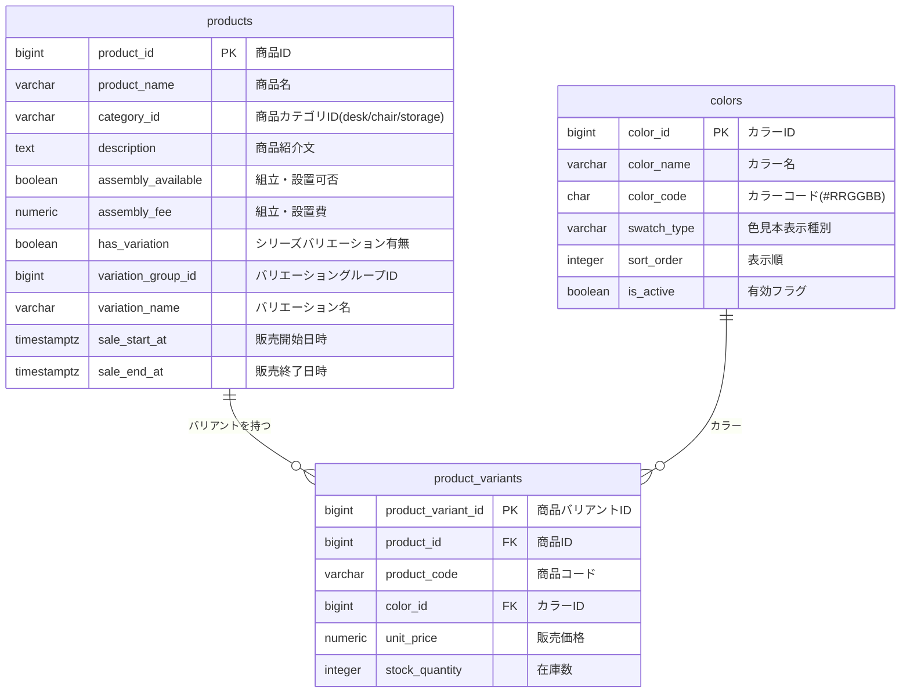
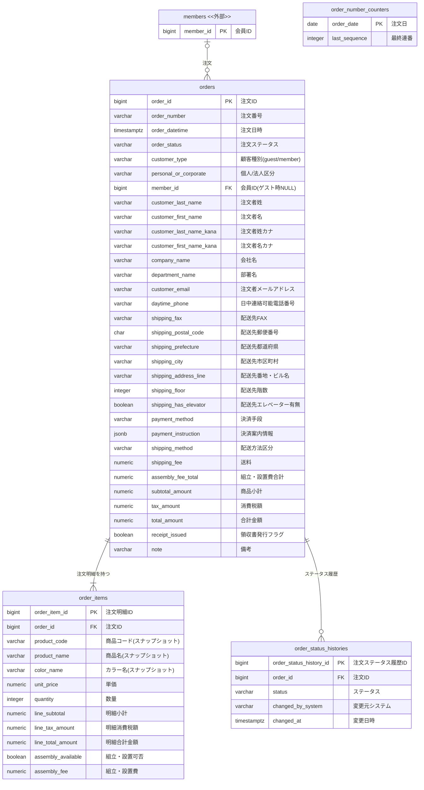
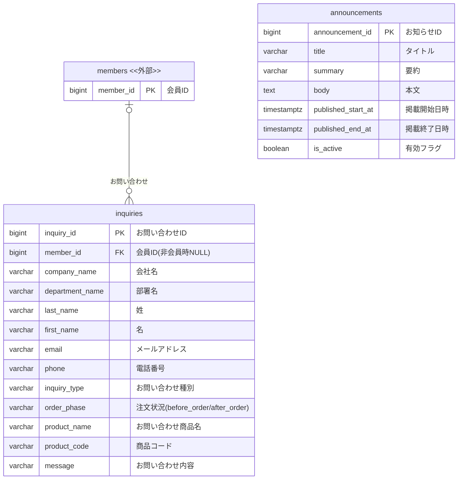
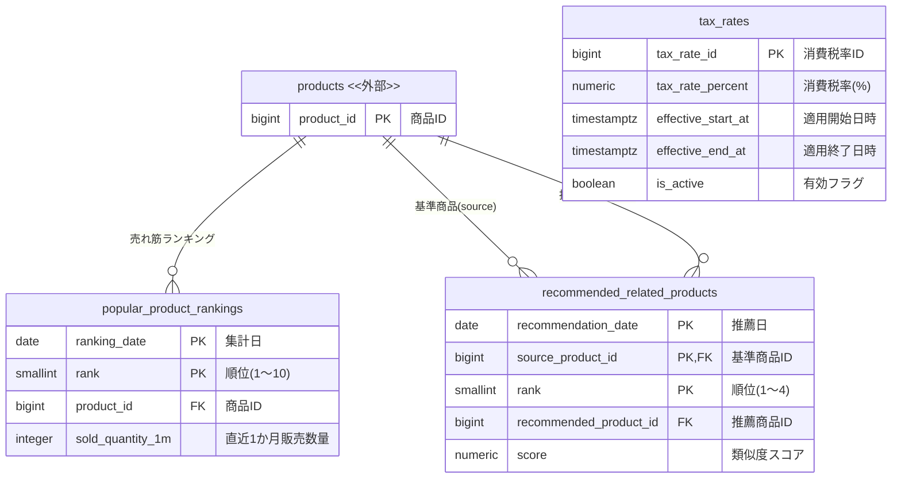
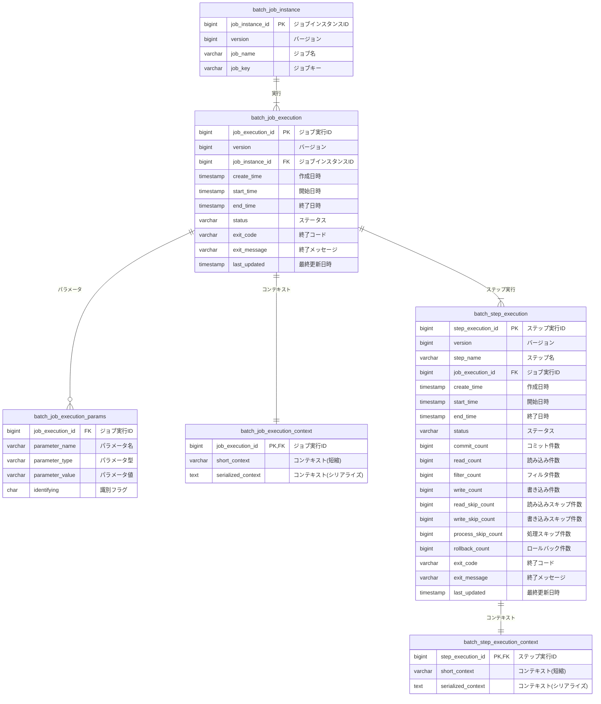

# ER図

> 最終更新: 2026-04-04  
> ※ 全テーブルに共通する `created_at`（作成日時）・`updated_at`（更新日時）カラムは省略しています。  
> ※ 他ドメインのテーブルを参照する場合、`<<外部>>` として PK のみ略記しています。

---

## 目次

1. [会員ドメイン](#1-会員ドメイン)
2. [商品ドメイン](#2-商品ドメイン)
3. [商品カテゴリ属性・マスタドメイン](#3-商品カテゴリ属性マスタドメイン)
4. [注文ドメイン](#4-注文ドメイン)
5. [コンテンツドメイン](#5-コンテンツドメイン)
6. [バッチ・ランキングドメイン](#6-バッチランキングドメイン)
7. [Spring Batch メタデータ](#7-spring-batch-メタデータ)
8. [テーブル一覧サマリ](#8-テーブル一覧サマリ)

---

## 1. 会員ドメイン

| テーブル | 論理名 |
|---------|--------|
| `members` | 会員 |
| `member_additional_addresses` | 会員追加お届け先 |
| `member_favorites` | 会員お気に入り |

---

## 2. 商品ドメイン

| テーブル | 論理名 |
|---------|--------|
| `products` | 商品 |
| `colors` | カラーマスタ |
| `product_variants` | 商品バリアント |

---

## 3. 商品カテゴリ属性・マスタドメイン

カテゴリ別の拡張属性テーブルと、絞り込み検索用のマスタテーブルです。

| テーブル | 論理名 |
|---------|--------|
| `product_desk_attributes` | 商品デスク属性 |
| `product_chair_attributes` | 商品チェア属性 |
| `product_storage_attributes` | 商品収納家具属性 |
| `desk_top_shapes` | デスク天板形状マスタ |
| `desk_tastes` | デスクテイストマスタ |
| `chair_functions` | チェア機能マスタ |
| `chair_materials` | チェア素材マスタ |
| `chair_tastes` | チェアテイストマスタ |
| `storage_usages` | 収納家具用途マスタ |
| `storage_tastes` | 収納家具テイストマスタ |

```mermaid
erDiagram

    products["products <<外部>>"] {
        bigint product_id PK "商品ID"
    }

    product_desk_attributes {
        bigint  product_id    PK,FK "商品ID"
        bigint  top_shape_id  FK    "天板形状ID"
        integer width_mm            "幅(mm)"
        integer depth_mm            "奥行(mm)"
        integer height_mm           "高さ(mm)"
        bigint  taste_id      FK    "テイストID"
    }

    product_chair_attributes {
        bigint product_id    PK,FK "商品ID"
        bigint function_id   FK    "機能ID"
        bigint material_id   FK    "素材ID"
        bigint taste_id      FK    "テイストID"
    }

    product_storage_attributes {
        bigint product_id  PK,FK "商品ID"
        bigint usage_id    FK    "用途ID"
        bigint taste_id    FK    "テイストID"
    }

    desk_top_shapes {
        bigint  top_shape_id  PK "天板形状ID"
        varchar display_name     "天板形状名"
        integer sort_order       "表示順"
        boolean is_active        "有効フラグ"
    }

    desk_tastes {
        bigint  taste_id     PK "テイストID"
        varchar display_name    "テイスト名"
        integer sort_order      "表示順"
        boolean is_active       "有効フラグ"
    }

    chair_functions {
        bigint  function_id  PK "機能ID"
        varchar display_name    "機能名"
        integer sort_order      "表示順"
        boolean is_active       "有効フラグ"
    }

    chair_materials {
        bigint  material_id  PK "素材ID"
        varchar display_name    "素材名"
        integer sort_order      "表示順"
        boolean is_active       "有効フラグ"
    }

    chair_tastes {
        bigint  taste_id     PK "テイストID"
        varchar display_name    "テイスト名"
        integer sort_order      "表示順"
        boolean is_active       "有効フラグ"
    }

    storage_usages {
        bigint  usage_id     PK "用途ID"
        varchar display_name    "用途名"
        integer sort_order      "表示順"
        boolean is_active       "有効フラグ"
    }

    storage_tastes {
        bigint  taste_id     PK "テイストID"
        varchar display_name    "テイスト名"
        integer sort_order      "表示順"
        boolean is_active       "有効フラグ"
    }

    products           ||--o| product_desk_attributes    : "デスク属性"
    products           ||--o| product_chair_attributes   : "チェア属性"
    products           ||--o| product_storage_attributes : "収納家具属性"

    desk_top_shapes    ||--o{ product_desk_attributes    : "天板形状"
    desk_tastes        ||--o{ product_desk_attributes    : "テイスト"

    chair_functions    ||--o{ product_chair_attributes   : "機能"
    chair_materials    ||--o{ product_chair_attributes   : "素材"
    chair_tastes       ||--o{ product_chair_attributes   : "テイスト"

    storage_usages     ||--o{ product_storage_attributes : "用途"
    storage_tastes     ||--o{ product_storage_attributes : "テイスト"
```

---

## 4. 注文ドメイン

| テーブル | 論理名 |
|---------|--------|
| `orders` | 注文 |
| `order_number_counters` | 注文番号採番カウンタ |
| `order_items` | 注文明細 |
| `order_status_histories` | 注文ステータス履歴 |

> **注意**: `order_items` は注文確定時点の商品情報（商品名・カラー名・単価）をスナップショットとして保持します。`products` / `product_variants` への FK は持たず、商品マスタ変更の影響を受けません。

---

## 5. コンテンツドメイン

| テーブル | 論理名 |
|---------|--------|
| `announcements` | お知らせ |
| `inquiries` | お問い合わせ |

---

## 6. バッチ・ランキングドメイン

| テーブル | 論理名 |
|---------|--------|
| `tax_rates` | 消費税率 |
| `popular_product_rankings` | 売れ筋ランキング |
| `recommended_related_products` | おすすめ関連商品 |

---

## 7. Spring Batch メタデータ

Spring Batch フレームワークが自動管理するジョブ実行管理テーブルです。

| テーブル | 論理名 |
|---------|--------|
| `batch_job_instance` | ジョブインスタンス |
| `batch_job_execution` | ジョブ実行 |
| `batch_job_execution_params` | ジョブ実行パラメータ |
| `batch_job_execution_context` | ジョブ実行コンテキスト |
| `batch_step_execution` | ステップ実行 |
| `batch_step_execution_context` | ステップ実行コンテキスト |

---

## 8. テーブル一覧サマリ

| ドメイン | テーブル名 | 論理名 |
|---------|-----------|--------|
| 会員 | `members` | 会員 |
| 会員 | `member_additional_addresses` | 会員追加お届け先 |
| 会員 | `member_favorites` | 会員お気に入り |
| 商品 | `products` | 商品 |
| 商品 | `colors` | カラーマスタ |
| 商品 | `product_variants` | 商品バリアント |
| 商品 | `product_desk_attributes` | 商品デスク属性 |
| 商品 | `product_chair_attributes` | 商品チェア属性 |
| 商品 | `product_storage_attributes` | 商品収納家具属性 |
| マスタ | `desk_top_shapes` | デスク天板形状マスタ |
| マスタ | `desk_tastes` | デスクテイストマスタ |
| マスタ | `chair_functions` | チェア機能マスタ |
| マスタ | `chair_materials` | チェア素材マスタ |
| マスタ | `chair_tastes` | チェアテイストマスタ |
| マスタ | `storage_usages` | 収納家具用途マスタ |
| マスタ | `storage_tastes` | 収納家具テイストマスタ |
| 注文 | `orders` | 注文 |
| 注文 | `order_number_counters` | 注文番号採番カウンタ |
| 注文 | `order_items` | 注文明細 |
| 注文 | `order_status_histories` | 注文ステータス履歴 |
| コンテンツ | `announcements` | お知らせ |
| コンテンツ | `inquiries` | お問い合わせ |
| バッチ | `tax_rates` | 消費税率 |
| バッチ | `popular_product_rankings` | 売れ筋ランキング |
| バッチ | `recommended_related_products` | おすすめ関連商品 |
| Spring Batch | `batch_job_instance` | ジョブインスタンス |
| Spring Batch | `batch_job_execution` | ジョブ実行 |
| Spring Batch | `batch_job_execution_params` | ジョブ実行パラメータ |
| Spring Batch | `batch_job_execution_context` | ジョブ実行コンテキスト |
| Spring Batch | `batch_step_execution` | ステップ実行 |
| Spring Batch | `batch_step_execution_context` | ステップ実行コンテキスト |
