```mermaid
erDiagram

    %% =====================================================================
    %% マスター系（商品属性）
    %% =====================================================================

    colors {
        BIGINT      color_id      PK
        VARCHAR     color_name
        CHAR        color_code
        VARCHAR     swatch_type
        INTEGER     sort_order
        BOOLEAN     is_active
        TIMESTAMPTZ created_at
        TIMESTAMPTZ updated_at
    }

    desk_top_shapes {
        BIGINT      top_shape_id  PK
        VARCHAR     display_name
        INTEGER     sort_order
        BOOLEAN     is_active
        TIMESTAMPTZ created_at
        TIMESTAMPTZ updated_at
    }

    desk_tastes {
        BIGINT      taste_id      PK
        VARCHAR     display_name
        INTEGER     sort_order
        BOOLEAN     is_active
        TIMESTAMPTZ created_at
        TIMESTAMPTZ updated_at
    }

    chair_functions {
        BIGINT      function_id   PK
        VARCHAR     display_name
        INTEGER     sort_order
        BOOLEAN     is_active
        TIMESTAMPTZ created_at
        TIMESTAMPTZ updated_at
    }

    chair_materials {
        BIGINT      material_id   PK
        VARCHAR     display_name
        INTEGER     sort_order
        BOOLEAN     is_active
        TIMESTAMPTZ created_at
        TIMESTAMPTZ updated_at
    }

    chair_tastes {
        BIGINT      taste_id      PK
        VARCHAR     display_name
        INTEGER     sort_order
        BOOLEAN     is_active
        TIMESTAMPTZ created_at
        TIMESTAMPTZ updated_at
    }

    storage_usages {
        BIGINT      usage_id      PK
        VARCHAR     display_name
        INTEGER     sort_order
        BOOLEAN     is_active
        TIMESTAMPTZ created_at
        TIMESTAMPTZ updated_at
    }

    storage_tastes {
        BIGINT      taste_id      PK
        VARCHAR     display_name
        INTEGER     sort_order
        BOOLEAN     is_active
        TIMESTAMPTZ created_at
        TIMESTAMPTZ updated_at
    }

    tax_rates {
        BIGINT      tax_rate_id        PK
        NUMERIC     tax_rate_percent
        TIMESTAMPTZ effective_start_at
        TIMESTAMPTZ effective_end_at
        BOOLEAN     is_active
        TIMESTAMPTZ created_at
        TIMESTAMPTZ updated_at
    }

    %% =====================================================================
    %% 商品系
    %% =====================================================================

    products {
        BIGINT      product_id         PK
        VARCHAR     product_name
        VARCHAR     category_id        "desk / chair / storage"
        TEXT        description
        BOOLEAN     assembly_available
        NUMERIC     assembly_fee
        BOOLEAN     has_variation
        BIGINT      variation_group_id
        VARCHAR     variation_name
        TIMESTAMPTZ sale_start_at
        TIMESTAMPTZ sale_end_at
        TIMESTAMPTZ created_at
        TIMESTAMPTZ updated_at
    }

    product_variants {
        BIGINT      product_variant_id PK
        BIGINT      product_id         FK
        VARCHAR     product_code       UK
        BIGINT      color_id           FK
        NUMERIC     unit_price
        INTEGER     stock_quantity
        TIMESTAMPTZ created_at
        TIMESTAMPTZ updated_at
    }

    product_desk_attributes {
        BIGINT      product_id    PK, FK
        BIGINT      top_shape_id  FK
        INTEGER     width_mm
        INTEGER     depth_mm
        INTEGER     height_mm
        BIGINT      taste_id      FK
        TIMESTAMPTZ created_at
        TIMESTAMPTZ updated_at
    }

    product_chair_attributes {
        BIGINT      product_id    PK, FK
        BIGINT      function_id   FK
        BIGINT      material_id   FK
        BIGINT      taste_id      FK
        TIMESTAMPTZ created_at
        TIMESTAMPTZ updated_at
    }

    product_storage_attributes {
        BIGINT      product_id    PK, FK
        BIGINT      usage_id      FK
        BIGINT      taste_id      FK
        TIMESTAMPTZ created_at
        TIMESTAMPTZ updated_at
    }

    popular_product_rankings {
        DATE        ranking_date      PK
        SMALLINT    rank              PK
        BIGINT      product_id        FK
        INTEGER     sold_quantity_1m
        TIMESTAMPTZ created_at
        TIMESTAMPTZ updated_at
    }

    recommended_related_products {
        DATE        recommendation_date   PK
        BIGINT      source_product_id     PK, FK
        SMALLINT    rank                  PK
        BIGINT      recommended_product_id FK
        NUMERIC     score
        TIMESTAMPTZ created_at
        TIMESTAMPTZ updated_at
    }

    %% =====================================================================
    %% 会員系
    %% =====================================================================

    members {
        BIGINT      member_id             PK
        VARCHAR     personal_or_corporate "personal / corporate"
        VARCHAR     last_name
        VARCHAR     first_name
        VARCHAR     last_name_kana
        VARCHAR     first_name_kana
        VARCHAR     company_name
        VARCHAR     department_name
        VARCHAR     email                 UK
        VARCHAR     gender
        DATE        anniversary_date
        VARCHAR     password_hash
        BOOLEAN     newsletter_opt_in
        CHAR        postal_code
        VARCHAR     prefecture
        VARCHAR     city
        VARCHAR     address_line
        INTEGER     delivery_floor
        BOOLEAN     has_elevator
        VARCHAR     daytime_phone
        VARCHAR     fax
        VARCHAR     member_status
        TIMESTAMPTZ withdrawn_at
        TIMESTAMPTZ created_at
        TIMESTAMPTZ updated_at
    }

    member_additional_addresses {
        BIGINT      member_address_id PK
        BIGINT      member_id         FK
        VARCHAR     last_name
        VARCHAR     first_name
        VARCHAR     last_name_kana
        VARCHAR     first_name_kana
        VARCHAR     company_name
        VARCHAR     department_name
        CHAR        postal_code
        VARCHAR     prefecture
        VARCHAR     city
        VARCHAR     address_line
        INTEGER     delivery_floor
        BOOLEAN     has_elevator
        VARCHAR     daytime_phone
        VARCHAR     fax
        TIMESTAMPTZ created_at
        TIMESTAMPTZ updated_at
    }

    member_favorites {
        BIGINT      member_id   PK, FK
        BIGINT      product_id  PK, FK
        TIMESTAMPTZ created_at
        TIMESTAMPTZ updated_at
    }

    %% =====================================================================
    %% 注文系
    %% =====================================================================

    orders {
        BIGINT      order_id              PK
        VARCHAR     order_number          UK
        TIMESTAMPTZ order_datetime
        VARCHAR     order_status
        VARCHAR     customer_type         "guest / member"
        VARCHAR     personal_or_corporate
        BIGINT      member_id             FK
        VARCHAR     customer_last_name
        VARCHAR     customer_first_name
        VARCHAR     customer_last_name_kana
        VARCHAR     customer_first_name_kana
        VARCHAR     company_name
        VARCHAR     department_name
        VARCHAR     customer_email
        VARCHAR     daytime_phone
        VARCHAR     shipping_fax
        CHAR        shipping_postal_code
        VARCHAR     shipping_prefecture
        VARCHAR     shipping_city
        VARCHAR     shipping_address_line
        INTEGER     shipping_floor
        BOOLEAN     shipping_has_elevator
        VARCHAR     payment_method
        JSONB       payment_instruction
        VARCHAR     shipping_method
        NUMERIC     shipping_fee
        NUMERIC     assembly_fee_total
        NUMERIC     subtotal_amount
        NUMERIC     tax_amount
        NUMERIC     total_amount
        BOOLEAN     receipt_issued
        VARCHAR     note
        TIMESTAMPTZ created_at
        TIMESTAMPTZ updated_at
    }

    order_number_counters {
        DATE        order_date    PK
        INTEGER     last_sequence
        TIMESTAMPTZ created_at
        TIMESTAMPTZ updated_at
    }

    order_items {
        BIGINT      order_item_id    PK
        BIGINT      order_id         FK
        VARCHAR     product_code
        VARCHAR     product_name
        VARCHAR     color_name
        NUMERIC     unit_price
        INTEGER     quantity
        NUMERIC     line_subtotal
        NUMERIC     line_tax_amount
        NUMERIC     line_total_amount
        BOOLEAN     assembly_available
        NUMERIC     assembly_fee
        TIMESTAMPTZ created_at
        TIMESTAMPTZ updated_at
    }

    order_status_histories {
        BIGINT      order_status_history_id PK
        BIGINT      order_id                FK
        VARCHAR     status
        VARCHAR     changed_by_system
        TIMESTAMPTZ changed_at
    }

    %% =====================================================================
    %% コンテンツ系
    %% =====================================================================

    announcements {
        BIGINT      announcement_id   PK
        VARCHAR     title
        VARCHAR     summary
        TEXT        body
        TIMESTAMPTZ published_start_at
        TIMESTAMPTZ published_end_at
        BOOLEAN     is_active
        TIMESTAMPTZ created_at
        TIMESTAMPTZ updated_at
    }

    inquiries {
        BIGINT      inquiry_id    PK
        BIGINT      member_id     FK
        VARCHAR     company_name
        VARCHAR     department_name
        VARCHAR     last_name
        VARCHAR     first_name
        VARCHAR     email
        VARCHAR     phone
        VARCHAR     inquiry_type  "product / delivery_date / order / shipping / return_cancel / other"
        VARCHAR     order_phase   "before_order / after_order"
        VARCHAR     product_name
        VARCHAR     product_code
        VARCHAR     message
        TIMESTAMPTZ created_at
        TIMESTAMPTZ updated_at
    }

    %% =====================================================================
    %% Spring Batch メタデータ
    %% =====================================================================

    batch_job_instance {
        BIGINT  job_instance_id PK
        BIGINT  version
        VARCHAR job_name
        VARCHAR job_key
    }

    batch_job_execution {
        BIGINT    job_execution_id PK
        BIGINT    version
        BIGINT    job_instance_id  FK
        TIMESTAMP create_time
        TIMESTAMP start_time
        TIMESTAMP end_time
        VARCHAR   status
        VARCHAR   exit_code
        VARCHAR   exit_message
        TIMESTAMP last_updated
    }

    batch_job_execution_params {
        BIGINT  job_execution_id FK
        VARCHAR parameter_name
        VARCHAR parameter_type
        VARCHAR parameter_value
        CHAR    identifying
    }

    batch_step_execution {
        BIGINT    step_execution_id  PK
        BIGINT    version
        VARCHAR   step_name
        BIGINT    job_execution_id   FK
        TIMESTAMP create_time
        TIMESTAMP start_time
        TIMESTAMP end_time
        VARCHAR   status
        BIGINT    commit_count
        BIGINT    read_count
        BIGINT    filter_count
        BIGINT    write_count
        BIGINT    read_skip_count
        BIGINT    write_skip_count
        BIGINT    process_skip_count
        BIGINT    rollback_count
        VARCHAR   exit_code
        VARCHAR   exit_message
        TIMESTAMP last_updated
    }

    batch_step_execution_context {
        BIGINT  step_execution_id PK, FK
        VARCHAR short_context
        TEXT    serialized_context
    }

    batch_job_execution_context {
        BIGINT  job_execution_id PK, FK
        VARCHAR short_context
        TEXT    serialized_context
    }

    %% =====================================================================
    %% リレーション
    %% =====================================================================

    %% --- 商品 ---
    products                    ||--o{ product_variants              : "has variants"
    colors                      ||--o{ product_variants              : "used by"
    products                    ||--o| product_desk_attributes       : "desk attrs"
    products                    ||--o| product_chair_attributes      : "chair attrs"
    products                    ||--o| product_storage_attributes    : "storage attrs"
    desk_top_shapes             ||--o{ product_desk_attributes       : "used by"
    desk_tastes                 ||--o{ product_desk_attributes       : "used by"
    chair_functions             ||--o{ product_chair_attributes      : "used by"
    chair_materials             ||--o{ product_chair_attributes      : "used by"
    chair_tastes                ||--o{ product_chair_attributes      : "used by"
    storage_usages              ||--o{ product_storage_attributes    : "used by"
    storage_tastes              ||--o{ product_storage_attributes    : "used by"

    %% --- ランキング / おすすめ ---
    products                    ||--o{ popular_product_rankings       : "ranked"
    products                    ||--o{ recommended_related_products   : "source"
    products                    ||--o{ recommended_related_products   : "recommended"

    %% --- 会員 ---
    members                     ||--o{ member_additional_addresses   : "has"
    members                     ||--o{ member_favorites              : "favorites"
    products                    ||--o{ member_favorites              : "favorited by"

    %% --- 注文 ---
    members                     ||--o{ orders                        : "places"
    orders                      ||--o{ order_items                   : "contains"
    orders                      ||--o{ order_status_histories        : "history"

    %% --- コンテンツ ---
    members                     ||--o{ inquiries                     : "submits"

    %% --- Spring Batch ---
    batch_job_instance          ||--o{ batch_job_execution           : "has"
    batch_job_execution         ||--o{ batch_job_execution_params    : "has"
    batch_job_execution         ||--o{ batch_step_execution          : "has"
    batch_step_execution        ||--|| batch_step_execution_context  : "has"
    batch_job_execution         ||--|| batch_job_execution_context   : "has"
```

# ER図 — OFFICE ORDER データベース

> 生成日: 2026-03-30  
> 対象スキーマ: `sql/schema/` 配下の全ファイル

---

---

## テーブル一覧

| ドメイン | テーブル名 | 説明 |
|---|---|---|
| **商品マスター** | `colors` | カラーマスタ |
| | `desk_top_shapes` | デスク天板形状マスタ |
| | `desk_tastes` | デスクテイストマスタ |
| | `chair_functions` | チェア機能マスタ |
| | `chair_materials` | チェア材質マスタ |
| | `chair_tastes` | チェアテイストマスタ |
| | `storage_usages` | 収納家具用途マスタ |
| | `storage_tastes` | 収納家具テイストマスタ |
| | `tax_rates` | 税率マスタ |
| **商品** | `products` | 商品（デスク / チェア / 収納家具） |
| | `product_variants` | 商品バリアント（商品×カラー×在庫×価格） |
| | `product_desk_attributes` | 商品デスク属性（天板形状・サイズ等） |
| | `product_chair_attributes` | 商品チェア属性（機能・材質等） |
| | `product_storage_attributes` | 商品収納家具属性（用途等） |
| | `popular_product_rankings` | 人気商品ランキング（バッチ集計） |
| | `recommended_related_products` | おすすめ関連商品（バッチ集計） |
| **会員** | `members` | 会員 |
| | `member_additional_addresses` | 会員追加お届け先 |
| | `member_favorites` | 会員お気に入り |
| **注文** | `orders` | 注文ヘッダ |
| | `order_number_counters` | 注文番号採番カウンタ |
| | `order_items` | 注文明細 |
| | `order_status_histories` | 注文ステータス変更履歴 |
| **コンテンツ** | `announcements` | お知らせ |
| | `inquiries` | お問い合わせ |
| **Spring Batch** | `batch_job_instance` | バッチジョブインスタンス |
| | `batch_job_execution` | バッチジョブ実行 |
| | `batch_job_execution_params` | バッチジョブ実行パラメータ |
| | `batch_step_execution` | バッチステップ実行 |
| | `batch_step_execution_context` | バッチステップ実行コンテキスト |
| | `batch_job_execution_context` | バッチジョブ実行コンテキスト |
