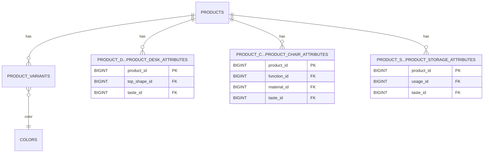
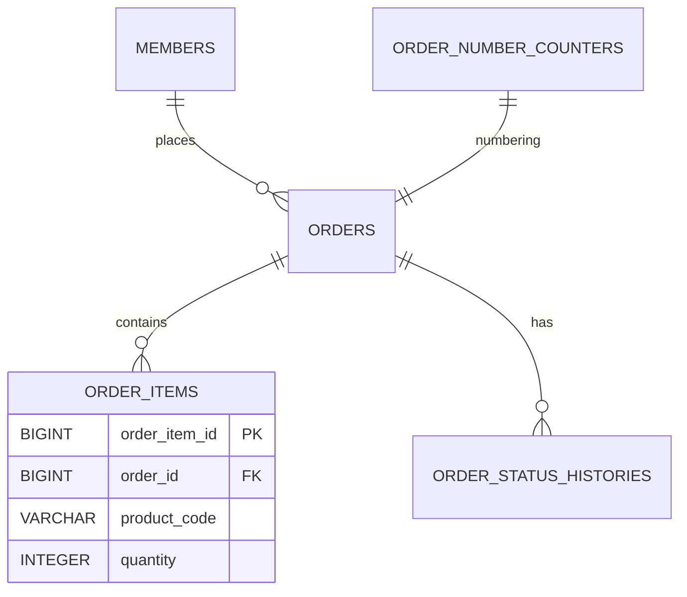
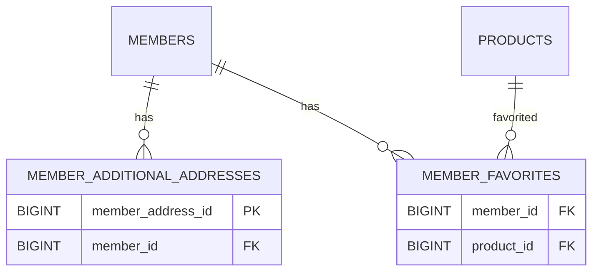
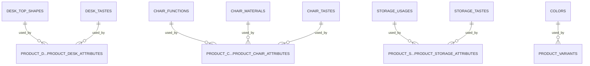

# ER 図（データベース設計）

このドキュメントは本プロジェクトで使用する主なデータベーステーブルの ER 図を Mermaid 記法で示します。
大きな図が見づらい場合に備え、ドメイン別の分割図も併記しています。

注意: 各テーブルの詳細なカラムや制約は `sql/schema/*.sql` に定義されています。ここでは主キー・外部キー中心に関係を示します。

---

## 全体（ハイレベル）

```mermaid
erDiagram
    PRODUCTS ||--o{ PRODUCT_VARIANTS : has
    PRODUCTS ||--o{ PRODUCT_DESK_ATTRIBUTES : has
    PRODUCTS ||--o{ PRODUCT_CHAIR_ATTRIBUTES : has
    PRODUCTS ||--o{ PRODUCT_STORAGE_ATTRIBUTES : has

    PRODUCT_VARIANTS }o--|| COLORS : color

    PRODUCTS ||--o{ MEMBER_FAVORITES : favorited_by
    MEMBERS ||--o{ MEMBER_FAVORITES : favorites

    MEMBERS ||--o{ MEMBER_ADDITIONAL_ADDRESSES : has

    ORDERS ||--o{ ORDER_ITEMS : contains
    ORDERS ||--o{ ORDER_STATUS_HISTORIES : has
    ORDERS }o--|| MEMBERS : placed_by

    PRODUCT_D...PRODUCT_DESK_ATTRIBUTES : "(see below)"
    PRODUCT_C...PRODUCT_CHAIR_ATTRIBUTES : "(see below)"
    PRODUCT_S...PRODUCT_STORAGE_ATTRIBUTES : "(see below)"

    %% マスタ群（簡略）
    DESK_TASTES ||--o{ PRODUCT_D...PRODUCT_DESK_ATTRIBUTES : referenced_by
    CHAIR_TASTES ||--o{ PRODUCT_C...PRODUCT_CHAIR_ATTRIBUTES : referenced_by
    STORAGE_TASTES ||--o{ PRODUCT_S...PRODUCT_STORAGE_ATTRIBUTES : referenced_by
    DESK_TOP_SHAPES ||--o{ PRODUCT_D...PRODUCT_DESK_ATTRIBUTES : referenced_by
    CHAIR_FUNCTIONS ||--o{ PRODUCT_C...PRODUCT_CHAIR_ATTRIBUTES : referenced_by
    CHAIR_MATERIALS ||--o{ PRODUCT_C...PRODUCT_CHAIR_ATTRIBUTES : referenced_by
    STORAGE_USAGES ||--o{ PRODUCT_S...PRODUCT_STORAGE_ATTRIBUTES : referenced_by

    %% 注文明細は製品コードを持つ（非参照整合性でアーカイブ）
    ORDER_ITEMS }o--|| PRODUCTS : references_by_code

    %% 補助テーブル
    ORDER_NUMBER_COUNTERS ||--|| ORDERS : generates

    PRODUCTS }|..|{ VARIATION_GROUPS : "variation grouping (logical)"
```

---

## ドメイン別（分割図）

### 1) Product ドメイン



### 2) Order ドメイン



### 3) Member ドメイン



### 4) Masters / Lookup ドメイン



---

## 備考

- `ORDER_ITEMS` は過去の明細を保持する目的で `product_code` / `product_name` / `color_name` をカラムとして持ち、常に `product_variants.product_code` を FK で参照するのではなくスナップショット保存する設計が取られています。
- `product_*_attributes` 系は各カテゴリ（desk/chair/storage）に専用テーブルを持ち、`products.product_id` を FK として 1:1 関係になっています。
- 詳細なカラム名や制約、インデックスは `sql/schema/*.sql` を参照してください。

---

ファイル: [docs/design/er-diagram.md](docs/design/er-diagram.md)
