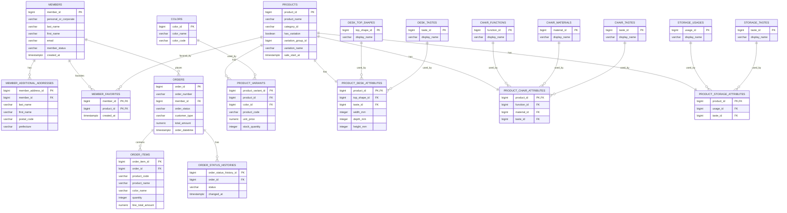

# ER図

以下は、本プロジェクトの主要なデータベース構造を Mermaid で表した ER 図です。

```mermaid
erDiagram
    MEMBERS ||--o{ MEMBER_ADDITIONAL_ADDRESSES : has
    MEMBERS ||--o{ MEMBER_FAVORITES : favorites
    MEMBERS ||--o{ ORDERS : places

    PRODUCTS ||--o{ PRODUCT_VARIANTS : has
    PRODUCTS ||--o{ MEMBER_FAVORITES : favored_by
    PRODUCTS ||--|| PRODUCT_DESK_ATTRIBUTES : has
    PRODUCTS ||--|| PRODUCT_CHAIR_ATTRIBUTES : has
    PRODUCTS ||--|| PRODUCT_STORAGE_ATTRIBUTES : has

    COLORS ||--o{ PRODUCT_VARIANTS : used_by

    DESK_TOP_SHAPES ||--o{ PRODUCT_DESK_ATTRIBUTES : used_by
    DESK_TASTES ||--o{ PRODUCT_DESK_ATTRIBUTES : used_by
    CHAIR_FUNCTIONS ||--o{ PRODUCT_CHAIR_ATTRIBUTES : used_by
    CHAIR_MATERIALS ||--o{ PRODUCT_CHAIR_ATTRIBUTES : used_by
    CHAIR_TASTES ||--o{ PRODUCT_CHAIR_ATTRIBUTES : used_by
    STORAGE_USAGES ||--o{ PRODUCT_STORAGE_ATTRIBUTES : used_by
    STORAGE_TASTES ||--o{ PRODUCT_STORAGE_ATTRIBUTES : used_by

    ORDERS ||--o{ ORDER_ITEMS : contains
    ORDERS ||--o{ ORDER_STATUS_HISTORIES : has

    MEMBERS {
        bigint member_id PK
        varchar personal_or_corporate
        varchar last_name
        varchar first_name
        varchar email
        varchar member_status
        timestamptz created_at
    }

    MEMBER_ADDITIONAL_ADDRESSES {
        bigint member_address_id PK
        bigint member_id FK
        varchar last_name
        varchar first_name
        varchar postal_code
        varchar prefecture
    }

    MEMBER_FAVORITES {
        bigint member_id PK, FK
        bigint product_id PK, FK
        timestamptz created_at
    }

    PRODUCTS {
        bigint product_id PK
        varchar product_name
        varchar category_id
        boolean has_variation
        bigint variation_group_id
        varchar variation_name
        timestamptz sale_start_at
    }

    PRODUCT_VARIANTS {
        bigint product_variant_id PK
        bigint product_id FK
        bigint color_id FK
        varchar product_code
        numeric unit_price
        integer stock_quantity
    }

    COLORS {
        bigint color_id PK
        varchar color_name
        varchar color_code
    }

    PRODUCT_DESK_ATTRIBUTES {
        bigint product_id PK, FK
        bigint top_shape_id FK
        bigint taste_id FK
        integer width_mm
        integer depth_mm
        integer height_mm
    }

    PRODUCT_CHAIR_ATTRIBUTES {
        bigint product_id PK, FK
        bigint function_id FK
        bigint material_id FK
        bigint taste_id FK
    }

    PRODUCT_STORAGE_ATTRIBUTES {
        bigint product_id PK, FK
        bigint usage_id FK
        bigint taste_id FK
    }

    DESK_TOP_SHAPES {
        bigint top_shape_id PK
        varchar display_name
    }

    DESK_TASTES {
        bigint taste_id PK
        varchar display_name
    }

    CHAIR_FUNCTIONS {
        bigint function_id PK
        varchar display_name
    }

    CHAIR_MATERIALS {
        bigint material_id PK
        varchar display_name
    }

    CHAIR_TASTES {
        bigint taste_id PK
        varchar display_name
    }

    STORAGE_USAGES {
        bigint usage_id PK
        varchar display_name
    }

    STORAGE_TASTES {
        bigint taste_id PK
        varchar display_name
    }

    ORDERS {
        bigint order_id PK
        varchar order_number
        bigint member_id FK
        varchar order_status
        varchar customer_type
        numeric total_amount
        timestamptz order_datetime
    }

    ORDER_ITEMS {
        bigint order_item_id PK
        bigint order_id FK
        varchar product_code
        varchar product_name
        varchar color_name
        integer quantity
        numeric line_total_amount
    }

    ORDER_STATUS_HISTORIES {
        bigint order_status_history_id PK
        bigint order_id FK
        varchar status
        timestamptz changed_at
    }
```

> 商品・会員・注文を中心に、マスタと属性テーブルを結びつける構成を表しています。
