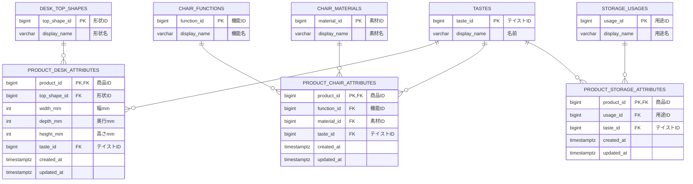
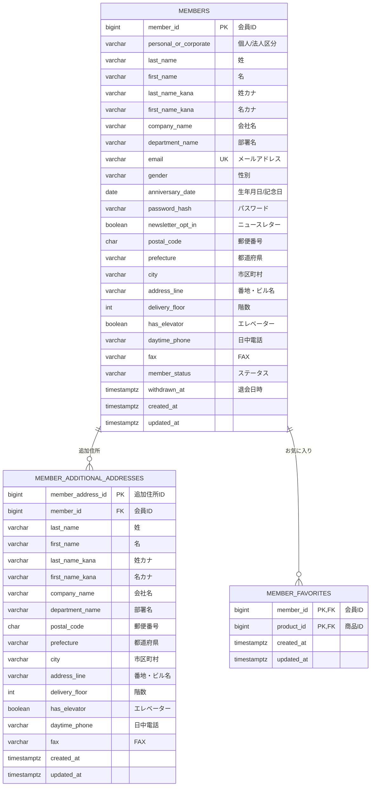
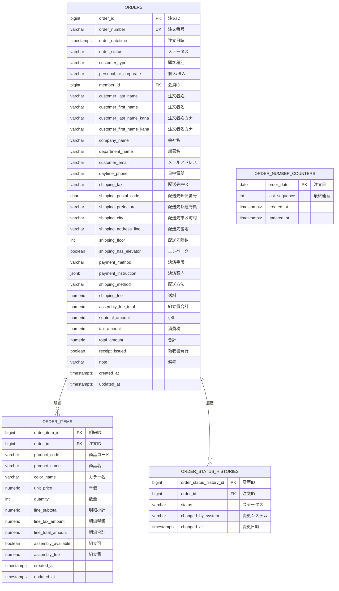
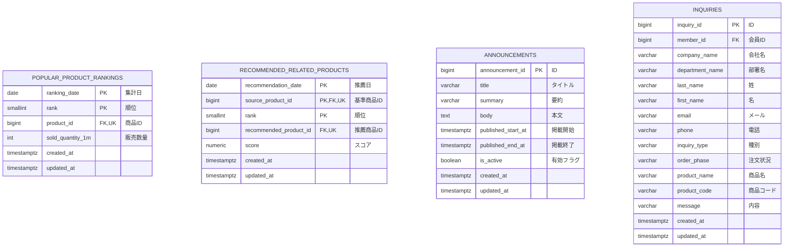

# ER図

## 全体図（関連性）

商品、会員、注文の主要リレーションシップ：

```mermaid
erDiagram
    PRODUCTS ||--o{ PRODUCT_VARIANTS : "has variants"
    PRODUCTS ||--o| PRODUCT_DESK_ATTRIBUTES : "desk"
    PRODUCTS ||--o| PRODUCT_CHAIR_ATTRIBUTES : "chair"
    PRODUCTS ||--o| PRODUCT_STORAGE_ATTRIBUTES : "storage"
    PRODUCTS ||--o{ MEMBER_FAVORITES : "favorited"
    PRODUCTS ||--o{ POPULAR_PRODUCT_RANKINGS : "ranked"
    PRODUCTS ||--o{ RECOMMENDED_RELATED_PRODUCTS : "recommended"
    COLORS ||--o{ PRODUCT_VARIANTS : "has"
    
    MEMBERS ||--o{ MEMBER_ADDITIONAL_ADDRESSES : "has"
    MEMBERS ||--o{ MEMBER_FAVORITES : "has"
    MEMBERS ||--o{ ORDERS : "places"
    MEMBERS ||--o{ INQUIRIES : "submits"
    
    ORDERS ||--o{ ORDER_ITEMS : "contains"
    ORDERS ||--o{ ORDER_STATUS_HISTORIES : "history"
    
    DESK_TOP_SHAPES ||--o{ PRODUCT_DESK_ATTRIBUTES : "shape"
    CHAIR_FUNCTIONS ||--o{ PRODUCT_CHAIR_ATTRIBUTES : "function"
    CHAIR_MATERIALS ||--o{ PRODUCT_CHAIR_ATTRIBUTES : "material"
    STORAGE_USAGES ||--o{ PRODUCT_STORAGE_ATTRIBUTES : "usage"
    TASTES ||--o{ PRODUCT_DESK_ATTRIBUTES : "taste"
    TASTES ||--o{ PRODUCT_CHAIR_ATTRIBUTES : "taste"
    TASTES ||--o{ PRODUCT_STORAGE_ATTRIBUTES : "taste"
```



## マスタテーブル

```mermaid
erDiagram
    COLORS {
        bigint color_id PK "カラーID"
        varchar color_name UK "カラー名"
        char color_code UK "カラーコード (#RRGGBB)"
        varchar swatch_type "色見本種別 (solid/transparent_pattern)"
        int sort_order "表示順"
        boolean is_active "有効フラグ"
        timestamptz created_at
        timestamptz updated_at
    }

    DESK_TOP_SHAPES {
        bigint top_shape_id PK "天板形状ID"
        varchar display_name UK "天板形状名"
        int sort_order "表示順"
        boolean is_active "有効フラグ"
        timestamptz created_at
        timestamptz updated_at
    }

    CHAIR_FUNCTIONS {
        bigint function_id PK "機能ID"
        varchar display_name UK "機能名"
        int sort_order "表示順"
        boolean is_active "有効フラグ"
        timestamptz created_at
        timestamptz updated_at
    }

    CHAIR_MATERIALS {
        bigint material_id PK "素材ID"
        varchar display_name UK "素材名"
        int sort_order "表示順"
        boolean is_active "有効フラグ"
        timestamptz created_at
        timestamptz updated_at
    }

    STORAGE_USAGES {
        bigint usage_id PK "用途ID"
        varchar display_name UK "用途名"
        int sort_order "表示順"
        boolean is_active "有効フラグ"
        timestamptz created_at
        timestamptz updated_at
    }

    TASTES {
        bigint taste_id PK "テイストID"
        varchar display_name UK "テイスト名"
        int sort_order "表示順"
        boolean is_active "有効フラグ"
        timestamptz created_at
        timestamptz updated_at
    }

    TAX_RATES {
        bigint tax_rate_id PK "消費税率ID"
        numeric tax_rate_percent "消費税率 (%)"
        timestamptz effective_start_at "適用開始日時"
        timestamptz effective_end_at "適用終了日時"
        boolean is_active "有効フラグ"
        timestamptz created_at
        timestamptz updated_at
    }
```



## 商品テーブル

```mermaid
erDiagram
    PRODUCTS {
        bigint product_id PK "商品ID"
        varchar product_name "商品名"
        varchar category_id "カテゴリID"
        text description "商品紹介文"
        boolean assembly_available "組立・設置可否"
        numeric assembly_fee "組立・設置費"
        boolean has_variation "バリエーション有無"
        bigint variation_group_id "グループID"
        varchar variation_name "バリエーション名"
        timestamptz sale_start_at "販売開始日時"
        timestamptz sale_end_at "販売終了日時"
        timestamptz created_at
        timestamptz updated_at
    }

    PRODUCT_VARIANTS {
        bigint product_variant_id PK "バリアントID"
        bigint product_id FK "商品ID"
        varchar product_code UK "商品コード"
        bigint color_id FK "カラーID"
        numeric unit_price "販売価格"
        int stock_quantity "在庫数"
        timestamptz created_at
        timestamptz updated_at
    }

    PRODUCT_DESK_ATTRIBUTES {
        bigint product_id PK,FK "商品ID"
        bigint top_shape_id FK "天板形状ID"
        int width_mm "幅 (mm)"
        int depth_mm "奥行 (mm)"
        int height_mm "高さ (mm)"
        bigint taste_id FK "テイストID"
        timestamptz created_at
        timestamptz updated_at
    }

    PRODUCT_CHAIR_ATTRIBUTES {
        bigint product_id PK,FK "商品ID"
        bigint function_id FK "機能ID"
        bigint material_id FK "素材ID"
        bigint taste_id FK "テイストID"
        timestamptz created_at
        timestamptz updated_at
    }

    PRODUCT_STORAGE_ATTRIBUTES {
        bigint product_id PK,FK "商品ID"
        bigint usage_id FK "用途ID"
        bigint taste_id FK "テイストID"
        timestamptz created_at
        timestamptz updated_at
    }

    COLORS {
        bigint color_id PK "カラーID"
        varchar color_name UK "カラー名"
        char color_code UK "カラーコード"
        varchar swatch_type "色見本種別"
        int sort_order "表示順"
        boolean is_active "有効フラグ"
        timestamptz created_at
        timestamptz updated_at
    }

    DESK_TOP_SHAPES {
        bigint top_shape_id PK "形状ID"
        varchar display_name UK "形状名"
        int sort_order "表示順"
        boolean is_active "有効フラグ"
        timestamptz created_at
        timestamptz updated_at
    }

    CHAIR_FUNCTIONS {
        bigint function_id PK "機能ID"
        varchar display_name UK "機能名"
        int sort_order "表示順"
        boolean is_active "有効フラグ"
        timestamptz created_at
        timestamptz updated_at
    }

    CHAIR_MATERIALS {
        bigint material_id PK "素材ID"
        varchar display_name UK "素材名"
        int sort_order "表示順"
        boolean is_active "有効フラグ"
        timestamptz created_at
        timestamptz updated_at
    }

    STORAGE_USAGES {
        bigint usage_id PK "用途ID"
        varchar display_name UK "用途名"
        int sort_order "表示順"
        boolean is_active "有効フラグ"
        timestamptz created_at
        timestamptz updated_at
    }

    TASTES {
        bigint taste_id PK "テイストID"
        varchar display_name UK "名前"
        int sort_order "表示順"
        boolean is_active "有効フラグ"
        timestamptz created_at
        timestamptz updated_at
    }

    PRODUCTS ||--o{ PRODUCT_VARIANTS : "variants"
    COLORS ||--o{ PRODUCT_VARIANTS : "色"
    PRODUCTS ||--o| PRODUCT_DESK_ATTRIBUTES : "デスク属性"
    PRODUCTS ||--o| PRODUCT_CHAIR_ATTRIBUTES : "チェア属性"
    PRODUCTS ||--o| PRODUCT_STORAGE_ATTRIBUTES : "収納属性"
```



## 商品・マスタ属性の関連



## 会員テーブル


```

## 注文テーブル



## 分析・コンテンツテーブル



---

## テーブル一覧

| グループ | テーブル名 | 論理名 |
|---|---|---|
| マスタ | `colors` | カラーマスタ |
| マスタ | `desk_top_shapes` | デスク天板形状マスタ |
| マスタ | `chair_functions` | チェア機能マスタ |
| マスタ | `chair_materials` | チェア素材マスタ |
| マスタ | `storage_usages` | 収納家具用途マスタ |
| マスタ | `tastes` | テイストマスタ（統合） |
| マスタ | `tax_rates` | 消費税率 |
| 商品 | `products` | 商品 |
| 商品 | `product_variants` | 商品バリアント |
| 商品 | `product_desk_attributes` | 商品デスク属性 |
| 商品 | `product_chair_attributes` | 商品チェア属性 |
| 商品 | `product_storage_attributes` | 商品収納家具属性 |
| 会員 | `members` | 会員 |
| 会員 | `member_additional_addresses` | 会員追加お届け先 |
| 会員 | `member_favorites` | 会員お気に入り |
| 注文 | `orders` | 注文 |
| 注文 | `order_items` | 注文明細 |
| 注文 | `order_status_histories` | 注文ステータス履歴 |
| 注文 | `order_number_counters` | 注文番号採番カウンタ |
| バッチ/分析 | `popular_product_rankings` | 売れ筋ランキング |
| バッチ/分析 | `recommended_related_products` | おすすめ関連商品 |
| コンテンツ | `announcements` | お知らせ |
| コンテンツ | `inquiries` | お問い合わせ |

## 設計上の補足

- **`order_items` は注文時スナップショット**: 商品名・カラー名・単価は注文確定時点の値を直接保持し、`products` / `product_variants` への FK は持たない。
- **`orders.member_id` は `SET NULL`**: 会員退会時でも注文レコードは保持される。`customer_type = 'member'` かつ `member_id IS NOT NULL` の整合は CHECK 制約で保証。
- **`order_number_counters` はスタンドアロン**: 注文番号の日別連番管理テーブル。`orders` や他テーブルとの FK は持たない。
- **`tastes` は共通マスタ**: デスク・チェア・収納家具の3カテゴリ属性テーブル（`product_*_attributes`）から共通して参照される。
- **`product_*_attributes` の PK は `products.product_id` と同値**: 1対1（PK共有）の識別リレーションシップ。
- **`recommended_related_products` の `products` への FK は2本**: `source_product_id`（基準商品）と `recommended_product_id`（推薦商品）がそれぞれ `products` を参照する。
