# ER図

以下は、schema 配下の SQL 定義を基準に、実装されているテーブル構造を整理した ER 図です。外部キーが明示されている関係のみを記載しています。未確認の関係は「未確認」としています。

```mermaid
erDiagram
    MEMBERS ||--o{ MEMBER_ADDITIONAL_ADDRESSES : has
    MEMBERS ||--o{ MEMBER_FAVORITES : has
    MEMBERS ||--o{ INQUIRIES : makes
    MEMBERS ||--o{ ORDERS : places

    PRODUCTS ||--o{ MEMBER_FAVORITES : favorited_by
    PRODUCTS ||--o{ PRODUCT_VARIANTS : has
    PRODUCTS ||--o| PRODUCT_DESK_ATTRIBUTES : has
    PRODUCTS ||--o| PRODUCT_CHAIR_ATTRIBUTES : has
    PRODUCTS ||--o| PRODUCT_STORAGE_ATTRIBUTES : has
    PRODUCTS ||--o{ POPULAR_PRODUCT_RANKINGS : ranked_in
    PRODUCTS ||--o{ RECOMMENDED_RELATED_PRODUCTS : source_product
    PRODUCTS ||--o{ RECOMMENDED_RELATED_PRODUCTS : recommended_product

    COLORS ||--o{ PRODUCT_VARIANTS : used_by

    DESK_TOP_SHAPES ||--o{ PRODUCT_DESK_ATTRIBUTES : used_by
    DESK_TASTES ||--o{ PRODUCT_DESK_ATTRIBUTES : used_by

    CHAIR_FUNCTIONS ||--o{ PRODUCT_CHAIR_ATTRIBUTES : used_by
    CHAIR_MATERIALS ||--o{ PRODUCT_CHAIR_ATTRIBUTES : used_by
    CHAIR_TASTES ||--o{ PRODUCT_CHAIR_ATTRIBUTES : used_by

    STORAGE_USAGES ||--o{ PRODUCT_STORAGE_ATTRIBUTES : used_by
    STORAGE_TASTES ||--o{ PRODUCT_STORAGE_ATTRIBUTES : used_by

    ORDERS ||--o{ ORDER_ITEMS : contains
    ORDERS ||--o{ ORDER_STATUS_HISTORIES : has

    MEMBERS {
        bigint member_id PK
        varchar personal_or_corporate
        varchar last_name
        varchar first_name
        varchar last_name_kana
        varchar first_name_kana
        varchar company_name
        varchar department_name
        varchar email
        varchar gender
        date anniversary_date
        varchar password_hash
        boolean newsletter_opt_in
        char postal_code
        varchar prefecture
        varchar city
        varchar address_line
        integer delivery_floor
        boolean has_elevator
        varchar daytime_phone
        varchar fax
        varchar member_status
        timestamptz withdrawn_at
        timestamptz created_at
        timestamptz updated_at
    }

    MEMBER_ADDITIONAL_ADDRESSES {
        bigint member_address_id PK
        bigint member_id FK
        varchar last_name
        varchar first_name
        varchar last_name_kana
        varchar first_name_kana
        varchar company_name
        varchar department_name
        char postal_code
        varchar prefecture
        varchar city
        varchar address_line
        integer delivery_floor
        boolean has_elevator
        varchar daytime_phone
        varchar fax
        timestamptz created_at
        timestamptz updated_at
    }

    MEMBER_FAVORITES {
        bigint member_id PK,FK
        bigint product_id PK,FK
        timestamptz created_at
        timestamptz updated_at
    }

    COLORS {
        bigint color_id PK
        varchar color_name
        char color_code
        varchar swatch_type
        integer sort_order
        boolean is_active
        timestamptz created_at
        timestamptz updated_at
    }

    PRODUCTS {
        bigint product_id PK
        varchar product_name
        varchar category_id
        text description
        boolean assembly_available
        numeric assembly_fee
        boolean has_variation
        bigint variation_group_id
        varchar variation_name
        timestamptz sale_start_at
        timestamptz sale_end_at
        timestamptz created_at
        timestamptz updated_at
    }

    PRODUCT_VARIANTS {
        bigint product_variant_id PK
        bigint product_id FK
        varchar product_code
        bigint color_id FK
        numeric unit_price
        integer stock_quantity
        timestamptz created_at
        timestamptz updated_at
    }

    DESK_TOP_SHAPES {
        bigint top_shape_id PK
        varchar display_name
        integer sort_order
        boolean is_active
        timestamptz created_at
        timestamptz updated_at
    }

    DESK_TASTES {
        bigint taste_id PK
        varchar display_name
        integer sort_order
        boolean is_active
        timestamptz created_at
        timestamptz updated_at
    }

    PRODUCT_DESK_ATTRIBUTES {
        bigint product_id PK,FK
        bigint top_shape_id FK
        integer width_mm
        integer depth_mm
        integer height_mm
        bigint taste_id FK
        timestamptz created_at
        timestamptz updated_at
    }

    CHAIR_FUNCTIONS {
        bigint function_id PK
        varchar display_name
        integer sort_order
        boolean is_active
        timestamptz created_at
        timestamptz updated_at
    }

    CHAIR_MATERIALS {
        bigint material_id PK
        varchar display_name
        integer sort_order
        boolean is_active
        timestamptz created_at
        timestamptz updated_at
    }

    CHAIR_TASTES {
        bigint taste_id PK
        varchar display_name
        integer sort_order
        boolean is_active
        timestamptz created_at
        timestamptz updated_at
    }

    PRODUCT_CHAIR_ATTRIBUTES {
        bigint product_id PK,FK
        bigint function_id FK
        bigint material_id FK
        bigint taste_id FK
        timestamptz created_at
        timestamptz updated_at
    }

    STORAGE_USAGES {
        bigint usage_id PK
        varchar display_name
        integer sort_order
        boolean is_active
        timestamptz created_at
        timestamptz updated_at
    }

    STORAGE_TASTES {
        bigint taste_id PK
        varchar display_name
        integer sort_order
        boolean is_active
        timestamptz created_at
        timestamptz updated_at
    }

    PRODUCT_STORAGE_ATTRIBUTES {
        bigint product_id PK,FK
        bigint usage_id FK
        bigint taste_id FK
        timestamptz created_at
        timestamptz updated_at
    }

    ANNOUNCEMENTS {
        bigint announcement_id PK
        varchar title
        varchar summary
        text body
        timestamptz published_start_at
        timestamptz published_end_at
        boolean is_active
        timestamptz created_at
        timestamptz updated_at
    }

    INQUIRIES {
        bigint inquiry_id PK
        bigint member_id FK
        varchar company_name
        varchar department_name
        varchar last_name
        varchar first_name
        varchar email
        varchar phone
        varchar inquiry_type
        varchar order_phase
        varchar product_name
        varchar product_code
        varchar message
        timestamptz created_at
        timestamptz updated_at
    }

    ORDERS {
        bigint order_id PK
        varchar order_number
        timestamptz order_datetime
        varchar order_status
        varchar customer_type
        varchar personal_or_corporate
        bigint member_id FK
        varchar customer_last_name
        varchar customer_first_name
        varchar customer_last_name_kana
        varchar customer_first_name_kana
        varchar company_name
        varchar department_name
        varchar customer_email
        varchar daytime_phone
        varchar shipping_fax
        char shipping_postal_code
        varchar shipping_prefecture
        varchar shipping_city
        varchar shipping_address_line
        integer shipping_floor
        boolean shipping_has_elevator
        varchar payment_method
        jsonb payment_instruction
        varchar shipping_method
        numeric shipping_fee
        numeric assembly_fee_total
        numeric subtotal_amount
        numeric tax_amount
        numeric total_amount
        boolean receipt_issued
        varchar note
        timestamptz created_at
        timestamptz updated_at
    }

    ORDER_NUMBER_COUNTERS {
        date order_date PK
        integer last_sequence
        timestamptz created_at
        timestamptz updated_at
    }

    ORDER_ITEMS {
        bigint order_item_id PK
        bigint order_id FK
        varchar product_code
        varchar product_name
        varchar color_name
        numeric unit_price
        integer quantity
        numeric line_subtotal
        numeric line_tax_amount
        numeric line_total_amount
        boolean assembly_available
        numeric assembly_fee
        timestamptz created_at
        timestamptz updated_at
    }

    ORDER_STATUS_HISTORIES {
        bigint order_status_history_id PK
        bigint order_id FK
        varchar status
        varchar changed_by_system
        timestamptz changed_at
    }

    TAX_RATES {
        bigint tax_rate_id PK
        numeric tax_rate_percent
        timestamptz effective_start_at
        timestamptz effective_end_at
        boolean is_active
        timestamptz created_at
        timestamptz updated_at
    }

    POPULAR_PRODUCT_RANKINGS {
        date ranking_date PK
        smallint rank PK
        bigint product_id FK
        integer sold_quantity_1m
        timestamptz created_at
        timestamptz updated_at
    }

    RECOMMENDED_RELATED_PRODUCTS {
        date recommendation_date PK
        bigint source_product_id PK,FK
        smallint rank PK
        bigint recommended_product_id FK
        numeric score
        timestamptz created_at
        timestamptz updated_at
    }
```

## 補足
- `members` と `member_additional_addresses` は 1対多の関係です。
- `members` と `products` は `member_favorites` を介して多対多の関係です。
- `products` と `product_variants` は 1対多の関係です。
- `products` と各カテゴリ属性テーブルは 1対1の関係です。
- `orders` と `order_items`、`order_status_histories` はそれぞれ 1対多の関係です。
- `recommended_related_products` は `products` を基準商品・推薦商品として参照する自己参照・関連テーブルです。
