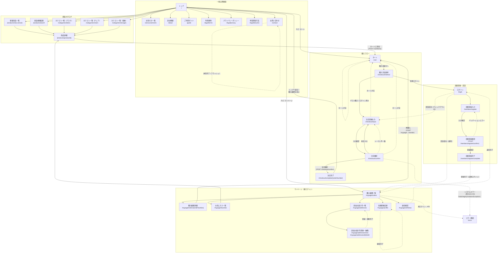

# 画面遷移図

## 凡例

```
[画面名]   : 画面（ページ）
-->        : 画面遷移（ユーザー操作）
-.->       : リダイレクト（条件分岐による自動遷移）
```

---

## 遷移図



---

## フロー別サマリー

### 購入フロー（ゲスト）

```
商品詳細 → カートに追加 → カート → 購入方法選択
  → ゲスト購入を選択 → 注文情報入力 → 注文確認 → 注文完了
```

### 購入フロー（会員）

```
商品詳細 → カートに追加 → カート → 購入方法選択
  → ログイン → 注文情報入力（会員情報を自動反映） → 注文確認 → 注文完了
```

### 会員登録フロー

```
ログイン画面から登録リンク → 会員登録入力 → 会員登録確認
  → 登録確定（自動ログイン） → 購入履歴一覧（マイページ）
```

### マイページ操作フロー

```
ログイン → 購入履歴一覧（マイページ起点）
  ├─ 購入履歴詳細 → 再購入 → カート
  ├─ お気に入り一覧 → 商品詳細
  ├─ 会員情報変更
  ├─ 追加お届け先一覧 → 登録・編集
  └─ 退会確認 → 退会完了 → ログイン
```

### チェックアウト中のガード遷移

| 条件                                          | 遷移先                                                   |
| --------------------------------------------- | -------------------------------------------------------- |
| `购入方法選択` アクセス時にカートが空         | `/cart` へリダイレクト                                   |
| `注文情報入力` アクセス時にカートが空         | `/cart` へリダイレクト                                   |
| `注文確認` アクセス時にセッションフォームなし | `/checkout/input` へリダイレクト                         |
| `注文確認` POSTでトークン不一致               | `/checkout/input` へリダイレクト（エラーメッセージ付き） |
| `注文確定` でビジネスエラー（在庫切れ等）     | `/checkout/input` へリダイレクト（エラーメッセージ付き） |
| `注文確定` でシステムエラー                   | エラー画面（500）                                        |
