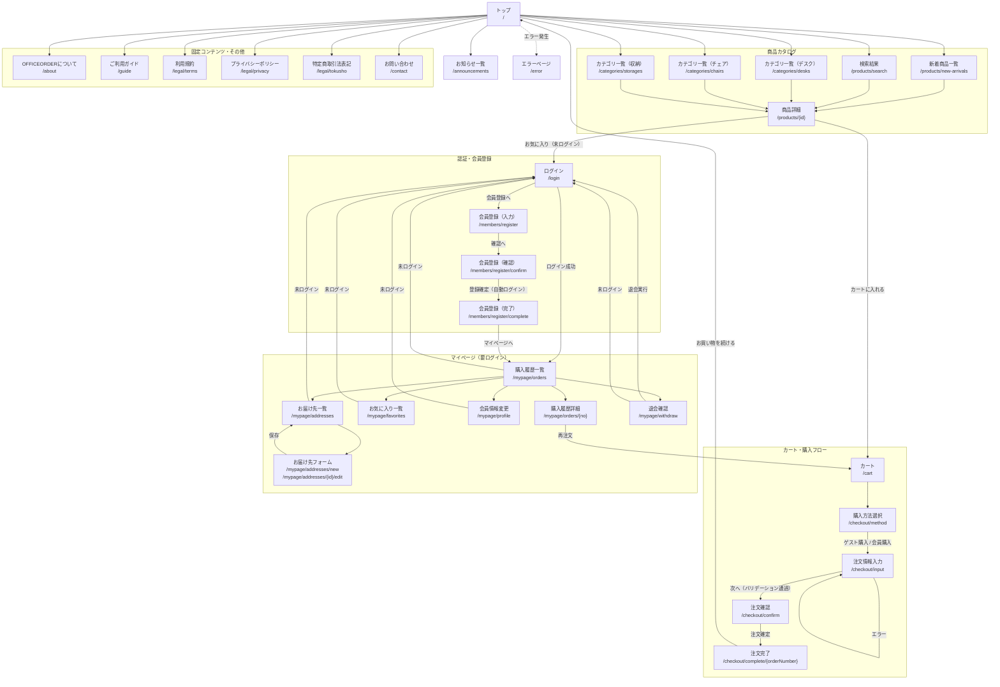
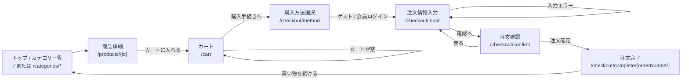
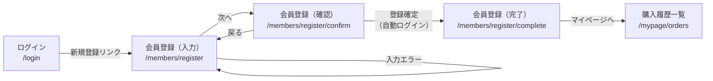
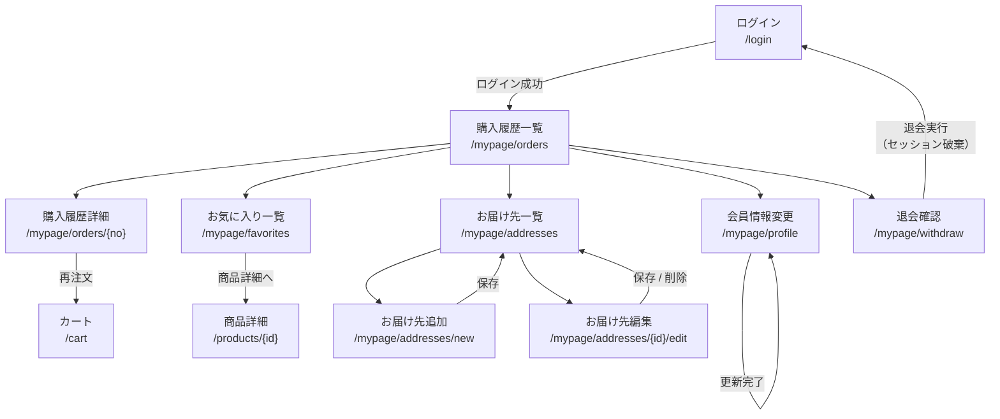
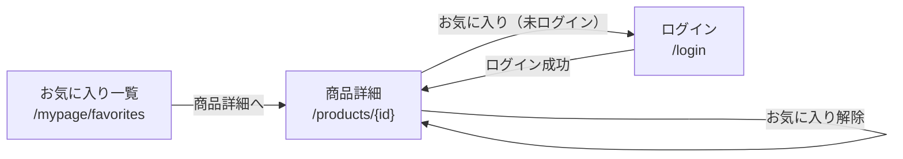
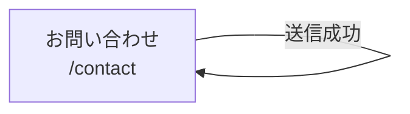
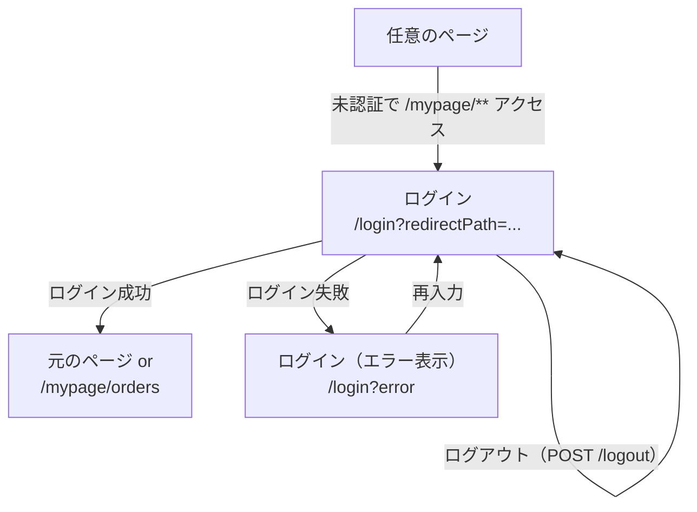

# 画面遷移図

## 全体フロー概要

```mermaid
flowchart TD
    TOP["トップ\n/"]
    ANNOUNCE["お知らせ一覧\n/announcements"]

    subgraph CATALOG["商品カタログ"]
        NEW_ARRIVALS["新着商品一覧\n/products/new-arrivals"]
        SEARCH["検索結果\n/products/search"]
        CAT_DESK["カテゴリ一覧（デスク）\n/categories/desks"]
        CAT_CHAIR["カテゴリ一覧（チェア）\n/categories/chairs"]
        CAT_STORAGE["カテゴリ一覧（収納）\n/categories/storages"]
        PRODUCT_DETAIL["商品詳細\n/products/{id}"]
    end

    subgraph CART_FLOW["カート・購入フロー"]
        CART["カート\n/cart"]
        CHECKOUT_METHOD["購入方法選択\n/checkout/method"]
        CHECKOUT_INPUT["注文情報入力\n/checkout/input"]
        CHECKOUT_CONFIRM["注文確認\n/checkout/confirm"]
        CHECKOUT_COMPLETE["注文完了\n/checkout/complete/{orderNumber}"]
    end

    subgraph AUTH["認証・会員登録"]
        LOGIN["ログイン\n/login"]
        REGISTER["会員登録（入力）\n/members/register"]
        REGISTER_CONFIRM["会員登録（確認）\n/members/register/confirm"]
        REGISTER_COMPLETE["会員登録（完了）\n/members/register/complete"]
    end

    subgraph MYPAGE["マイページ（要ログイン）"]
        ORDERS_LIST["購入履歴一覧\n/mypage/orders"]
        ORDER_DETAIL["購入履歴詳細\n/mypage/orders/{no}"]
        FAVORITES["お気に入り一覧\n/mypage/favorites"]
        PROFILE["会員情報変更\n/mypage/profile"]
        ADDRESSES["お届け先一覧\n/mypage/addresses"]
        ADDRESS_FORM["お届け先フォーム\n/mypage/addresses/new\n/mypage/addresses/{id}/edit"]
        WITHDRAW["退会確認\n/mypage/withdraw"]
    end

    subgraph CONTENT["固定コンテンツ・その他"]
        ABOUT["OFFICEORDERについて\n/about"]
        GUIDE["ご利用ガイド\n/guide"]
        TERMS["利用規約\n/legal/terms"]
        PRIVACY["プライバシーポリシー\n/legal/privacy"]
        TOKUSHO["特定商取引法表記\n/legal/tokusho"]
        CONTACT["お問い合わせ\n/contact"]
    end

    ERROR["エラーページ\n/error"]

    %% トップからの遷移
    TOP --> ANNOUNCE
    TOP --> NEW_ARRIVALS
    TOP --> CAT_DESK
    TOP --> CAT_CHAIR
    TOP --> CAT_STORAGE
    TOP --> SEARCH

    %% カタログ内の遷移
    NEW_ARRIVALS --> PRODUCT_DETAIL
    SEARCH --> PRODUCT_DETAIL
    CAT_DESK --> PRODUCT_DETAIL
    CAT_CHAIR --> PRODUCT_DETAIL
    CAT_STORAGE --> PRODUCT_DETAIL

    %% 商品詳細からカートへ
    PRODUCT_DETAIL -->|"カートに入れる"| CART
    PRODUCT_DETAIL -->|"お気に入り（未ログイン）"| LOGIN

    %% カート〜購入完了
    CART --> CHECKOUT_METHOD
    CHECKOUT_METHOD -->|"ゲスト購入 / 会員購入"| CHECKOUT_INPUT
    CHECKOUT_INPUT -->|"次へ（バリデーション通過）"| CHECKOUT_CONFIRM
    CHECKOUT_INPUT -->|"エラー"| CHECKOUT_INPUT
    CHECKOUT_CONFIRM -->|"注文確定"| CHECKOUT_COMPLETE
    CHECKOUT_COMPLETE -->|"お買い物を続ける"| TOP

    %% ログイン・登録
    LOGIN -->|"ログイン成功"| ORDERS_LIST
    LOGIN -->|"会員登録へ"| REGISTER
    REGISTER -->|"確認へ"| REGISTER_CONFIRM
    REGISTER_CONFIRM -->|"登録確定（自動ログイン）"| REGISTER_COMPLETE
    REGISTER_COMPLETE -->|"マイページへ"| ORDERS_LIST

    %% マイページ内遷移
    ORDERS_LIST --> ORDER_DETAIL
    ORDER_DETAIL -->|"再注文"| CART
    ORDERS_LIST --> FAVORITES
    ORDERS_LIST --> PROFILE
    ORDERS_LIST --> ADDRESSES
    ADDRESSES --> ADDRESS_FORM
    ADDRESS_FORM -->|"保存"| ADDRESSES
    ORDERS_LIST --> WITHDRAW
    WITHDRAW -->|"退会実行"| LOGIN

    %% 未認証 → ログイン
    ORDERS_LIST -->|"未ログイン"| LOGIN
    FAVORITES -->|"未ログイン"| LOGIN
    PROFILE -->|"未ログイン"| LOGIN
    ADDRESSES -->|"未ログイン"| LOGIN
    WITHDRAW -->|"未ログイン"| LOGIN

    %% フッターリンク
    TOP --> ABOUT
    TOP --> GUIDE
    TOP --> TERMS
    TOP --> PRIVACY
    TOP --> TOKUSHO
    TOP --> CONTACT

    %% エラー
    TOP -.->|"エラー発生"| ERROR
```

---

## 商品閲覧〜カート〜購入完了フロー

```mermaid
flowchart LR
    A["トップ / カテゴリ一覧\n/ または /categories/*"] --> B["商品詳細\n/products/{id}"]
    B -->|"カートに入れる"| C["カート\n/cart"]
    C -->|"カートが空"| C
    C -->|"購入手続きへ"| D["購入方法選択\n/checkout/method"]
    D -->|"ゲスト / 会員ログイン"| E["注文情報入力\n/checkout/input"]
    E -->|"入力エラー"| E
    E -->|"確認へ"| F["注文確認\n/checkout/confirm"]
    F -->|"戻る"| E
    F -->|"注文確定"| G["注文完了\n/checkout/complete/{orderNumber}"]
    G -->|"買い物を続ける"| A
```

---

## 会員登録フロー

```mermaid
flowchart LR
    A["ログイン\n/login"] -->|"新規登録リンク"| B["会員登録（入力）\n/members/register"]
    B -->|"入力エラー"| B
    B -->|"次へ"| C["会員登録（確認）\n/members/register/confirm"]
    C -->|"戻る"| B
    C -->|"登録確定\n（自動ログイン）"| D["会員登録（完了）\n/members/register/complete"]
    D -->|"マイページへ"| E["購入履歴一覧\n/mypage/orders"]
```

---

## マイページフロー（要ログイン）

```mermaid
flowchart TD
    LOGIN["ログイン\n/login"] -->|"ログイン成功"| ORDERS["購入履歴一覧\n/mypage/orders"]

    ORDERS --> ORDER_DETAIL["購入履歴詳細\n/mypage/orders/{no}"]
    ORDER_DETAIL -->|"再注文"| CART["カート\n/cart"]

    ORDERS --> FAVORITES["お気に入り一覧\n/mypage/favorites"]
    FAVORITES -->|"商品詳細へ"| PRODUCT["商品詳細\n/products/{id}"]

    ORDERS --> PROFILE["会員情報変更\n/mypage/profile"]
    PROFILE -->|"更新完了"| PROFILE

    ORDERS --> ADDRESSES["お届け先一覧\n/mypage/addresses"]
    ADDRESSES --> ADDR_NEW["お届け先追加\n/mypage/addresses/new"]
    ADDRESSES --> ADDR_EDIT["お届け先編集\n/mypage/addresses/{id}/edit"]
    ADDR_NEW -->|"保存"| ADDRESSES
    ADDR_EDIT -->|"保存 / 削除"| ADDRESSES

    ORDERS --> WITHDRAW["退会確認\n/mypage/withdraw"]
    WITHDRAW -->|"退会実行\n（セッション破棄）"| LOGIN
```

---

## お気に入りフロー

```mermaid
flowchart LR
    A["商品詳細\n/products/{id}"]
    A -->|"お気に入り（ログイン済み）"| A
    A -->|"お気に入り（未ログイン）"| B["ログイン\n/login"]
    B -->|"ログイン成功"| A
    C["お気に入り一覧\n/mypage/favorites"] -->|"商品詳細へ"| A
    A -->|"お気に入り解除"| A
```

---

## お問い合わせフロー

```mermaid
flowchart LR
    A["お問い合わせ\n/contact"] -->|"入力エラー"| A
    A -->|"送信成功"| A
```

---

## 認証フロー（ログイン・ログアウト）

```mermaid
flowchart TD
    ANY["任意のページ"] -->|"未認証で /mypage/** アクセス"| LOGIN["ログイン\n/login?redirectPath=..."]
    LOGIN -->|"ログイン成功"| REDIRECT["元のページ or\n/mypage/orders"]
    LOGIN -->|"ログイン失敗"| LOGIN_ERROR["ログイン（エラー表示）\n/login?error"]
    LOGIN_ERROR -->|"再入力"| LOGIN
    LOGIN -->|"ログアウト（POST /logout）"| LOGIN
```
