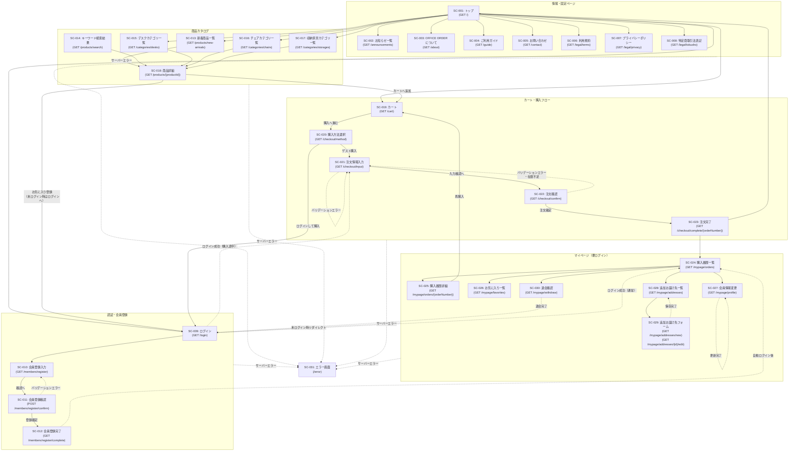

# 画面遷移図

本ドキュメントはシステムの主要な画面遷移を Mermaid 記法で表したものです。
各画面の詳細は [screen-list.md](./screen-list.md) を参照してください。

---

## 凡例

| 矢印の種類 | 意味 |
|-----------|------|
| `A --> B` | 通常のページ遷移（リンク・ボタン押下） |
| `A -- ラベル --> B` | ラベル付き通常遷移 |
| `A -.-> B` | リダイレクト遷移（POST後のリダイレクト、条件付き遷移） |
| `A -. ラベル .-> B` | ラベル付きリダイレクト遷移 |

---

## 画面遷移図

---

## 補足

### 全画面共通のグローバルナビゲーション

ヘッダー・フッターから以下の遷移が全画面より可能ですが、図の簡潔さのため省略しています。

| 遷移元 | 遷移先 |
|--------|--------|
| 任意の画面（ヘッダーロゴ） | SC-001: トップ (`/`) |
| 任意の画面（ヘッダー検索フォーム） | SC-014: キーワード検索結果 (`/products/search?q=...`) |
| 任意の画面（ヘッダーカートアイコン） | SC-019: カート (`/cart`) |
| 任意の画面（ヘッダーログインリンク） | SC-009: ログイン (`/login`) |
| ログイン済み・任意の画面（ヘッダーマイページリンク） | SC-024: 購入履歴一覧 (`/mypage/orders`) |
| 任意の画面（フッター各リンク） | SC-003〜SC-008: 各固定コンテンツページ |

### 購入方法選択画面（SC-020）のログインフォーム

SC-020（購入方法選択）には、ログインフォームが埋め込まれています。
このフォームから会員ログインを行うと、Spring Security により `/checkout/input` へリダイレクトされます（`checkoutRedirectPath` セッション属性による制御）。

### マイページの未認証アクセス

`/mypage/**` への未認証アクセス時は、`requireLoginMember()` が HTTP 401 をスローし、
Spring Security のエラーハンドリングにより SC-009（ログイン画面）へリダイレクトされます。
