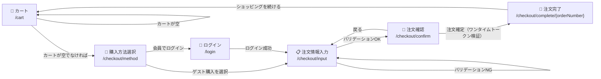
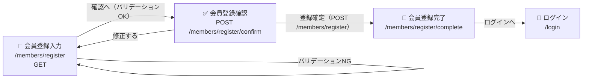
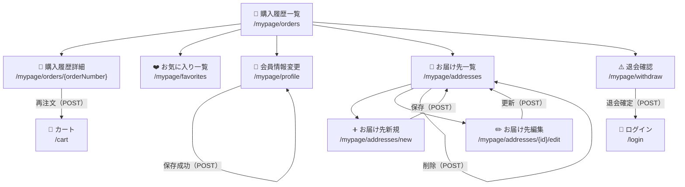

# 画面遷移図

> 最終更新: 2026-04-18（★CUSTOM-001 お薦め機能対応）

## 全体遷移図

```mermaid
flowchart TD
    %% ========== 共通 ==========
    TOP["🏠 トップ\n/"]
    ANNOUNCE["📢 お知らせ一覧\n/announcements"]
    CONTACT["✉️ お問い合わせ\n/contact"]
    ABOUT["ℹ️ OFFICE ORDER について\n/about"]
    GUIDE["📖 ご利用ガイド\n/guide"]
    LEGAL_TERMS["📄 利用規約\n/legal/terms"]
    LEGAL_PRIVACY["📄 プライバシーポリシー\n/legal/privacy"]
    LEGAL_TOKUSHO["📄 特定商取引法に基づく表記\n/legal/tokusho"]

    %% ========== 商品カタログ ==========
    SEARCH["🔍 キーワード検索結果\n/products/search"]
    NEW_ARRIVALS["🆕 新着商品一覧\n/products/new-arrivals"]
    CAT_DESK["🖥️ デスク一覧\n/categories/desks"]
    CAT_CHAIR["🪑 チェア一覧\n/categories/chairs"]
    CAT_STORAGE["🗄️ 収納家具一覧\n/categories/storages"]
    PRODUCT_DETAIL["📦 商品詳細\n/products/{productId}"]

    %% ========== 認証・会員登録 ==========
    LOGIN["🔑 ログイン\n/login"]
    REG_INPUT["📝 会員登録入力\n/members/register"]
    REG_CONFIRM["✅ 会員登録確認\n（POST /members/register/confirm のビュー）"]
    REG_COMPLETE["🎉 会員登録完了\n/members/register/complete"]

    %% ========== カート・購入フロー ==========
    CART["🛒 カート\n/cart"]
    CHECKOUT_METHOD["🤔 購入方法選択\n/checkout/method"]
    CHECKOUT_INPUT["📋 注文情報入力\n/checkout/input"]
    CHECKOUT_CONFIRM["🧾 注文確認\n/checkout/confirm"]
    CHECKOUT_COMPLETE["🎊 注文完了\n/checkout/complete/{orderNumber}"]

    %% ========== マイページ ==========
    MYPAGE_ORDERS["📜 購入履歴一覧\n/mypage/orders"]
    MYPAGE_ORDER_DETAIL["🔎 購入履歴詳細\n/mypage/orders/{orderNumber}"]
    MYPAGE_FAVORITES["❤️ お気に入り一覧\n/mypage/favorites"]
    MYPAGE_PROFILE["👤 会員情報変更\n/mypage/profile"]
    MYPAGE_ADDRESSES["📍 お届け先一覧\n/mypage/addresses"]
    MYPAGE_ADDR_NEW["➕ お届け先新規登録\n/mypage/addresses/new"]
    MYPAGE_ADDR_EDIT["✏️ お届け先編集\n/mypage/addresses/{id}/edit"]
    MYPAGE_WITHDRAW["⚠️ 退会確認\n/mypage/withdraw"]

    %% ========== エラー ==========
    ERROR["🚫 エラー画面\n/error"]

    %% ========== トップからの主要遷移 ==========
    TOP --> ANNOUNCE
    TOP --> SEARCH
    TOP --> NEW_ARRIVALS
    TOP --> CAT_DESK
    TOP --> CAT_CHAIR
    TOP --> CAT_STORAGE
    TOP --> CART
    TOP --> ABOUT
    TOP --> GUIDE
    TOP --> CONTACT
    TOP --> LEGAL_TERMS
    TOP --> LEGAL_PRIVACY
    TOP --> LEGAL_TOKUSHO
    TOP -- "★超マジお薦めクリック\n会員ログイン時のみ(CUSTOM-001)" --> PRODUCT_DETAIL

    %% ========== 商品カタログ ==========
    SEARCH --> PRODUCT_DETAIL
    NEW_ARRIVALS --> PRODUCT_DETAIL
    CAT_DESK --> PRODUCT_DETAIL
    CAT_CHAIR --> PRODUCT_DETAIL
    CAT_STORAGE --> PRODUCT_DETAIL

    PRODUCT_DETAIL -- "カートに追加 (POST)" --> CART
    PRODUCT_DETAIL -- "お気に入り (POST)\n未ログイン時" --> LOGIN
    PRODUCT_DETAIL -- "お気に入り (POST)\nログイン中" --> PRODUCT_DETAIL
    PRODUCT_DETAIL -- "★関連商品クリック\n(CUSTOM-001)" --> PRODUCT_DETAIL

    %% ========== カート・購入フロー ==========
    CART -- "購入手続きへ" --> CHECKOUT_METHOD
    CART -- "★クロスセル商品クリック\n(CUSTOM-001)" --> PRODUCT_DETAIL
    CHECKOUT_METHOD -- "ゲスト購入" --> CHECKOUT_INPUT
    CHECKOUT_METHOD -- "会員ログインへ" --> LOGIN
    LOGIN -- "ログイン成功\n（checkout経由）" --> CHECKOUT_INPUT
    CHECKOUT_INPUT -- "次へ（バリデーションOK）" --> CHECKOUT_CONFIRM
    CHECKOUT_INPUT -- "バリデーションNG" --> CHECKOUT_INPUT
    CHECKOUT_CONFIRM -- "注文確定 (POST)" --> CHECKOUT_COMPLETE
    CHECKOUT_CONFIRM -- "内容を修正" --> CHECKOUT_INPUT
    CHECKOUT_COMPLETE -- "続けて購入" --> TOP

    %% ========== 認証・会員登録 ==========
    LOGIN -- "ログイン成功\n（通常）" --> MYPAGE_ORDERS
    LOGIN -- "新規会員登録へ" --> REG_INPUT
    REG_INPUT -- "確認へ (バリデーションOK)" --> REG_CONFIRM
    REG_INPUT -- "バリデーションNG" --> REG_INPUT
    REG_CONFIRM -- "登録確定 (POST)" --> REG_COMPLETE
    REG_CONFIRM -- "戻る" --> REG_INPUT
    REG_COMPLETE -- "ログインへ" --> LOGIN

    %% ========== マイページ ==========
    MYPAGE_ORDERS --> MYPAGE_ORDER_DETAIL
    MYPAGE_ORDER_DETAIL -- "再注文 (POST)" --> CART
    MYPAGE_ORDERS --> MYPAGE_FAVORITES
    MYPAGE_ORDERS --> MYPAGE_PROFILE
    MYPAGE_ORDERS --> MYPAGE_ADDRESSES
    MYPAGE_ORDERS --> MYPAGE_WITHDRAW
    MYPAGE_PROFILE -- "保存成功 (POST)" --> MYPAGE_PROFILE
    MYPAGE_ADDRESSES --> MYPAGE_ADDR_NEW
    MYPAGE_ADDRESSES --> MYPAGE_ADDR_EDIT
    MYPAGE_ADDR_NEW -- "保存 (POST)" --> MYPAGE_ADDRESSES
    MYPAGE_ADDR_EDIT -- "更新 (POST)" --> MYPAGE_ADDRESSES
    MYPAGE_ADDRESSES -- "削除 (POST)" --> MYPAGE_ADDRESSES
    MYPAGE_WITHDRAW -- "退会確定 (POST)" --> LOGIN

    %% ========== 未認証リダイレクト ==========
    MYPAGE_ORDERS -. "未ログイン時" .-> LOGIN
    MYPAGE_PROFILE -. "未ログイン時" .-> LOGIN
    MYPAGE_ADDRESSES -. "未ログイン時" .-> LOGIN

    %% ========== エラー ==========
    TOP -. "404/500時" .-> ERROR
    PRODUCT_DETAIL -. "商品が存在しない場合" .-> ERROR
```

---

## 購入フロー（詳細）

```mermaid
flowchart LR
    CART["🛒 カート\n/cart"]
    METHOD["🤔 購入方法選択\n/checkout/method"]
    INPUT["📋 注文情報入力\n/checkout/input"]
    CONFIRM["🧾 注文確認\n/checkout/confirm"]
    COMPLETE["🎊 注文完了\n/checkout/complete/{orderNumber}"]
    LOGIN["🔑 ログイン\n/login"]

    CART -->|"カートが空でなければ"| METHOD
    CART -->|"カートが空"| CART

    METHOD -->|"ゲスト購入を選択"| INPUT
    METHOD -->|"会員でログイン"| LOGIN
    LOGIN -->|"ログイン成功"| INPUT

    INPUT -->|"バリデーションOK"| CONFIRM
    INPUT -->|"バリデーションNG"| INPUT

    CONFIRM -->|"戻る"| INPUT
    CONFIRM -->|"注文確定（ワンタイムトークン検証）"| COMPLETE

    COMPLETE -->|"ショッピングを続ける"| CART
```

---

## 会員登録フロー（詳細）

```mermaid
flowchart LR
    REG["📝 会員登録入力\n/members/register\nGET"]
    CONFIRM["✅ 会員登録確認\nPOST /members/register/confirm"]
    COMPLETE["🎉 会員登録完了\n/members/register/complete"]
    LOGIN["🔑 ログイン\n/login"]

    REG -->|"確認へ（バリデーションOK）"| CONFIRM
    REG -->|"バリデーションNG"| REG
    CONFIRM -->|"修正する"| REG
    CONFIRM -->|"登録確定（POST /members/register）"| COMPLETE
    COMPLETE -->|"ログインへ"| LOGIN
```

---

## マイページ内遷移（詳細）

```mermaid
flowchart TD
    ORDERS["📜 購入履歴一覧\n/mypage/orders"]
    ORDER_DETAIL["🔎 購入履歴詳細\n/mypage/orders/{orderNumber}"]
    FAVORITES["❤️ お気に入り一覧\n/mypage/favorites"]
    PROFILE["👤 会員情報変更\n/mypage/profile"]
    ADDRESSES["📍 お届け先一覧\n/mypage/addresses"]
    ADDR_NEW["➕ お届け先新規\n/mypage/addresses/new"]
    ADDR_EDIT["✏️ お届け先編集\n/mypage/addresses/{id}/edit"]
    WITHDRAW["⚠️ 退会確認\n/mypage/withdraw"]
    CART["🛒 カート\n/cart"]
    LOGIN["🔑 ログイン\n/login"]

    ORDERS --> ORDER_DETAIL
    ORDERS --> FAVORITES
    ORDERS --> PROFILE
    ORDERS --> ADDRESSES
    ORDERS --> WITHDRAW

    ORDER_DETAIL -->|"再注文（POST）"| CART

    PROFILE -->|"保存成功（POST）"| PROFILE

    ADDRESSES --> ADDR_NEW
    ADDRESSES --> ADDR_EDIT
    ADDR_NEW -->|"保存（POST）"| ADDRESSES
    ADDR_EDIT -->|"更新（POST）"| ADDRESSES
    ADDRESSES -->|"削除（POST）"| ADDRESSES

    WITHDRAW -->|"退会確定（POST）"| LOGIN
```
