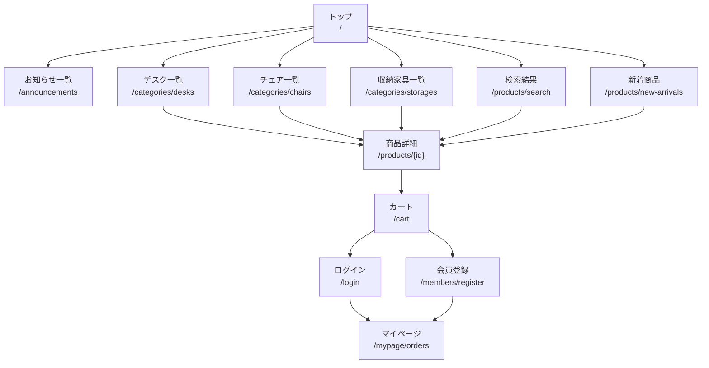
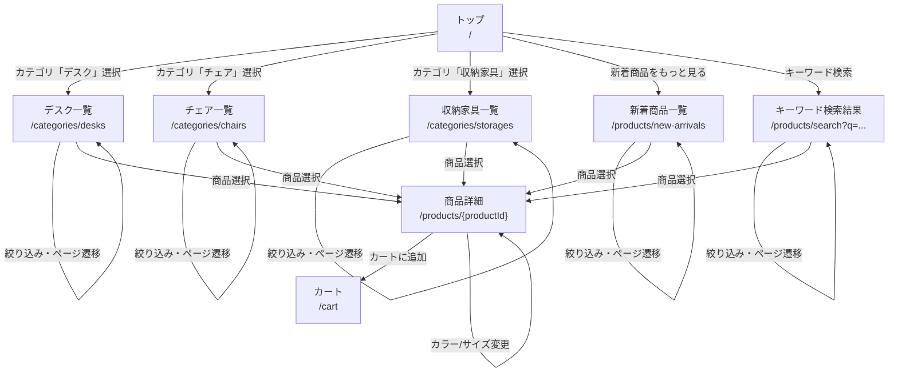
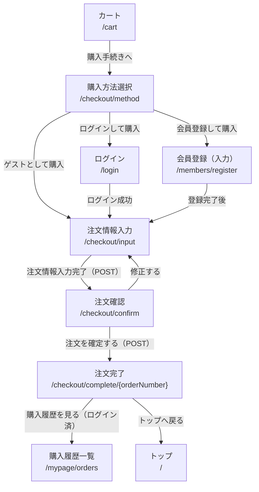
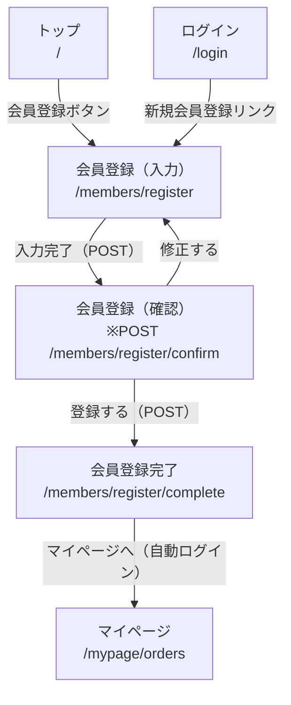
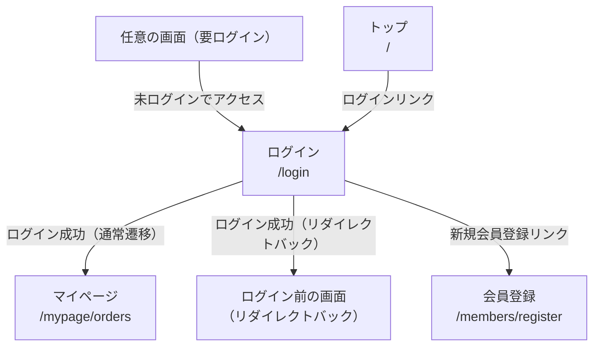
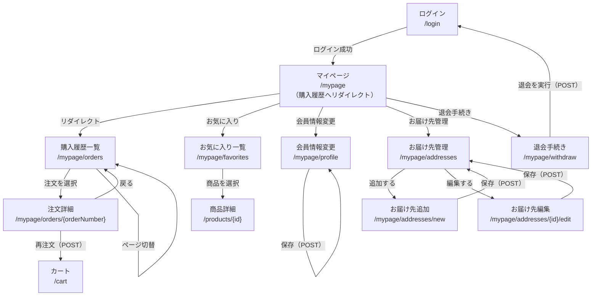
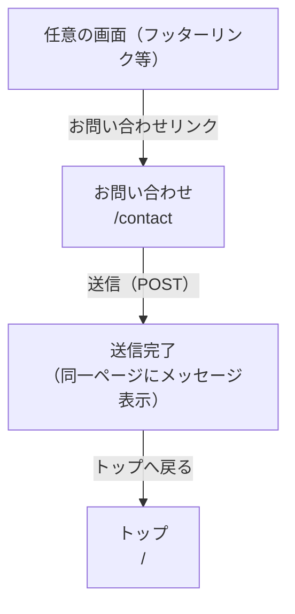
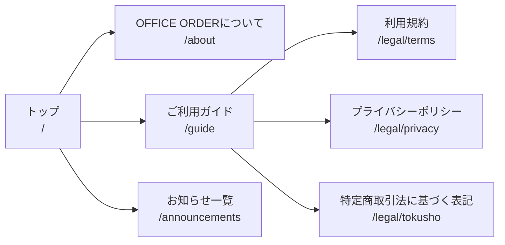

# 画面遷移図

本ドキュメントは OFFICE ORDER の主要な画面遷移を Mermaid 記法で表したものです。

---

## 1. 全体フロー概観

---

## 2. 商品カタログ・検索フロー

---

## 3. 購入フロー

---

## 4. 会員登録フロー

---

## 5. 認証フロー

---

## 6. マイページフロー

---

## 7. お問い合わせフロー

---

## 8. コンテンツページ

