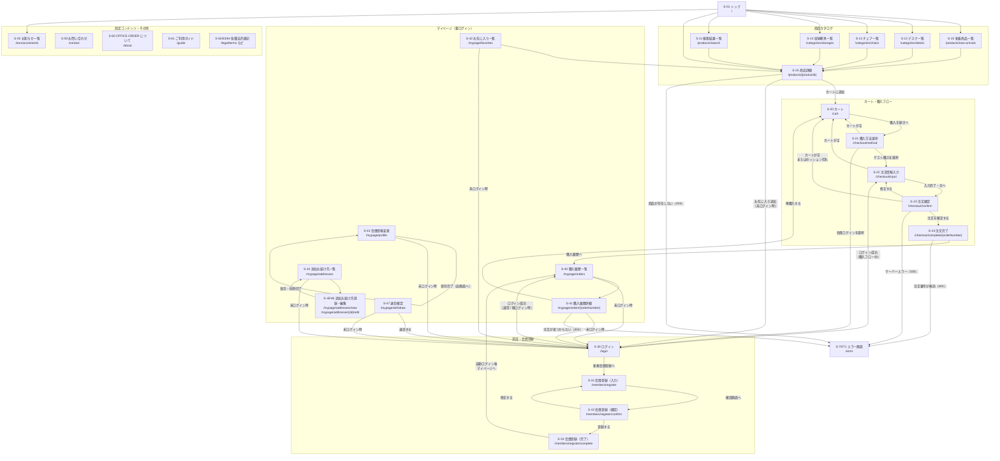

# 画面遷移図



---

## 補足

### 購入フローのセッション制御

```
カート（Cookie）→ 購入方法選択 → 注文情報入力
                                  ↓ セッションに保存（フォーム＋ワンタイムトークン）
                               注文確認
                                  ↓ トークン照合 OK → 注文確定 → セッション破棄・カートクリア
                               注文完了
```

### ログイン後リダイレクト

`/login?redirect={path}` パラメータ付きでアクセスした場合、ログイン成功後は `redirect` で指定されたパスへ遷移する（お気に入り操作・購入フローからの誘導などで利用）。

### `/mypage` へのアクセス

`GET /mypage` は `GET /mypage/orders`（購入履歴一覧）へ自動リダイレクトする。
