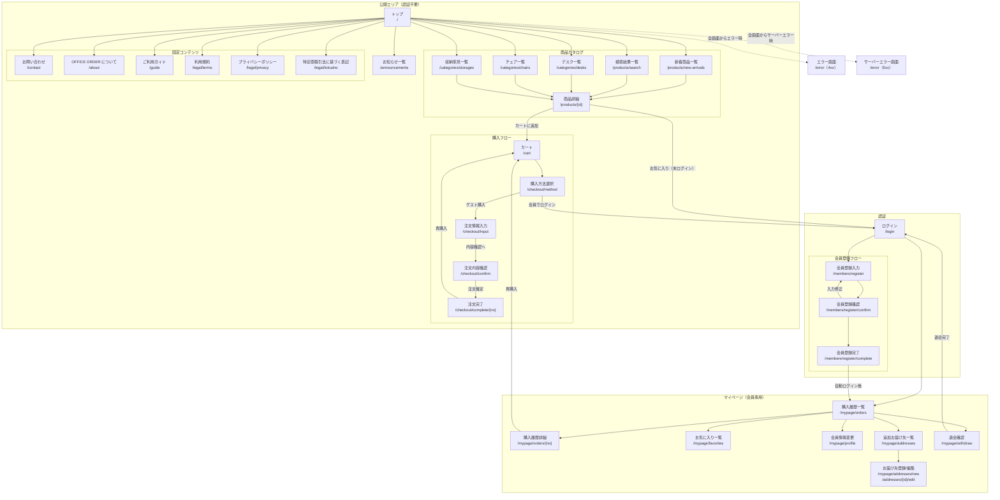
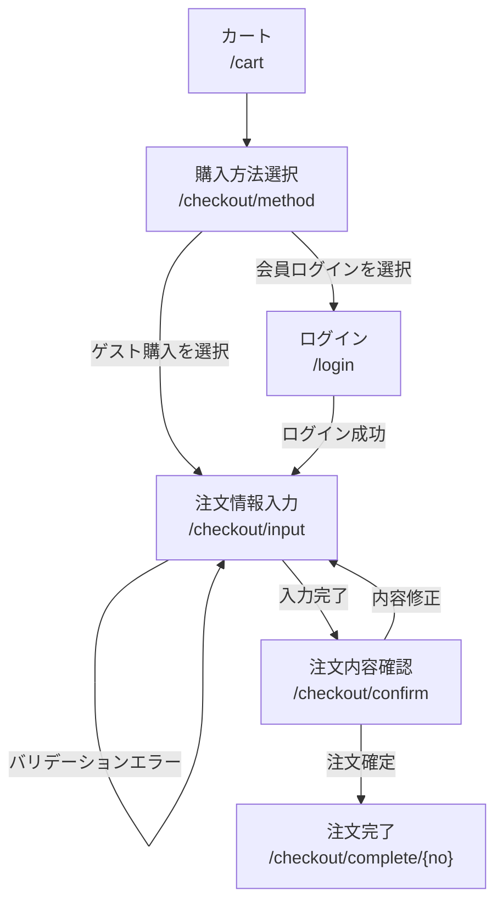
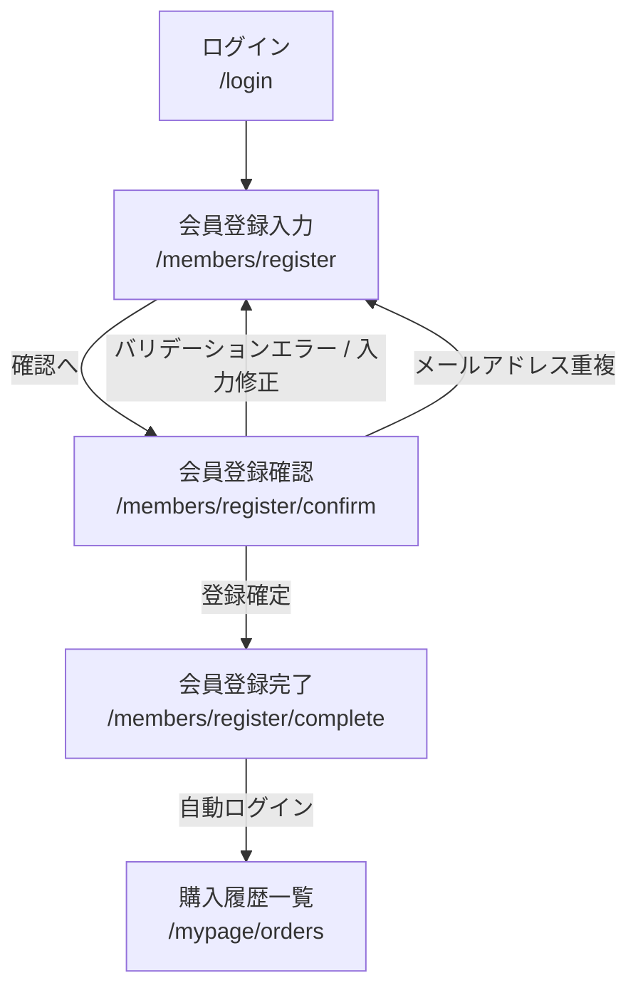
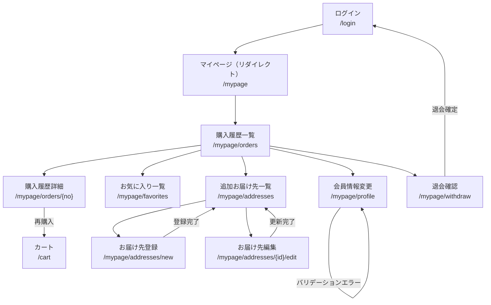

# 画面遷移図

最終更新: 2026-03-10

---

## 全体遷移図

```mermaid
flowchart TD
    %% ===== 公開エリア =====
    subgraph PUBLIC["公開エリア（認証不要）"]
        TOP["トップ\n/"]
        ANNOUNCE["お知らせ一覧\n/announcements"]

        subgraph CATALOG["商品カタログ"]
            PL_NEW["新着商品一覧\n/products/new-arrivals"]
            PL_SEARCH["検索結果一覧\n/products/search"]
            PL_DESK["デスク一覧\n/categories/desks"]
            PL_CHAIR["チェア一覧\n/categories/chairs"]
            PL_STORAGE["収納家具一覧\n/categories/storages"]
            PD["商品詳細\n/products/{id}"]
        end

        subgraph CHECKOUT["購入フロー"]
            CART["カート\n/cart"]
            CO_METHOD["購入方法選択\n/checkout/method"]
            CO_INPUT["注文情報入力\n/checkout/input"]
            CO_CONFIRM["注文内容確認\n/checkout/confirm"]
            CO_COMPLETE["注文完了\n/checkout/complete/{no}"]
        end

        subgraph CONTENT["固定コンテンツ"]
            CONTACT["お問い合わせ\n/contact"]
            ABOUT["OFFICE ORDER について\n/about"]
            GUIDE["ご利用ガイド\n/guide"]
            TERMS["利用規約\n/legal/terms"]
            PRIVACY["プライバシーポリシー\n/legal/privacy"]
            TOKUSHO["特定商取引法に基づく表記\n/legal/tokusho"]
        end
    end

    %% ===== 認証エリア =====
    subgraph AUTH["認証"]
        LOGIN["ログイン\n/login"]

        subgraph REGISTER["会員登録フロー"]
            REG["会員登録入力\n/members/register"]
            REG_CONFIRM["会員登録確認\n/members/register/confirm"]
            REG_COMPLETE["会員登録完了\n/members/register/complete"]
        end
    end

    %% ===== マイページ（会員専用）=====
    subgraph MYPAGE["マイページ（会員専用）"]
        MP_ORDERS["購入履歴一覧\n/mypage/orders"]
        MP_ORDER_DETAIL["購入履歴詳細\n/mypage/orders/{no}"]
        MP_FAVORITES["お気に入り一覧\n/mypage/favorites"]
        MP_PROFILE["会員情報変更\n/mypage/profile"]
        MP_ADDRESSES["追加お届け先一覧\n/mypage/addresses"]
        MP_ADDR_FORM["お届け先登録/編集\n/mypage/addresses/new\n/addresses/{id}/edit"]
        MP_WITHDRAW["退会確認\n/mypage/withdraw"]
    end

    %% ===== エラー =====
    ERR["エラー画面\n/error（4xx）"]
    ERR500["サーバーエラー画面\n/error（5xx）"]

    %% ===== 遷移定義 =====

    %% トップ → カタログ
    TOP --> PL_NEW
    TOP --> PL_SEARCH
    TOP --> PL_DESK
    TOP --> PL_CHAIR
    TOP --> PL_STORAGE
    TOP --> ANNOUNCE

    %% カタログ → 商品詳細
    PL_NEW     --> PD
    PL_SEARCH  --> PD
    PL_DESK    --> PD
    PL_CHAIR   --> PD
    PL_STORAGE --> PD

    %% 商品詳細 → カート / ログイン
    PD -->|カートに追加| CART
    PD -->|お気に入り（未ログイン）| LOGIN

    %% 購入フロー
    CART       --> CO_METHOD
    CO_METHOD  -->|ゲスト購入| CO_INPUT
    CO_METHOD  -->|会員でログイン| LOGIN
    CO_INPUT   -->|内容確認へ| CO_CONFIRM
    CO_CONFIRM -->|注文確定| CO_COMPLETE
    CO_COMPLETE -->|再購入| CART

    %% ログイン → マイページ / 会員登録
    LOGIN --> MP_ORDERS
    LOGIN --> REG

    %% 会員登録フロー
    REG         --> REG_CONFIRM
    REG_CONFIRM -->|入力修正| REG
    REG_CONFIRM --> REG_COMPLETE
    REG_COMPLETE -->|自動ログイン後| MP_ORDERS

    %% マイページ内遷移
    MP_ORDERS       --> MP_ORDER_DETAIL
    MP_ORDER_DETAIL -->|再購入| CART
    MP_ORDERS       --> MP_FAVORITES
    MP_ORDERS       --> MP_PROFILE
    MP_ORDERS       --> MP_ADDRESSES
    MP_ORDERS       --> MP_WITHDRAW
    MP_ADDRESSES    --> MP_ADDR_FORM
    MP_WITHDRAW     -->|退会完了| LOGIN

    %% 固定コンテンツ（トップのフッター/ヘッダーから）
    TOP --> CONTACT
    TOP --> ABOUT
    TOP --> GUIDE
    TOP --> TERMS
    TOP --> PRIVACY
    TOP --> TOKUSHO

    %% エラー
    TOP -.全画面からエラー時.-> ERR
    TOP -.全画面からサーバーエラー時.-> ERR500
```

---

## 購入フロー詳細

```mermaid
flowchart TD
    CART["カート\n/cart"]
    CO_METHOD["購入方法選択\n/checkout/method"]
    LOGIN["ログイン\n/login"]
    CO_INPUT["注文情報入力\n/checkout/input"]
    CO_CONFIRM["注文内容確認\n/checkout/confirm"]
    CO_COMPLETE["注文完了\n/checkout/complete/{no}"]

    CART --> CO_METHOD
    CO_METHOD -->|ゲスト購入を選択| CO_INPUT
    CO_METHOD -->|会員ログインを選択| LOGIN
    LOGIN -->|ログイン成功| CO_INPUT
    CO_INPUT -->|バリデーションエラー| CO_INPUT
    CO_INPUT -->|入力完了| CO_CONFIRM
    CO_CONFIRM -->|内容修正| CO_INPUT
    CO_CONFIRM -->|注文確定| CO_COMPLETE
```

---

## 会員登録フロー

```mermaid
flowchart TD
    LOGIN["ログイン\n/login"]
    REG["会員登録入力\n/members/register"]
    REG_CONFIRM["会員登録確認\n/members/register/confirm"]
    REG_COMPLETE["会員登録完了\n/members/register/complete"]
    MP_ORDERS["購入履歴一覧\n/mypage/orders"]

    LOGIN --> REG
    REG -->|確認へ| REG_CONFIRM
    REG_CONFIRM -->|バリデーションエラー / 入力修正| REG
    REG_CONFIRM -->|メールアドレス重複| REG
    REG_CONFIRM -->|登録確定| REG_COMPLETE
    REG_COMPLETE -->|自動ログイン| MP_ORDERS
```

---

## マイページフロー

```mermaid
flowchart TD
    LOGIN["ログイン\n/login"]
    MP_TOP["マイページ（リダイレクト）\n/mypage"]
    MP_ORDERS["購入履歴一覧\n/mypage/orders"]
    MP_ORDER_DETAIL["購入履歴詳細\n/mypage/orders/{no}"]
    CART["カート\n/cart"]
    MP_FAVORITES["お気に入り一覧\n/mypage/favorites"]
    MP_PROFILE["会員情報変更\n/mypage/profile"]
    MP_ADDRESSES["追加お届け先一覧\n/mypage/addresses"]
    MP_ADDR_FORM_NEW["お届け先登録\n/mypage/addresses/new"]
    MP_ADDR_FORM_EDIT["お届け先編集\n/mypage/addresses/{id}/edit"]
    MP_WITHDRAW["退会確認\n/mypage/withdraw"]

    LOGIN      --> MP_TOP
    MP_TOP     --> MP_ORDERS

    MP_ORDERS  --> MP_ORDER_DETAIL
    MP_ORDER_DETAIL -->|再購入| CART

    MP_ORDERS  --> MP_FAVORITES
    MP_ORDERS  --> MP_PROFILE
    MP_PROFILE -->|バリデーションエラー| MP_PROFILE

    MP_ORDERS  --> MP_ADDRESSES
    MP_ADDRESSES --> MP_ADDR_FORM_NEW
    MP_ADDRESSES --> MP_ADDR_FORM_EDIT
    MP_ADDR_FORM_NEW  -->|登録完了| MP_ADDRESSES
    MP_ADDR_FORM_EDIT -->|更新完了| MP_ADDRESSES

    MP_ORDERS  --> MP_WITHDRAW
    MP_WITHDRAW -->|退会確定| LOGIN
```
