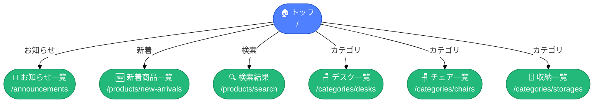
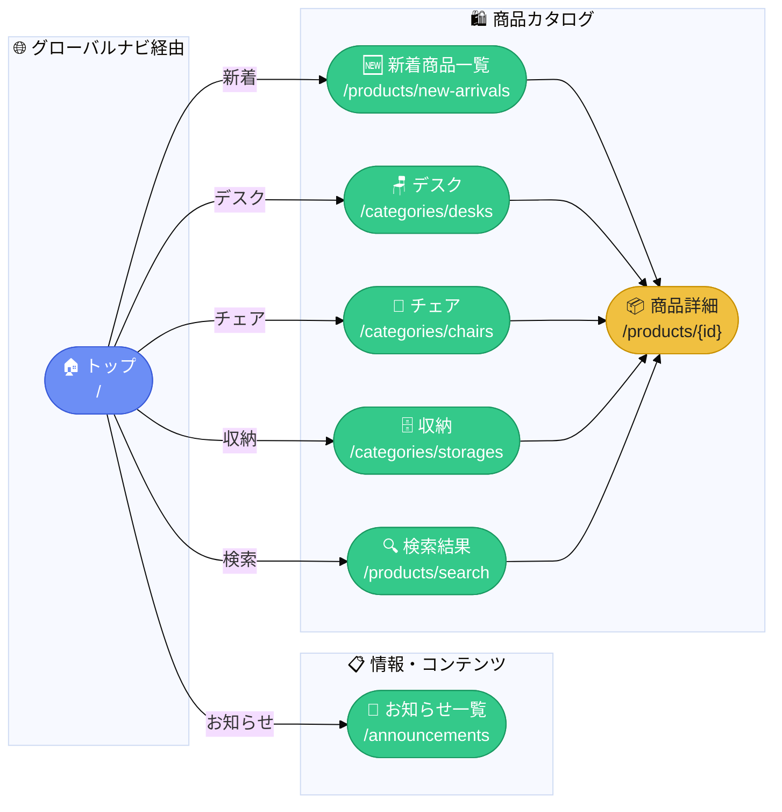
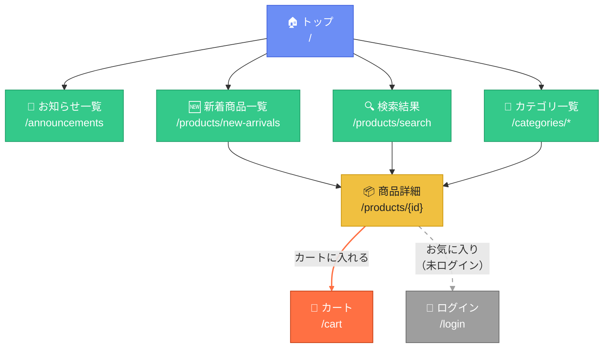

# 画面遷移図 スタイルサンプル

> `トップ → お知らせ一覧` 周辺を題材に、Mermaid でよりグラフィカルに表現するサンプル集。

---

## パターン A: カラー＋形状で種別を表現

ノード形状で画面の種別を区別し、`classDef` で色を付けます。



---

## パターン B: subgraph＋背景色でゾーン分け

画面グループを `subgraph` で囲み、エリア全体の背景を塗り分けます。



---

## パターン C: 「上から一本道」＋ステータス表示

ユーザーが辿る主動線のみに絞り、ラベルをアクション名で統一してシンプルに見せます。

```mermaid
flowchart TD
    classDef active  fill:#4f80ff,stroke:none,color:#fff,font-weight:bold
    classDef normal  fill:#e8eeff,stroke:#4f80ff,color:#4f80ff
    classDef success fill:#22b97a,stroke:none,color:#fff
    classDef warn    fill:#f5a623,stroke:none,color:#fff

    START(["`**開始**
    ブラウザでアクセス`"]):::active

    TOP(["`🏠 **トップ**
    \`/\``"]):::active

    ANNOUNCE(["`📢 **お知らせ一覧**
    \`/announcements\``"]):::normal

    NEW(["`🆕 **新着商品一覧**
    \`/products/new-arrivals\``"]):::normal

    PRODUCT(["`📦 **商品詳細**
    \`/products/{id}\``"]):::normal

    CART(["`🛒 **カート**
    \`/cart\``"]):::success

    START -->|"アクセス"| TOP
    TOP -->|"お知らせを見る"| ANNOUNCE
    TOP -->|"新着商品を見る"| NEW
    NEW -->|"商品を選ぶ"| PRODUCT
    PRODUCT -->|"カートに追加"| CART

    style START fill:#a0b4ff,stroke:none,color:#fff
```

---

## パターン D: `graph` + `linkStyle` でエッジを色分け

通常遷移・エラー遷移・リダイレクトを矢印の色で区別します。



---

## 使い方メモ

| テクニック | 効果 |
|---|---|
| `classDef` + `:::` | ノード種別ごとに色・形を一括定義 |
| `style ノード名` | 個別ノードに直接スタイルを当てる |
| `linkStyle N` | N番目のエッジ（0-indexed）の色・太さを変更 |
| `subgraph` + `direction` | ゾーンをボックスで囲み背景を分ける |
| `([" "])` 形状 | スタジアム型（角丸ピル形）でページ感を演出 |
| 絵文字をラベルに含める | テキスト情報を補完し視覚的に分かりやすく |
| `` %%{init: ...}%% `` | テーマ全体の基調色・フォントを上書き |
