# シーケンス図

> 最終更新: 2026-04-18（★CUSTOM-001 お薦め機能対応）

## 凡例

| 略称 | 対応コンポーネント |
|------|-----------------|
| Browser | ブラウザ（ユーザー操作） |
| Controller | Spring MVC Controller 層 |
| Service | ビジネスロジック層（Service クラス） |
| Repository | データアクセス層（Repository / MyBatis Mapper） |
| DB | PostgreSQL |
| Session | HTTP セッション / Cookie |
| SpringSec | Spring Security フィルタチェーン |

---

## 1. 共通・静的コンテンツ

### 1-1. トップ画面（GET /）

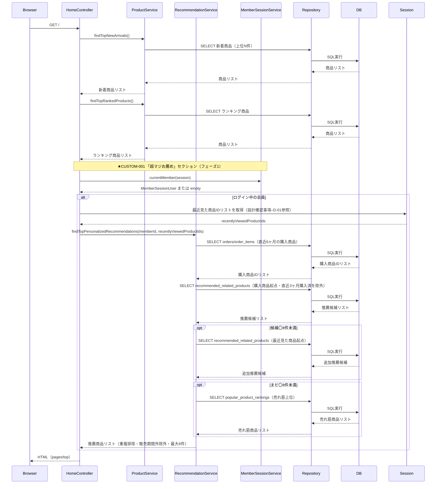

---

### 1-2. お知らせ一覧（GET /announcements）

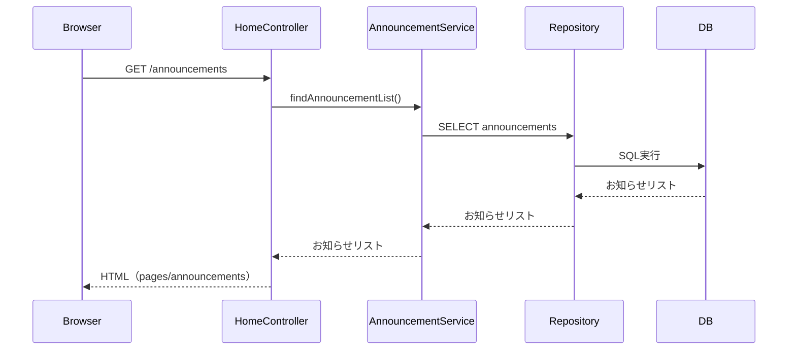

---

### 1-8. お問い合わせフォーム表示（GET /contact）

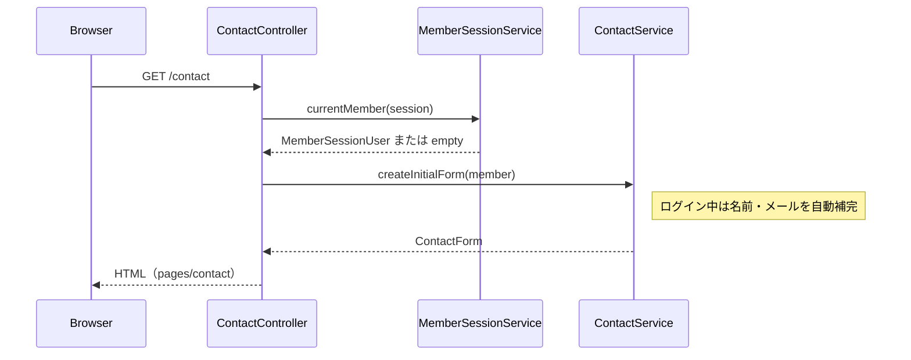

---

### 1-8b. お問い合わせ送信（POST /contact）

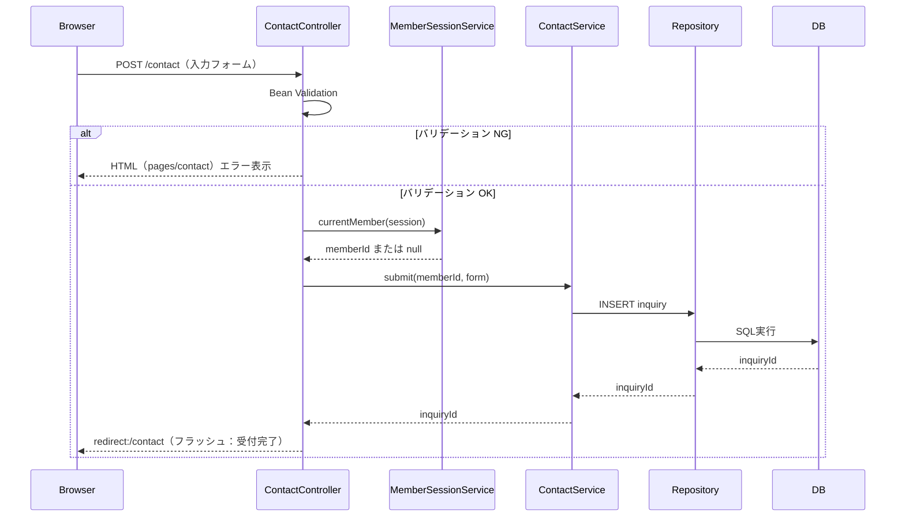

---

## 2. 商品カタログ

### 2-1. 新着商品一覧（GET /products/new-arrivals）

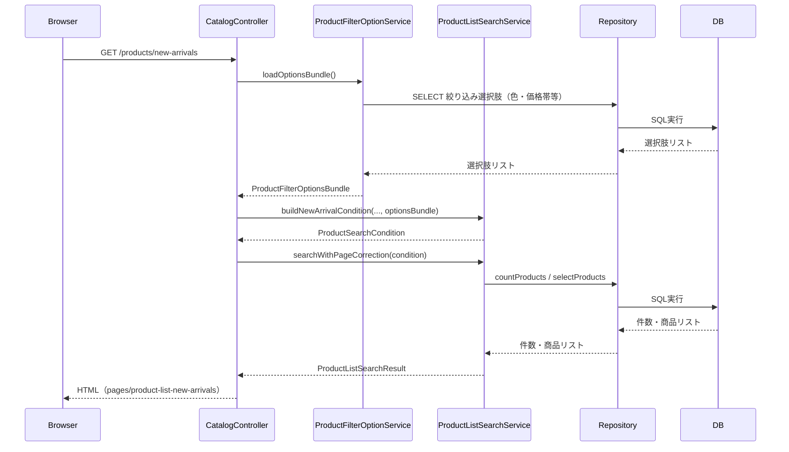

---

### 2-2. キーワード検索結果（GET /products/search）★FEAT-001

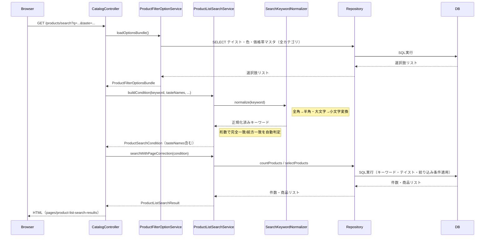

---

### 2-3〜2-5. カテゴリ一覧（GET /categories/{desks|chairs|storages}）

> デスクを例として記載。チェア・収納家具も同構造。

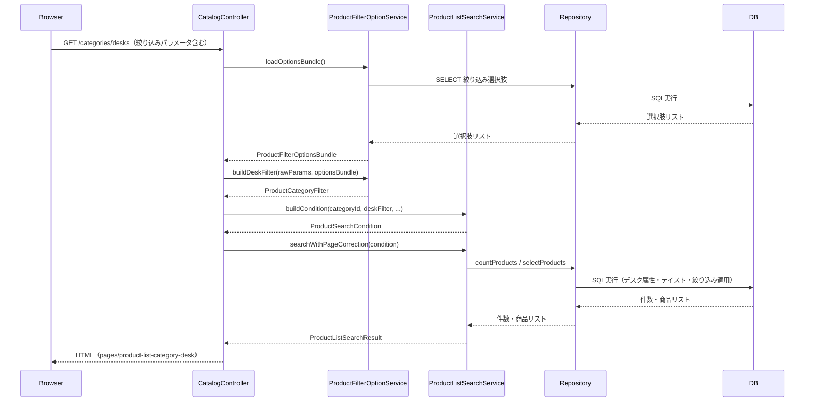

---

### 2-6. 商品詳細（GET /products/{productId}）

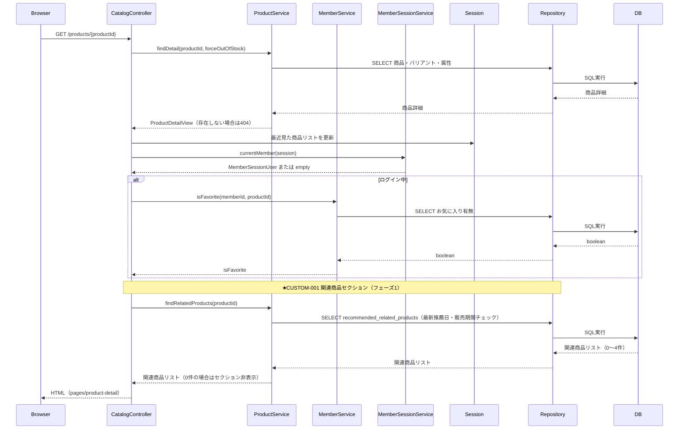

---

### 2-7. お気に入りトグル（POST /products/{productId}/favorite）

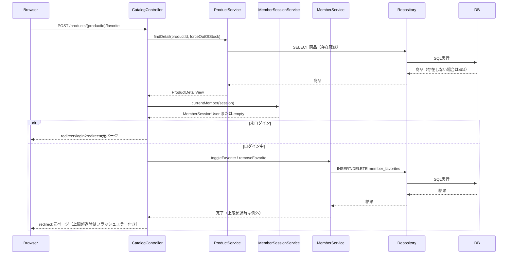

---

## 3. 認証・会員登録

### 3-1. ログイン画面表示（GET /login）

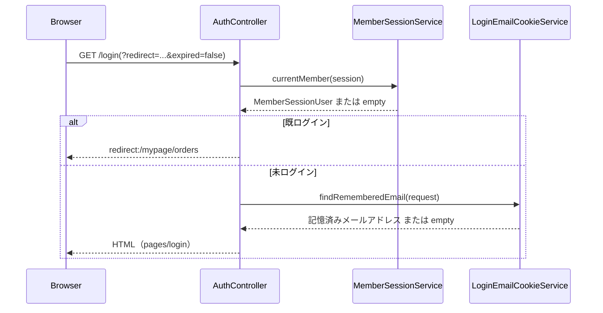

---

### 3-1b. ログイン処理（POST /login）

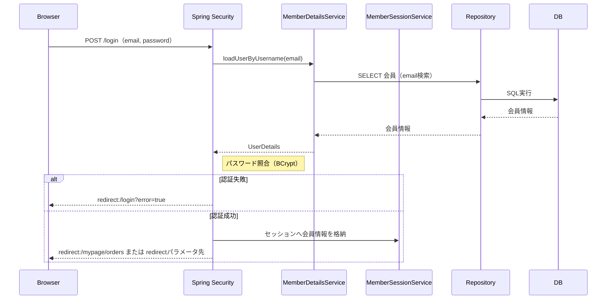

---

### 3-2. ログアウト処理（POST /logout）

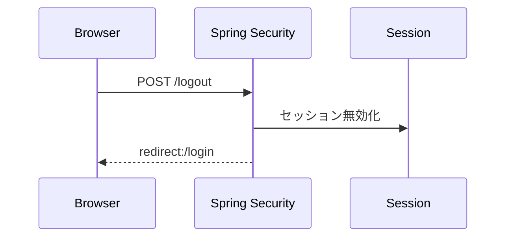

---

### 3-3. 会員登録入力（GET /members/register）

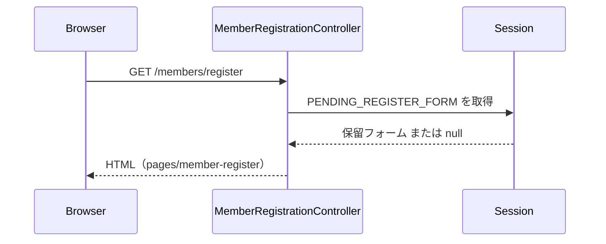

---

### 3-3b. 会員登録バリデーション・確認画面遷移（POST /members/register/confirm）

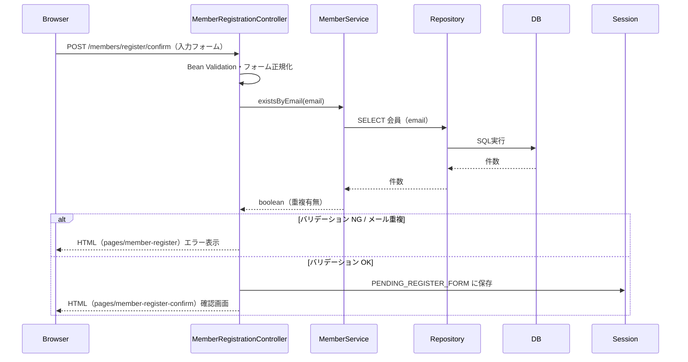

---

### 3-4b. 会員登録確定（POST /members/register）

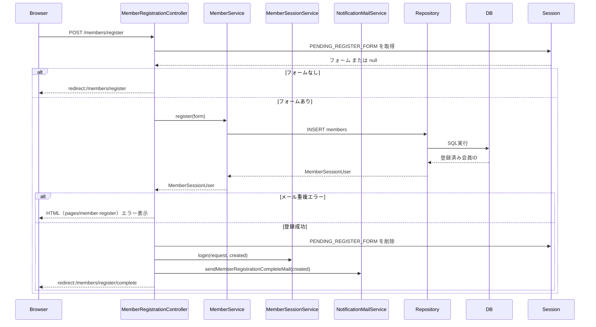

---

### 3-5. 会員登録完了（GET /members/register/complete）

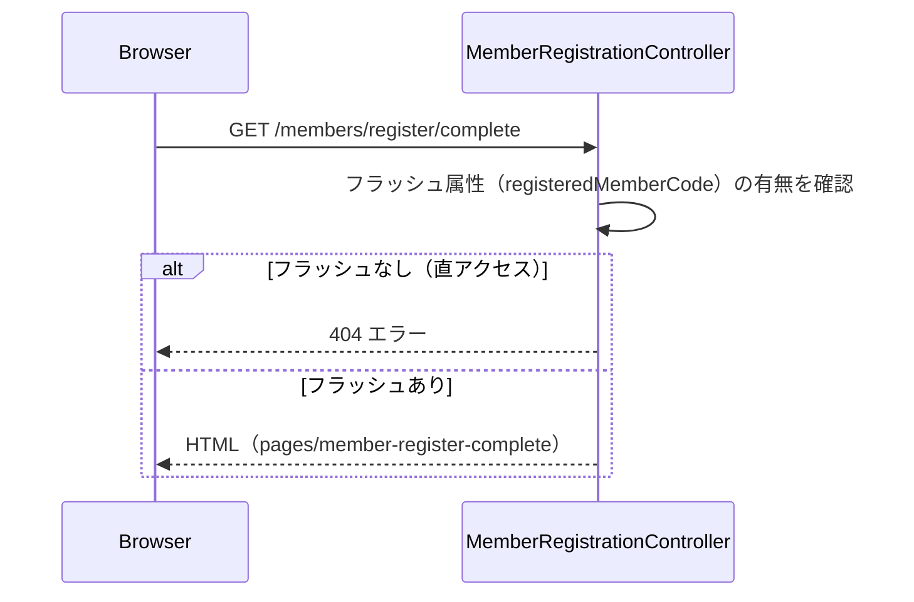

---

## 4. カート・購入フロー

### 4-1. カート表示（GET /cart）

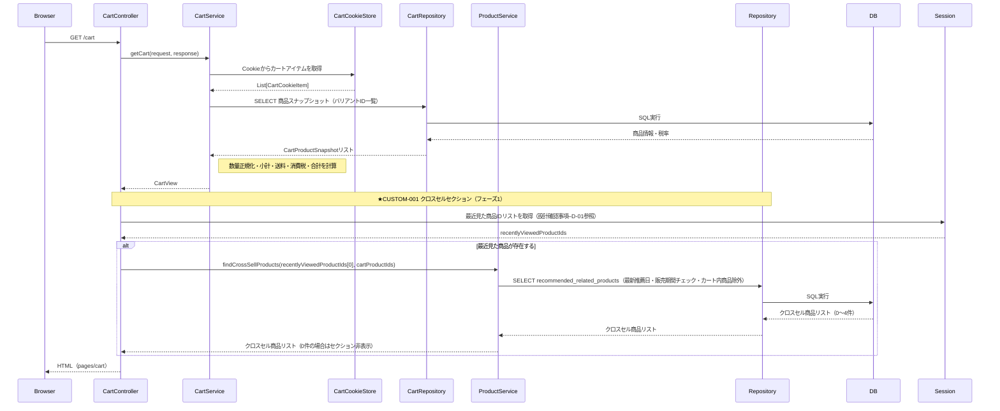

---

### 4-1b. カート追加（POST /cart/items）

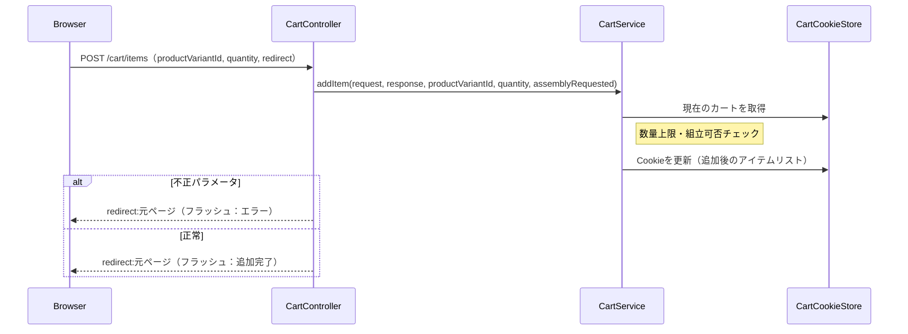

---

### 4-1c. カート数量更新（POST /cart/items/{productVariantId}/update）

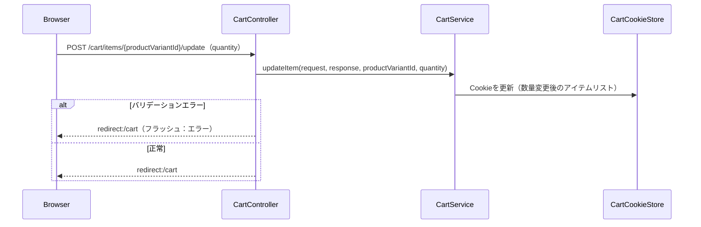

---

### 4-1d. カートアイテム削除（POST /cart/items/{productVariantId}/delete）

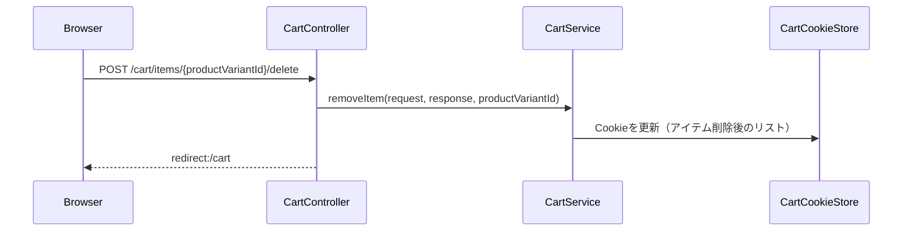

---

### 4-1e. カートクリア（POST /cart/clear）

```mermaid
sequenceDiagram
    participant Browser
    participant CartController
    participant CartService
    participant CartCookieStore

    Browser->>CartController: POST /cart/clear
    CartController->>CartService: clear(request, response)
    CartService->>CartCookieStore: Cookieを空にする
    CartController-->>Browser: redirect:/cart
```

---

### 4-2. 購入方法選択（GET /checkout/method）

```mermaid
sequenceDiagram
    participant Browser
    participant CartController
    participant CartService
    participant LoginEmailCookieService

    Browser->>CartController: GET /checkout/method
    CartController->>CartService: getCart(request, response)
    CartService-->>CartController: CartView

    alt カートが空
        CartController-->>Browser: redirect:/cart
    else カートあり
        CartController->>LoginEmailCookieService: findRememberedEmail(request)
        LoginEmailCookieService-->>CartController: 記憶済みメールアドレス または empty
        CartController-->>Browser: HTML（pages/checkout-method）
    end
```

---

### 4-3. 注文情報入力（GET /checkout/input）

```mermaid
sequenceDiagram
    participant Browser
    participant CartController
    participant CartService
    participant MemberSessionService
    participant OrderService
    participant MemberService
    participant Repository
    participant DB
    participant Session

    Browser->>CartController: GET /checkout/input
    CartController->>CartService: getCart(request, response)
    CartService-->>CartController: CartView

    alt カートが空
        CartController-->>Browser: redirect:/cart
    else カートあり
        CartController->>Session: CHECKOUT_FORM_SESSION_KEY を取得
        CartController->>MemberSessionService: currentMember(session)
        MemberSessionService-->>CartController: MemberSessionUser または empty

        alt ログイン中かつセッションフォームなし
            CartController->>OrderService: createInitialForm(member)
            OrderService->>MemberService: 会員情報・追加お届け先を取得
            MemberService->>Repository: SELECT 会員・追加お届け先
            Repository->>DB: SQL実行
            DB-->>Repository: 会員情報
            Repository-->>MemberService: 会員情報
            MemberService-->>OrderService: 会員情報
            OrderService-->>CartController: CheckoutInputForm（初期値補完済み）
        end

        CartController->>MemberService: findAdditionalAddresses(memberId)
        MemberService->>Repository: SELECT 追加お届け先
        Repository->>DB: SQL実行
        DB-->>Repository: 追加お届け先
        Repository-->>MemberService: 追加お届け先リスト
        MemberService-->>CartController: 追加お届け先リスト

        CartController-->>Browser: HTML（pages/checkout-input）
    end
```

---

### 4-3b. 注文情報入力送信（POST /checkout/input）

```mermaid
sequenceDiagram
    participant Browser
    participant CartController
    participant CartService
    participant Session

    Browser->>CartController: POST /checkout/input（入力フォーム）
    CartController->>CartService: getCart(request, response)
    CartService-->>CartController: CartView

    alt カートが空
        CartController-->>Browser: redirect:/cart
    else カートあり
        CartController->>CartController: Bean Validation・業務ルール検証・フォーム正規化

        alt バリデーション NG
            CartController-->>Browser: HTML（pages/checkout-input）エラー表示
        else バリデーション OK
            CartController->>Session: CHECKOUT_FORM_SESSION_KEY に保存
            CartController->>Session: CHECKOUT_CONFIRM_TOKEN_SESSION_KEY にトークンを生成・保存
            CartController-->>Browser: redirect:/checkout/confirm
        end
    end
```

---

### 4-4. 注文確認（GET /checkout/confirm）

```mermaid
sequenceDiagram
    participant Browser
    participant CartController
    participant CartService
    participant Session

    Browser->>CartController: GET /checkout/confirm
    CartController->>CartService: getCart(request, response)
    CartService-->>CartController: CartView

    alt カートが空
        CartController->>Session: 購入フローセッションをクリア
        CartController-->>Browser: redirect:/cart
    else カートあり
        CartController->>Session: CHECKOUT_FORM_SESSION_KEY を取得

        alt セッションフォームなし
            CartController-->>Browser: redirect:/checkout/input
        else フォームあり
            CartController->>Session: CHECKOUT_CONFIRM_TOKEN_SESSION_KEY を取得または新規生成
            CartController-->>Browser: HTML（pages/checkout-confirm）
        end
    end
```

---

### 4-4b. 注文確定（POST /checkout/confirm）

```mermaid
sequenceDiagram
    participant Browser
    participant CartController
    participant CartService
    participant MemberSessionService
    participant OrderService
    participant NotificationMailService
    participant OrderRepository
    participant DB
    participant Session

    Browser->>CartController: POST /checkout/confirm（token）
    CartController->>CartService: getCart(request, response)
    CartService-->>CartController: CartView

    alt カートが空
        CartController-->>Browser: redirect:/cart
    else カートあり
        CartController->>Session: フォーム・トークンを取得

        alt フォームなし
            CartController-->>Browser: redirect:/checkout/input（フラッシュ：再入力案内）
        else トークン不一致
            CartController->>Session: 購入フローセッションをクリア
            CartController-->>Browser: redirect:/checkout/input（フラッシュ：エラー）
        else 正常
            CartController->>MemberSessionService: currentMember(session)
            MemberSessionService-->>CartController: memberId または null
            CartController->>OrderService: placeOrder(memberId, sessionForm, cart)
            OrderService->>OrderRepository: INSERT orders / order_items
            OrderRepository->>DB: SQL実行（トランザクション）
            DB-->>OrderRepository: 受注ID・注文番号
            OrderRepository-->>OrderService: 注文番号
            Note right of OrderService: トランザクションコミット後にメール送信を予約
            OrderService->>NotificationMailService: sendOrderCompleteMail(payload)
            OrderService-->>CartController: 注文番号

            CartController->>Session: 購入フローセッションをクリア
            CartController->>CartService: clear（カートを空にする）
            CartController-->>Browser: redirect:/checkout/complete/{orderNumber}
        end
    end
```

---

### 4-5. 注文完了（GET /checkout/complete/{orderNumber}）

```mermaid
sequenceDiagram
    participant Browser
    participant CartController
    participant OrderService
    participant OrderRepository
    participant DB

    Browser->>CartController: GET /checkout/complete/{orderNumber}
    CartController->>OrderService: findOrderCompleteView(orderNumber)
    OrderService->>OrderRepository: SELECT orders（注文番号）
    OrderRepository->>DB: SQL実行
    DB-->>OrderRepository: 注文情報
    OrderRepository-->>OrderService: 注文情報
    OrderService-->>CartController: OrderCompleteView（存在しない場合は404）
    CartController-->>Browser: HTML（pages/checkout-complete）
```

---

## 5. マイページ（要ログイン）

> 各画面で Spring Security または `requireLoginMember()` により未認証は 401 を返す。

### 5-1. マイページトップ（GET /mypage）

```mermaid
sequenceDiagram
    participant Browser
    participant MyPageController

    Browser->>MyPageController: GET /mypage
    MyPageController-->>Browser: redirect:/mypage/orders
```

---

### 5-2. 購入履歴一覧（GET /mypage/orders）

```mermaid
sequenceDiagram
    participant Browser
    participant MyPageController
    participant MemberSessionService
    participant OrderService
    participant OrderRepository
    participant DB

    Browser->>MyPageController: GET /mypage/orders(?page=...)
    MyPageController->>MemberSessionService: requireLoginMember(session)
    MemberSessionService-->>MyPageController: MemberSessionUser（未認証は401）

    MyPageController->>OrderService: findMemberOrderHistories(memberId, page)
    OrderService->>OrderRepository: SELECT orders（会員ID・ページネーション）
    OrderRepository->>DB: SQL実行
    DB-->>OrderRepository: 注文一覧・件数
    OrderRepository-->>OrderService: 注文一覧・件数
    OrderService-->>MyPageController: MemberOrderHistoryPage

    opt ページ超過（補正処理）
        MyPageController->>OrderService: findMemberOrderHistories(memberId, totalPages)
        OrderService-->>MyPageController: MemberOrderHistoryPage（最終ページ）
    end

    MyPageController-->>Browser: HTML（pages/mypage-orders-list）
```

---

### 5-3. 購入履歴詳細（GET /mypage/orders/{orderNumber}）

```mermaid
sequenceDiagram
    participant Browser
    participant MyPageController
    participant MemberSessionService
    participant OrderService
    participant OrderRepository
    participant DB

    Browser->>MyPageController: GET /mypage/orders/{orderNumber}
    MyPageController->>MemberSessionService: requireLoginMember(session)
    MemberSessionService-->>MyPageController: MemberSessionUser

    MyPageController->>OrderService: findMemberOrderDetail(memberId, orderNumber)
    OrderService->>OrderRepository: SELECT orders / order_items（会員ID + 注文番号）
    OrderRepository->>DB: SQL実行
    DB-->>OrderRepository: 注文詳細
    OrderRepository-->>OrderService: 注文詳細
    OrderService-->>MyPageController: MemberOrderDetailView（存在しない場合は404）

    MyPageController-->>Browser: HTML（pages/mypage-order-detail）
```

---

### 5-3b. 再注文（POST /mypage/orders/{orderNumber}/reorder）

```mermaid
sequenceDiagram
    participant Browser
    participant MyPageController
    participant MemberSessionService
    participant OrderService
    participant OrderRepository
    participant CartService
    participant CartCookieStore
    participant DB

    Browser->>MyPageController: POST /mypage/orders/{orderNumber}/reorder
    MyPageController->>MemberSessionService: requireLoginMember(session)
    MemberSessionService-->>MyPageController: MemberSessionUser

    MyPageController->>OrderService: findMemberOrderDetail(memberId, orderNumber)
    OrderService->>OrderRepository: SELECT orders（存在確認）
    OrderRepository->>DB: SQL実行
    DB-->>OrderRepository: 注文
    OrderRepository-->>OrderService: 注文
    OrderService-->>MyPageController: MemberOrderDetailView または empty

    alt 存在しない
        MyPageController-->>Browser: 404エラー
    else 存在する
        MyPageController->>OrderService: findReorderItems(memberId, orderNumber)
        OrderService->>OrderRepository: SELECT order_items（再注文用バリアント情報付き）
        OrderRepository->>DB: SQL実行
        DB-->>OrderRepository: 再注文アイテムリスト
        OrderRepository-->>OrderService: 再注文アイテムリスト
        OrderService-->>MyPageController: List[OrderReorderItem]

        loop アイテム数ぶんループ
            MyPageController->>CartService: addItem(productVariantId, quantity, ...)
            CartService->>CartCookieStore: Cookieを更新
        end

        MyPageController-->>Browser: redirect:/cart（フラッシュ：成功/一部失敗メッセージ）
    end
```

---

### 5-4. お気に入り一覧（GET /mypage/favorites）

```mermaid
sequenceDiagram
    participant Browser
    participant MyPageController
    participant MemberSessionService
    participant MemberService
    participant Repository
    participant DB

    Browser->>MyPageController: GET /mypage/favorites(?page=...)
    MyPageController->>MemberSessionService: requireLoginMember(session)
    MemberSessionService-->>MyPageController: MemberSessionUser

    MyPageController->>MemberService: findFavorites(memberId, page)
    MemberService->>Repository: SELECT favorites（会員ID・ページネーション）
    Repository->>DB: SQL実行
    DB-->>Repository: お気に入り一覧・件数
    Repository-->>MemberService: お気に入り一覧・件数
    MemberService-->>MyPageController: MemberFavoritePage

    opt ページ超過（補正処理）
        MyPageController->>MemberService: findFavorites(memberId, totalPages)
        MemberService-->>MyPageController: MemberFavoritePage（最終ページ）
    end

    MyPageController-->>Browser: HTML（pages/mypage-favorites）
```

---

### 5-5. 会員情報変更フォーム表示（GET /mypage/profile）

```mermaid
sequenceDiagram
    participant Browser
    participant MyPageController
    participant MemberSessionService
    participant MemberService
    participant Repository
    participant DB

    Browser->>MyPageController: GET /mypage/profile
    MyPageController->>MemberSessionService: requireLoginMember(session)
    MemberSessionService-->>MyPageController: MemberSessionUser

    MyPageController->>MemberService: findProfileByMemberId(memberId)
    MemberService->>Repository: SELECT 会員情報
    Repository->>DB: SQL実行
    DB-->>Repository: 会員情報
    Repository-->>MemberService: 会員情報
    MemberService-->>MyPageController: MemberProfileEditForm

    MyPageController-->>Browser: HTML（pages/mypage-profile-edit）
```

---

### 5-5b. 会員情報変更送信（POST /mypage/profile）

```mermaid
sequenceDiagram
    participant Browser
    participant MyPageController
    participant MemberSessionService
    participant MemberService
    participant Repository
    participant DB

    Browser->>MyPageController: POST /mypage/profile（入力フォーム）
    MyPageController->>MemberSessionService: requireLoginMember(session)
    MemberSessionService-->>MyPageController: MemberSessionUser

    MyPageController->>MyPageController: Bean Validation・法人必須ルール検証・フォーム正規化

    alt バリデーション NG
        MyPageController-->>Browser: HTML（pages/mypage-profile-edit）エラー表示
    else バリデーション OK
        MyPageController->>MemberService: updateProfile(memberId, form)
        MemberService->>Repository: UPDATE members
        Repository->>DB: SQL実行
        DB-->>Repository: 更新件数
        Repository-->>MemberService: 更新結果
        MemberService-->>MyPageController: 完了（メール重複時は例外）

        alt メール重複
            MyPageController-->>Browser: HTML（pages/mypage-profile-edit）エラー表示
        else 更新成功
            MyPageController->>MemberService: findActiveById(memberId)
            MemberService->>Repository: SELECT 会員
            Repository->>DB: SQL実行
            DB-->>Repository: 会員情報
            Repository-->>MemberService: 会員情報
            MemberService-->>MyPageController: MemberSessionUser
            MyPageController->>MemberSessionService: login(request, updatedMember)
            MyPageController-->>Browser: redirect:/mypage/profile（フラッシュ：更新完了）
        end
    end
```

---

### 5-6. お届け先一覧（GET /mypage/addresses）

```mermaid
sequenceDiagram
    participant Browser
    participant MyPageController
    participant MemberSessionService
    participant MemberService
    participant Repository
    participant DB

    Browser->>MyPageController: GET /mypage/addresses(?page=...)
    MyPageController->>MemberSessionService: requireLoginMember(session)
    MemberSessionService-->>MyPageController: MemberSessionUser

    MyPageController->>MemberService: findAdditionalAddresses(memberId, page)
    MemberService->>Repository: SELECT member_additional_addresses（ページネーション）
    Repository->>DB: SQL実行
    DB-->>Repository: お届け先一覧・件数
    Repository-->>MemberService: お届け先一覧・件数
    MemberService-->>MyPageController: MemberAdditionalAddressPage

    MyPageController-->>Browser: HTML（pages/mypage-addresses）（上限到達フラグ付き）
```

---

### 5-7. お届け先新規登録（GET → POST /mypage/addresses/new）

```mermaid
sequenceDiagram
    participant Browser
    participant MyPageController
    participant MemberSessionService
    participant MemberService
    participant Repository
    participant DB

    Browser->>MyPageController: GET /mypage/addresses/new
    MyPageController->>MemberSessionService: requireLoginMember(session)
    MemberSessionService-->>MyPageController: MemberSessionUser
    MyPageController->>MemberService: isAddressLimitReached(memberId)
    MemberService-->>MyPageController: boolean（上限到達有無）
    MyPageController-->>Browser: HTML（pages/mypage-address-form）

    Browser->>MyPageController: POST /mypage/addresses（入力フォーム）
    MyPageController->>MemberSessionService: requireLoginMember(session)
    MemberSessionService-->>MyPageController: MemberSessionUser
    MyPageController->>MyPageController: Bean Validation・法人必須ルール検証・フォーム正規化

    alt バリデーション NG
        MyPageController-->>Browser: HTML（pages/mypage-address-form）エラー表示
    else バリデーション OK
        MyPageController->>MemberService: createAdditionalAddress(memberId, form)
        MemberService->>Repository: INSERT member_additional_addresses
        Repository->>DB: SQL実行
        DB-->>Repository: 結果
        Repository-->>MemberService: 結果
        MemberService-->>MyPageController: 完了（上限超過時は例外）

        alt 上限超過
            MyPageController-->>Browser: redirect:/mypage/addresses（フラッシュ：エラー）
        else 登録成功
            MyPageController-->>Browser: redirect:/mypage/addresses
        end
    end
```

---

### 5-8. お届け先編集（GET → POST /mypage/addresses/{id}/edit）

```mermaid
sequenceDiagram
    participant Browser
    participant MyPageController
    participant MemberSessionService
    participant MemberService
    participant Repository
    participant DB

    Browser->>MyPageController: GET /mypage/addresses/{memberAddressId}/edit
    MyPageController->>MemberSessionService: requireLoginMember(session)
    MemberSessionService-->>MyPageController: MemberSessionUser
    MyPageController->>MemberService: findAdditionalAddressById(memberId, memberAddressId)
    MemberService->>Repository: SELECT member_additional_addresses（会員ID + 住所ID）
    Repository->>DB: SQL実行
    DB-->>Repository: お届け先（存在しない場合は404）
    Repository-->>MemberService: お届け先
    MemberService-->>MyPageController: MemberAdditionalAddressView
    MyPageController-->>Browser: HTML（pages/mypage-address-form）既存データを初期値として表示

    Browser->>MyPageController: POST /mypage/addresses/{memberAddressId}（入力フォーム）
    MyPageController->>MemberSessionService: requireLoginMember(session)
    MemberSessionService-->>MyPageController: MemberSessionUser
    MyPageController->>MyPageController: Bean Validation・法人必須ルール検証・フォーム正規化

    alt バリデーション NG
        MyPageController-->>Browser: HTML（pages/mypage-address-form）エラー表示
    else バリデーション OK
        MyPageController->>MemberService: updateAdditionalAddress(memberId, memberAddressId, form)
        MemberService->>Repository: UPDATE member_additional_addresses
        Repository->>DB: SQL実行
        DB-->>Repository: 更新件数
        Repository-->>MemberService: 更新結果
        MemberService-->>MyPageController: boolean（更新有無）
        MyPageController-->>Browser: redirect:/mypage/addresses
    end
```

---

### 5-9. お届け先削除（POST /mypage/addresses/{id}/delete）

```mermaid
sequenceDiagram
    participant Browser
    participant MyPageController
    participant MemberSessionService
    participant MemberService
    participant Repository
    participant DB

    Browser->>MyPageController: POST /mypage/addresses/{memberAddressId}/delete
    MyPageController->>MemberSessionService: requireLoginMember(session)
    MemberSessionService-->>MyPageController: MemberSessionUser
    MyPageController->>MemberService: deleteAdditionalAddress(memberId, memberAddressId)
    MemberService->>Repository: DELETE member_additional_addresses
    Repository->>DB: SQL実行
    DB-->>Repository: 結果
    Repository-->>MemberService: 結果
    MyPageController-->>Browser: redirect:/mypage/addresses
```

---

### 5-10. 退会確認・退会実行（GET / POST /mypage/withdraw）

```mermaid
sequenceDiagram
    participant Browser
    participant MyPageController
    participant MemberSessionService
    participant MemberService
    participant Repository
    participant DB

    Browser->>MyPageController: GET /mypage/withdraw
    MyPageController->>MemberSessionService: requireLoginMember(session)
    MemberSessionService-->>MyPageController: MemberSessionUser
    MyPageController-->>Browser: HTML（pages/mypage-withdraw）退会確認画面

    Browser->>MyPageController: POST /mypage/withdraw
    MyPageController->>MemberSessionService: requireLoginMember(session)
    MemberSessionService-->>MyPageController: MemberSessionUser
    MyPageController->>MemberService: withdraw(memberId)
    MemberService->>Repository: UPDATE members（退会フラグ / 論理削除）
    Repository->>DB: SQL実行
    DB-->>Repository: 更新件数
    Repository-->>MemberService: 結果
    MemberService-->>MyPageController: 完了
    MyPageController->>MemberSessionService: clear(session)
    Note right of MemberSessionService: セッション無効化
    MyPageController-->>Browser: redirect:/login
```

