# シーケンス図一覧

本ドキュメントは、office-order システムの主要なユースケースのシーケンス図を Mermaid 記法でまとめた設計資料です。

## 目次

1. [会員登録フロー](#1-会員登録フロー)
2. [ログインフロー](#2-ログインフロー)
3. [商品一覧・詳細閲覧フロー](#3-商品一覧詳細閲覧フロー)
4. [お気に入り登録・解除フロー](#4-お気に入り登録解除フロー)
5. [カート操作フロー](#5-カート操作フロー)
6. [チェックアウト（注文確定）フロー](#6-チェックアウト注文確定フロー)
7. [購入履歴・再購入フロー](#7-購入履歴再購入フロー)
8. [会員情報変更フロー](#8-会員情報変更フロー)
9. [追加お届け先管理フロー](#9-追加お届け先管理フロー)
10. [退会フロー](#10-退会フロー)
11. [お問い合わせ送信フロー](#11-お問い合わせ送信フロー)
12. [バッチ実行フロー](#12-バッチ実行フロー)

---

## 1. 会員登録フロー

入力 → 確認 → 確定の3ステップで会員登録を行う。確定時にセッションログインとメール送信を実施する。

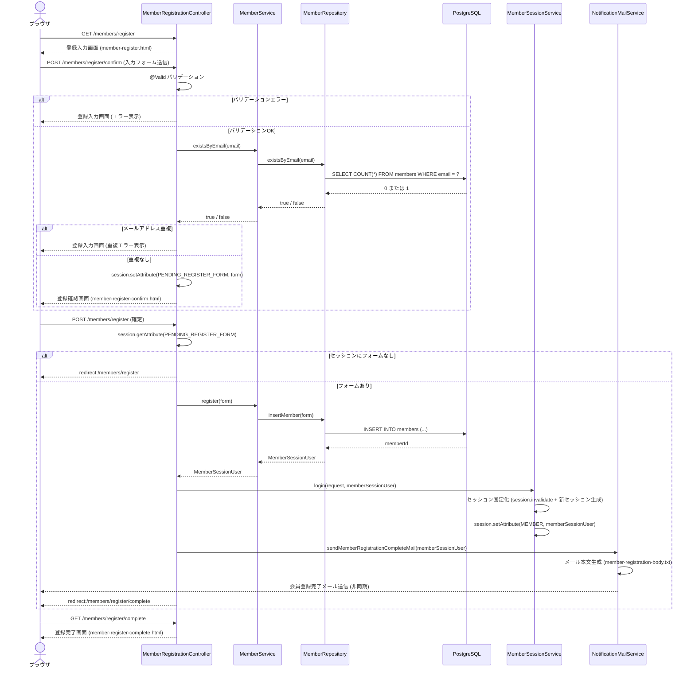

---

## 2. ログインフロー

Spring Security のフォームログイン機能は使用せず、独自の `MemberSessionService` でセッション管理を行う。

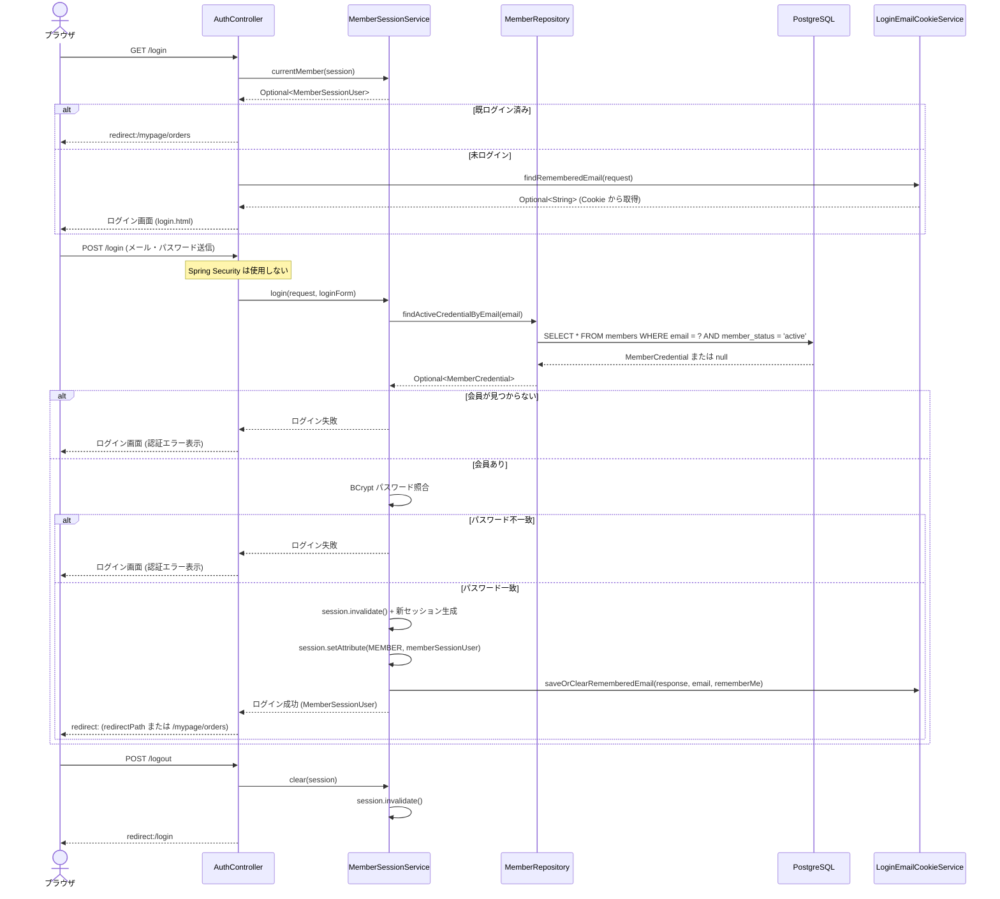

---

## 3. 商品一覧・詳細閲覧フロー

カテゴリ一覧・キーワード検索・新着一覧は共通の `ProductService` を経由する。商品詳細ではおすすめ関連商品も合わせて取得する。

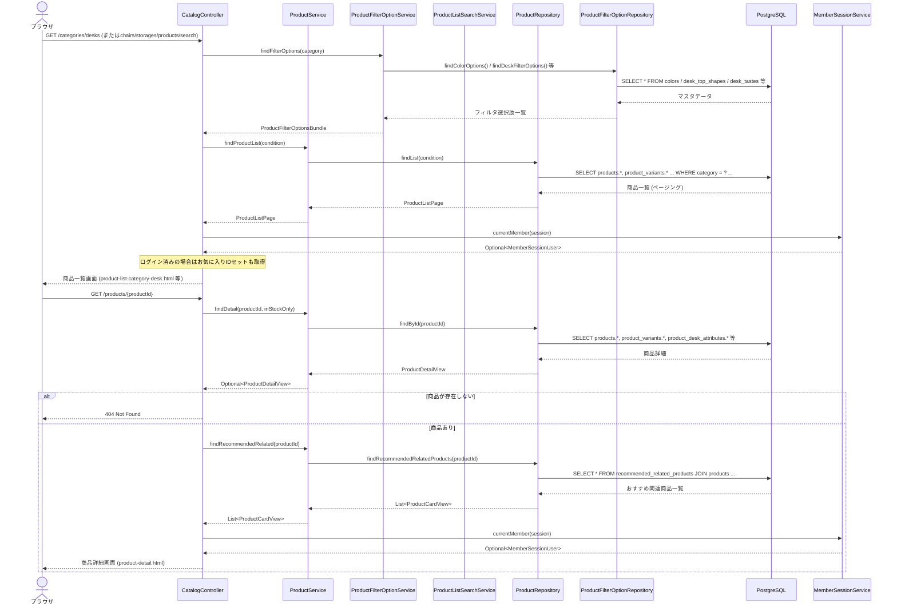

---

## 4. お気に入り登録・解除フロー

未ログイン時はログイン画面へリダイレクトする。登録上限超過時はエラーをフラッシュメッセージで表示する。

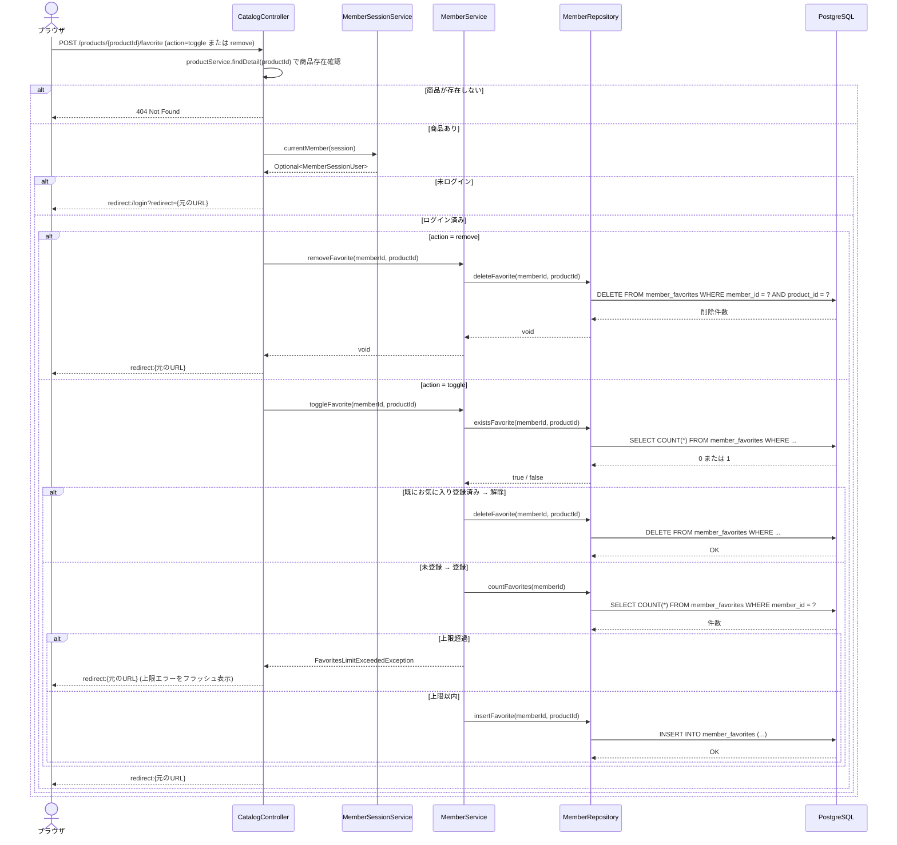

---

## 5. カート操作フロー

カートデータは Cookie で管理される。DB アクセスは商品バリアント情報・税率の参照のみ。

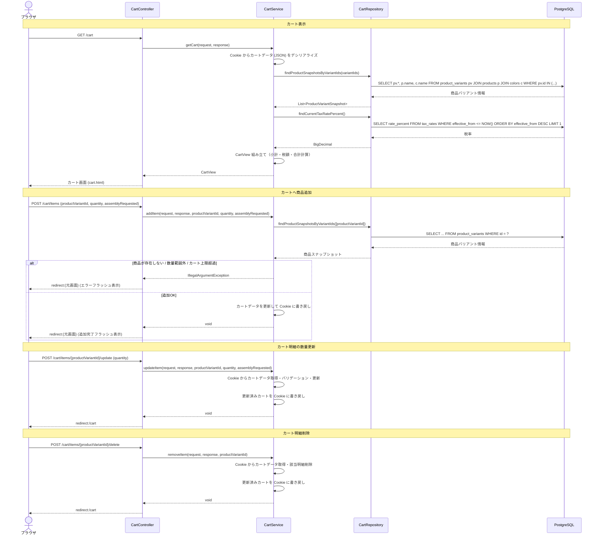

---

## 6. チェックアウト（注文確定）フロー

PRG パターン + ワンタイムトークンで二重送信を防止する。確定成功後にカートをクリアしてメール送信する。

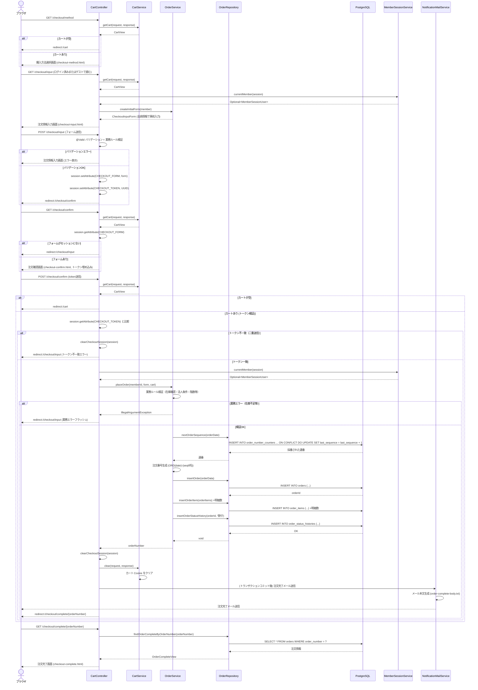

---

## 7. 購入履歴・再購入フロー

購入履歴は `order_items` のスナップショットデータを表示する。再購入は現在有効な商品バリアントを検索しカートへ追加する。

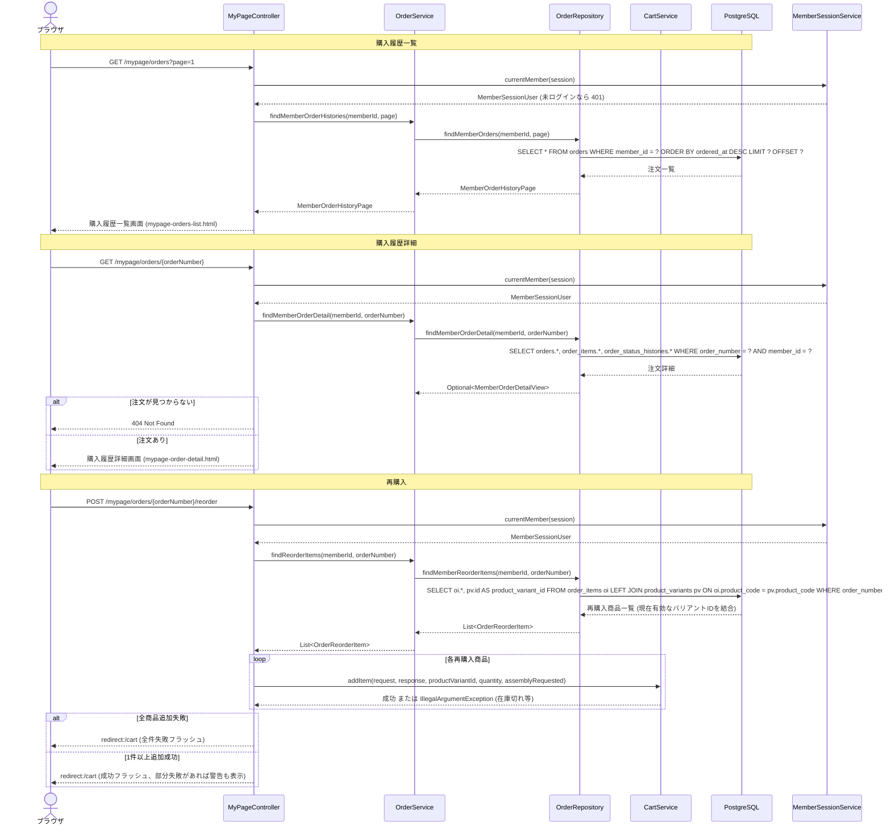

---

## 8. 会員情報変更フロー

変更成功後はセッションの会員情報を最新化してからリダイレクトする。

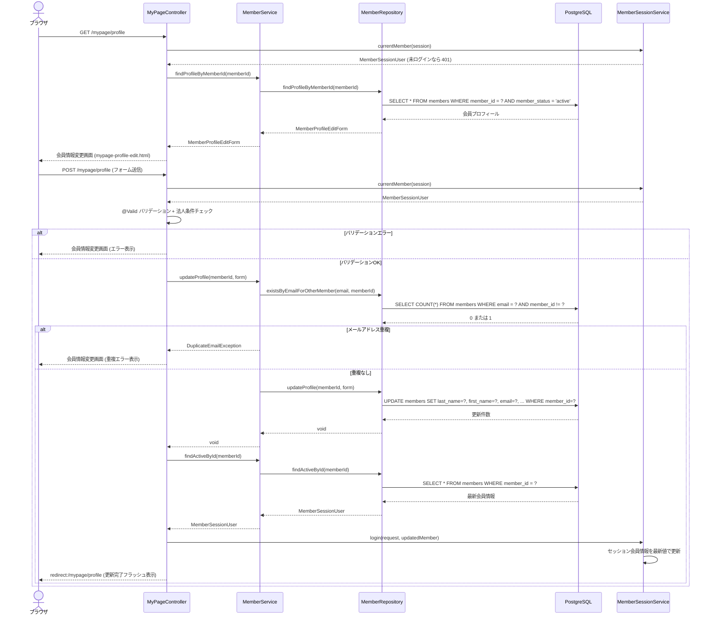

---

## 9. 追加お届け先管理フロー

新規登録・編集・削除の3操作を含む。登録上限（システム定義の上限件数）に達した場合は追加不可。

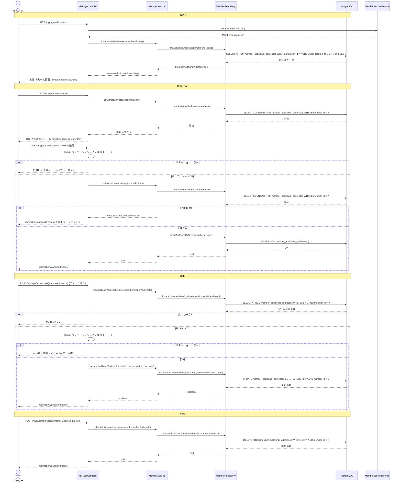

---

## 10. 退会フロー

物理削除ではなく `member_status='withdrawn'` への論理削除を行い、セッションを破棄してログアウトする。

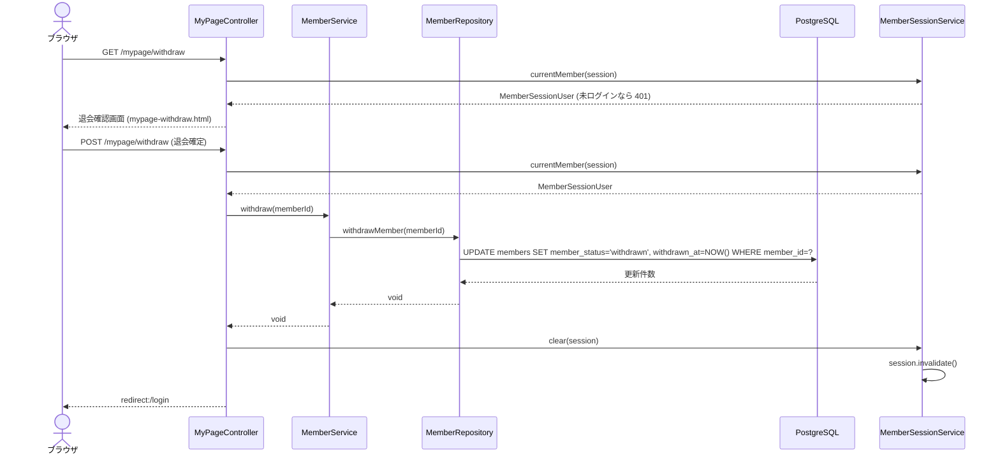

---

## 11. お問い合わせ送信フロー

ログイン済み会員の場合は氏名・メールアドレスをフォームに事前入力する。送信成功後は PRG でリダイレクトし、フラッシュメッセージを表示する。

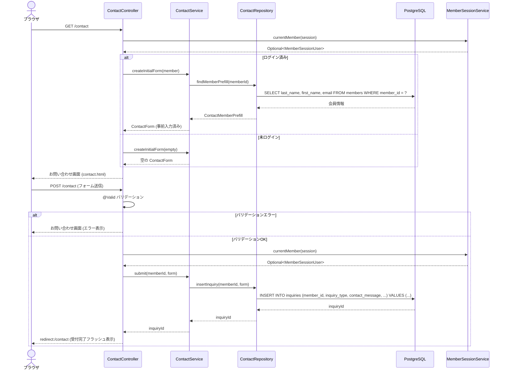

---

## 12. バッチ実行フロー

`InternalBatchController` の REST API 経由で Spring Batch ジョブを起動・停止する。バッチは `order_items` を集計して `popular_product_rankings` や `recommended_related_products` を洗い替え更新する。

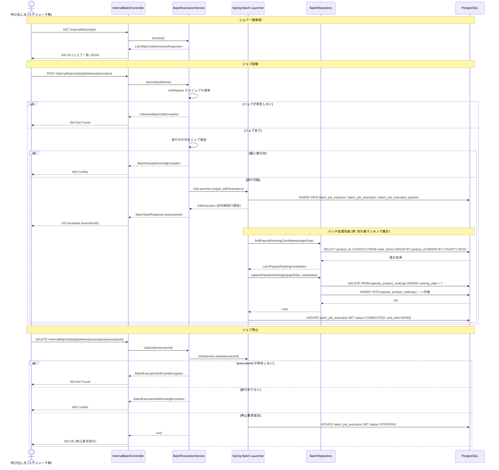
