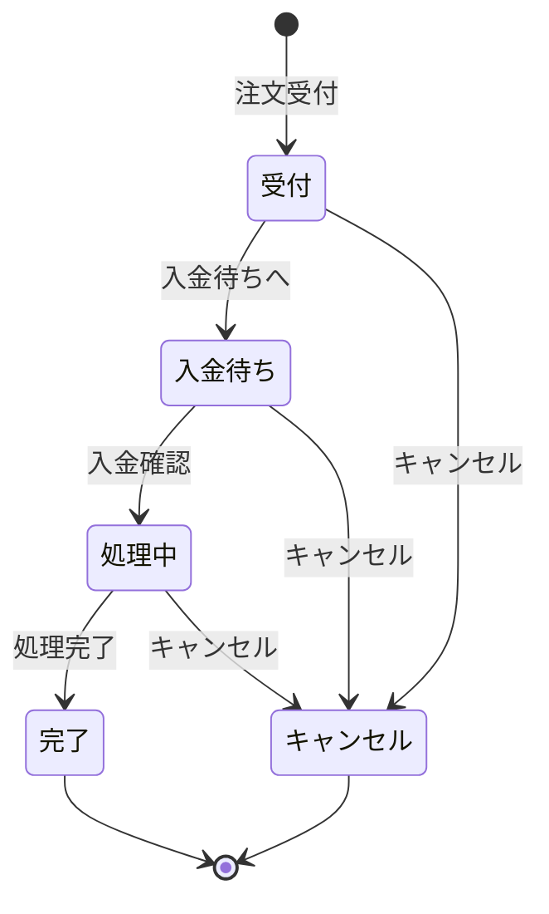

# テーブル定義書

| 項目 | 内容 |
|------|------|
| ドキュメント種別 | 詳細設計書 |
| 対象システム | office-order （オフィス家具ECサイト） |
| 対象DB | PostgreSQL 15 |
| 作成日 | 2026-03-16 |
| バージョン | 1.0 |

---

## テーブル一覧

| # | テーブル名 | 論理名 | 区分 |
|---|-----------|--------|------|
| 1 | `members` | 会員 | トランザクション |
| 2 | `member_additional_addresses` | 会員追加お届け先 | トランザクション |
| 3 | `member_favorites` | 会員お気に入り | トランザクション |
| 4 | `products` | 商品 | マスタ |
| 5 | `product_variants` | 商品バリアント | マスタ |
| 6 | `product_desk_attributes` | 商品デスク属性 | マスタ |
| 7 | `product_chair_attributes` | 商品チェア属性 | マスタ |
| 8 | `product_storage_attributes` | 商品収納家具属性 | マスタ |
| 9 | `colors` | カラーマスタ | マスタ |
| 10 | `desk_top_shapes` | デスク天板形状マスタ | マスタ |
| 11 | `desk_tastes` | デスクテイストマスタ | マスタ |
| 12 | `chair_functions` | チェア機能マスタ | マスタ |
| 13 | `chair_materials` | チェア素材マスタ | マスタ |
| 14 | `chair_tastes` | チェアテイストマスタ | マスタ |
| 15 | `storage_usages` | 収納家具用途マスタ | マスタ |
| 16 | `storage_tastes` | 収納家具テイストマスタ | マスタ |
| 17 | `orders` | 注文 | トランザクション |
| 18 | `order_items` | 注文明細 | トランザクション |
| 19 | `order_status_histories` | 注文ステータス変更履歴 | トランザクション |
| 20 | `order_number_counters` | 注文番号採番カウンタ | トランザクション |
| 21 | `tax_rates` | 消費税率 | マスタ |
| 22 | `popular_product_rankings` | 売れ筋ランキング | バッチ集計 |
| 23 | `recommended_related_products` | おすすめ関連商品 | バッチ集計 |
| 24 | `announcements` | お知らせ | コンテンツ |
| 25 | `inquiries` | お問い合わせ | トランザクション |

---

## 1. `members` （会員）

| カラム名 | 論理名 | 型 | NOT NULL | PK | FK | デフォルト | 備考 |
|---------|--------|------|----------|----|----|----------|------|
| `member_id` | 会員ID | `BIGINT` | ○ | ○ | | GENERATED ALWAYS AS IDENTITY | |
| `personal_or_corporate` | 個人/法人区分 | `VARCHAR(10)` | ○ | | | | `personal` / `corporate` |
| `last_name` | 姓 | `VARCHAR(50)` | ○ | | | | |
| `first_name` | 名 | `VARCHAR(50)` | ○ | | | | |
| `last_name_kana` | 姓カナ | `VARCHAR(50)` | ○ | | | | |
| `first_name_kana` | 名カナ | `VARCHAR(50)` | ○ | | | | |
| `company_name` | 会社名 | `VARCHAR(120)` | | | | NULL | 法人区分時は必須 |
| `department_name` | 部署名 | `VARCHAR(120)` | | | | NULL | |
| `email` | メールアドレス | `VARCHAR(254)` | ○ | | | | UNIQUE（小文字で一意） |
| `gender` | 性別 | `VARCHAR(10)` | ○ | | | | `male` / `female` / `no_answer` |
| `anniversary_date` | 生年月日/記念日 | `DATE` | ○ | | | | |
| `password_hash` | パスワードハッシュ | `VARCHAR(255)` | ○ | | | | BCrypt形式 |
| `newsletter_opt_in` | メールマガジン希望 | `BOOLEAN` | ○ | | | `FALSE` | |
| `postal_code` | 郵便番号 | `CHAR(7)` | ○ | | | | 数字7桁 |
| `prefecture` | 都道府県 | `VARCHAR(20)` | ○ | | | | |
| `city` | 市区町村 | `VARCHAR(120)` | ○ | | | | |
| `address_line` | 番地・ビル名 | `VARCHAR(255)` | ○ | | | | |
| `delivery_floor` | お届け先階数 | `INTEGER` | ○ | | | | 0以上 |
| `has_elevator` | エレベーター有無 | `BOOLEAN` | ○ | | | | |
| `daytime_phone` | 日中連絡可能電話番号 | `VARCHAR(12)` | ○ | | | | 10〜12桁数字 |
| `fax` | FAX | `VARCHAR(12)` | | | | NULL | 10〜12桁数字 |
| `member_status` | 会員状態 | `VARCHAR(10)` | ○ | | | `active` | `active` / `withdrawn` |
| `withdrawn_at` | 退会日時 | `TIMESTAMPTZ` | | | | NULL | 退会時に設定 |
| `created_at` | 作成日時 | `TIMESTAMPTZ` | ○ | | | `CURRENT_TIMESTAMP` | |
| `updated_at` | 更新日時 | `TIMESTAMPTZ` | ○ | | | `CURRENT_TIMESTAMP` | |

**インデックス:**
| インデックス名 | カラム | 備考 |
|--------------|--------|------|
| `uq_members_email_lower` | `LOWER(email)` | UNIQUE |
| `idx_members_status` | `member_status` | |
| `idx_members_created_at` | `created_at DESC` | |

---

## 2. `member_additional_addresses` （会員追加お届け先）

| カラム名 | 論理名 | 型 | NOT NULL | PK | FK | デフォルト | 備考 |
|---------|--------|------|----------|----|----|----------|------|
| `member_address_id` | 会員追加お届け先ID | `BIGINT` | ○ | ○ | | GENERATED ALWAYS AS IDENTITY | |
| `member_id` | 会員ID | `BIGINT` | ○ | | `members.member_id` | | ON DELETE CASCADE |
| `last_name` 〜 `fax` | （会員テーブルと同構成） | — | 各同上 | | | | |
| `created_at` | 作成日時 | `TIMESTAMPTZ` | ○ | | | `CURRENT_TIMESTAMP` | |
| `updated_at` | 更新日時 | `TIMESTAMPTZ` | ○ | | | `CURRENT_TIMESTAMP` | |

**インデックス:**
| インデックス名 | カラム |
|--------------|--------|
| `idx_member_additional_addresses_member_created` | `(member_id, created_at ASC)` |

---

## 3. `member_favorites` （会員お気に入り）

| カラム名 | 論理名 | 型 | NOT NULL | PK | FK | デフォルト | 備考 |
|---------|--------|------|----------|----|----|----------|------|
| `member_id` | 会員ID | `BIGINT` | ○ | ○ | `members.member_id` | | ON DELETE CASCADE |
| `product_id` | 商品ID | `BIGINT` | ○ | ○ | `products.product_id` | | ON DELETE CASCADE |
| `created_at` | 作成日時 | `TIMESTAMPTZ` | ○ | | | `CURRENT_TIMESTAMP` | |
| `updated_at` | 更新日時 | `TIMESTAMPTZ` | ○ | | | `CURRENT_TIMESTAMP` | |

**制約:** PK = `(member_id, product_id)` の複合主キー。1会員につき最大20件（アプリ層でチェック）。

---

## 4. `products` （商品）

| カラム名 | 論理名 | 型 | NOT NULL | PK | FK | デフォルト | 備考 |
|---------|--------|------|----------|----|----|----------|------|
| `product_id` | 商品ID | `BIGINT` | ○ | ○ | | GENERATED ALWAYS AS IDENTITY | |
| `product_name` | 商品名 | `VARCHAR(255)` | ○ | | | | |
| `category_id` | 商品カテゴリID | `VARCHAR(20)` | ○ | | | | `desk` / `chair` / `storage` |
| `description` | 商品紹介文 | `TEXT` | | | | NULL | |
| `assembly_available` | 組立・設置可否 | `BOOLEAN` | ○ | | | `FALSE` | |
| `assembly_fee` | 組立・設置費 | `NUMERIC(12,0)` | ○ | | | `0` | 0以上。組立不可の場合は0 |
| `has_variation` | シリーズバリエーション有無 | `BOOLEAN` | ○ | | | `FALSE` | |
| `variation_group_id` | バリエーショングループID | `BIGINT` | | | | NULL | `has_variation=true` 時に設定 |
| `variation_name` | バリエーション名 | `VARCHAR(120)` | | | | NULL | `has_variation=true` 時に設定 |
| `sale_start_at` | 販売開始日時 | `TIMESTAMPTZ` | ○ | | | | |
| `sale_end_at` | 販売終了日時 | `TIMESTAMPTZ` | | | | NULL | NULL は無期限販売 |
| `created_at` | 作成日時 | `TIMESTAMPTZ` | ○ | | | `CURRENT_TIMESTAMP` | |
| `updated_at` | 更新日時 | `TIMESTAMPTZ` | ○ | | | `CURRENT_TIMESTAMP` | |

---

## 5. `product_variants` （商品バリアント）

| カラム名 | 論理名 | 型 | NOT NULL | PK | FK | デフォルト | 備考 |
|---------|--------|------|----------|----|----|----------|------|
| `product_variant_id` | 商品バリアントID | `BIGINT` | ○ | ○ | | GENERATED ALWAYS AS IDENTITY | |
| `product_id` | 商品ID | `BIGINT` | ○ | | `products.product_id` | | ON DELETE CASCADE |
| `product_code` | 商品コード | `VARCHAR(32)` | ○ | | | | UNIQUE |
| `color_id` | カラーID | `BIGINT` | ○ | | `colors.color_id` | | ON DELETE RESTRICT |
| `unit_price` | 販売価格（税抜） | `NUMERIC(12,0)` | ○ | | | `0` | 0以上 |
| `stock_quantity` | 在庫数 | `INTEGER` | ○ | | | `0` | 0以上 |
| `created_at` | 作成日時 | `TIMESTAMPTZ` | ○ | | | `CURRENT_TIMESTAMP` | |
| `updated_at` | 更新日時 | `TIMESTAMPTZ` | ○ | | | `CURRENT_TIMESTAMP` | |

**制約:** `UNIQUE(product_id, color_id)` — 1商品につき同一カラーは1バリアントのみ。

---

## 6. `product_desk_attributes` （商品デスク属性）

| カラム名 | 論理名 | 型 | NOT NULL | PK/FK | 備考 |
|---------|--------|------|----------|-------|------|
| `product_id` | 商品ID | `BIGINT` | ○ | PK / `products.product_id` | ON DELETE CASCADE |
| `top_shape_id` | 天板形状ID | `BIGINT` | ○ | `desk_top_shapes.top_shape_id` | |
| `width_mm` | 幅(mm) | `INTEGER` | ○ | | 0超 |
| `depth_mm` | 奥行(mm) | `INTEGER` | ○ | | 0超 |
| `height_mm` | 高さ(mm) | `INTEGER` | ○ | | 0超 |
| `taste_id` | テイストID | `BIGINT` | ○ | `desk_tastes.taste_id` | |
| `created_at` | 作成日時 | `TIMESTAMPTZ` | ○ | | |
| `updated_at` | 更新日時 | `TIMESTAMPTZ` | ○ | | |

---

## 7. `product_chair_attributes` （商品チェア属性）

| カラム名 | 論理名 | 型 | NOT NULL | PK/FK | 備考 |
|---------|--------|------|----------|-------|------|
| `product_id` | 商品ID | `BIGINT` | ○ | PK / `products.product_id` | ON DELETE CASCADE |
| `function_id` | 機能ID | `BIGINT` | ○ | `chair_functions.function_id` | |
| `material_id` | 素材ID | `BIGINT` | ○ | `chair_materials.material_id` | |
| `taste_id` | テイストID | `BIGINT` | ○ | `chair_tastes.taste_id` | |
| `created_at` | 作成日時 | `TIMESTAMPTZ` | ○ | | |
| `updated_at` | 更新日時 | `TIMESTAMPTZ` | ○ | | |

---

## 8. `product_storage_attributes` （商品収納家具属性）

| カラム名 | 論理名 | 型 | NOT NULL | PK/FK | 備考 |
|---------|--------|------|----------|-------|------|
| `product_id` | 商品ID | `BIGINT` | ○ | PK / `products.product_id` | ON DELETE CASCADE |
| `usage_id` | 用途ID | `BIGINT` | ○ | `storage_usages.usage_id` | |
| `taste_id` | テイストID | `BIGINT` | ○ | `storage_tastes.taste_id` | |
| `created_at` | 作成日時 | `TIMESTAMPTZ` | ○ | | |
| `updated_at` | 更新日時 | `TIMESTAMPTZ` | ○ | | |

---

## 9. `colors` （カラーマスタ）

| カラム名 | 論理名 | 型 | NOT NULL | PK | デフォルト | 備考 |
|---------|--------|------|----------|----|----|------|
| `color_id` | カラーID | `BIGINT` | ○ | ○ | GENERATED ALWAYS AS IDENTITY | |
| `color_name` | カラー名 | `VARCHAR(40)` | ○ | | | UNIQUE |
| `color_code` | カラーコード | `CHAR(7)` | ○ | | | UNIQUE / `#RRGGBB` 形式 |
| `swatch_type` | 色見本表示種別 | `VARCHAR(32)` | ○ | | `solid` | `solid` / `transparent_pattern` |
| `sort_order` | 表示順 | `INTEGER` | ○ | | `0` | 0以上 |
| `is_active` | 有効フラグ | `BOOLEAN` | ○ | | `TRUE` | |
| `created_at` / `updated_at` | 作成・更新日時 | `TIMESTAMPTZ` | ○ | | `CURRENT_TIMESTAMP` | |

---

## 10〜16. マスタテーブル（共通構成）

`desk_top_shapes` / `desk_tastes` / `chair_functions` / `chair_materials` / `chair_tastes` / `storage_usages` / `storage_tastes` は同一カラム構成。

| カラム名 | 論理名 | 型 | NOT NULL | PK | デフォルト |
|---------|--------|------|----------|----|----|
| `{entity}_id` | エンティティID | `BIGINT` | ○ | ○ | GENERATED ALWAYS AS IDENTITY |
| `display_name` | 表示名 | `VARCHAR(100)` | ○ | | UNIQUE |
| `sort_order` | 表示順 | `INTEGER` | ○ | | `0` |
| `is_active` | 有効フラグ | `BOOLEAN` | ○ | | `TRUE` |
| `created_at` | 作成日時 | `TIMESTAMPTZ` | ○ | | `CURRENT_TIMESTAMP` |
| `updated_at` | 更新日時 | `TIMESTAMPTZ` | ○ | | `CURRENT_TIMESTAMP` |

---

## 17. `orders` （注文）

| カラム名 | 論理名 | 型 | NOT NULL | PK | FK | デフォルト | 備考 |
|---------|--------|------|----------|----|----|----------|------|
| `order_id` | 注文ID | `BIGINT` | ○ | ○ | | GENERATED ALWAYS AS IDENTITY | |
| `order_number` | 注文番号 | `VARCHAR(20)` | ○ | | | | UNIQUE / `{YYYYMMDD}-{NNNNNN}` |
| `order_datetime` | 注文日時 | `TIMESTAMPTZ` | ○ | | | `CURRENT_TIMESTAMP` | |
| `order_status` | 注文ステータス | `VARCHAR(20)` | ○ | | | `received` | 後述ステータス値参照 |
| `customer_type` | 顧客種別 | `VARCHAR(10)` | ○ | | | | `guest` / `member` |
| `personal_or_corporate` | 個人/法人区分 | `VARCHAR(10)` | ○ | | | | `personal` / `corporate` |
| `member_id` | 会員ID | `BIGINT` | | | `members.member_id` | NULL | ON DELETE SET NULL |
| `customer_last_name` | 注文者姓 | `VARCHAR(50)` | ○ | | | | |
| `customer_first_name` | 注文者名 | `VARCHAR(50)` | ○ | | | | |
| `customer_last_name_kana` | 注文者姓カナ | `VARCHAR(50)` | ○ | | | | |
| `customer_first_name_kana` | 注文者名カナ | `VARCHAR(50)` | ○ | | | | |
| `company_name` | 会社名 | `VARCHAR(120)` | | | | NULL | 法人区分時は必須 |
| `department_name` | 部署名 | `VARCHAR(120)` | | | | NULL | |
| `customer_email` | 注文者メールアドレス | `VARCHAR(254)` | ○ | | | | |
| `daytime_phone` | 日中連絡可能電話番号 | `VARCHAR(12)` | ○ | | | | 10〜12桁数字 |
| `shipping_fax` | 配送先FAX | `VARCHAR(12)` | | | | NULL | |
| `shipping_postal_code` | 配送先郵便番号 | `CHAR(7)` | ○ | | | | 数字7桁 |
| `shipping_prefecture` | 配送先都道府県 | `VARCHAR(20)` | ○ | | | | |
| `shipping_city` | 配送先市区町村 | `VARCHAR(120)` | ○ | | | | |
| `shipping_address_line` | 配送先番地・ビル名 | `VARCHAR(255)` | ○ | | | | |
| `shipping_floor` | 配送先階数 | `INTEGER` | ○ | | | | 0以上 |
| `shipping_has_elevator` | 配送先エレベーター有無 | `BOOLEAN` | ○ | | | | |
| `payment_method` | 決済手段 | `VARCHAR(20)` | ○ | | | | `bank_transfer` / `cash_on_delivery` / `convenience_store` |
| `payment_instruction` | 決済案内情報 | `JSONB` | | | | NULL | コンビニ決済時のみ設定 |
| `shipping_method` | 配送方法区分 | `VARCHAR(20)` | ○ | | | | `normal` / `assembly` |
| `shipping_fee` | 送料 | `NUMERIC(12,0)` | ○ | | | `0` | |
| `assembly_fee_total` | 組立・設置費合計 | `NUMERIC(12,0)` | ○ | | | `0` | |
| `subtotal_amount` | 商品小計 | `NUMERIC(12,0)` | ○ | | | `0` | 税抜 |
| `tax_amount` | 消費税額 | `NUMERIC(12,0)` | ○ | | | `0` | |
| `total_amount` | 合計金額 | `NUMERIC(12,0)` | ○ | | | `0` | 税込 |
| `receipt_issued` | 領収書発行フラグ | `BOOLEAN` | ○ | | | `FALSE` | |
| `note` | 備考 | `VARCHAR(500)` | | | | NULL | |
| `created_at` | 作成日時 | `TIMESTAMPTZ` | ○ | | | `CURRENT_TIMESTAMP` | |
| `updated_at` | 更新日時 | `TIMESTAMPTZ` | ○ | | | `CURRENT_TIMESTAMP` | |

**注文ステータス遷移:**

---

## 18. `order_items` （注文明細）

| カラム名 | 論理名 | 型 | NOT NULL | PK | FK | デフォルト | 備考 |
|---------|--------|------|----------|----|----|----------|------|
| `order_item_id` | 注文明細ID | `BIGINT` | ○ | ○ | | GENERATED ALWAYS AS IDENTITY | |
| `order_id` | 注文ID | `BIGINT` | ○ | | `orders.order_id` | | ON DELETE CASCADE |
| `product_code` | 商品コード | `VARCHAR(32)` | ○ | | | | 受注時点のスナップショット |
| `product_name` | 商品名 | `VARCHAR(255)` | ○ | | | | 〃 |
| `color_name` | カラー名 | `VARCHAR(40)` | ○ | | | | 〃 |
| `unit_price` | 単価（税抜） | `NUMERIC(12,0)` | ○ | | | `0` | 〃 |
| `quantity` | 数量 | `INTEGER` | ○ | | | `1` | 1〜99 |
| `line_subtotal` | 明細小計（税抜） | `NUMERIC(12,0)` | ○ | | | `0` | |
| `line_tax_amount` | 明細消費税額 | `NUMERIC(12,0)` | ○ | | | `0` | |
| `line_total_amount` | 明細合計（税込） | `NUMERIC(12,0)` | ○ | | | `0` | |
| `assembly_available` | 組立・設置可否 | `BOOLEAN` | ○ | | | `FALSE` | 受注時スナップショット |
| `assembly_fee` | 組立・設置費 | `NUMERIC(12,0)` | ○ | | | `0` | 〃 |
| `created_at` | 作成日時 | `TIMESTAMPTZ` | ○ | | | `CURRENT_TIMESTAMP` | |
| `updated_at` | 更新日時 | `TIMESTAMPTZ` | ○ | | | `CURRENT_TIMESTAMP` | |

---

## 19. `order_status_histories` （注文ステータス変更履歴）

| カラム名 | 論理名 | 型 | NOT NULL | PK | FK | デフォルト | 備考 |
|---------|--------|------|----------|----|----|----------|------|
| `order_status_history_id` | 注文ステータス変更履歴ID | `BIGINT` | ○ | ○ | | GENERATED ALWAYS AS IDENTITY | |
| `order_id` | 注文ID | `BIGINT` | ○ | | `orders.order_id` | | ON DELETE CASCADE |
| `status` | ステータス | `VARCHAR(20)` | ○ | | | | `orders.order_status` と同値域 |
| `changed_by_system` | 変更システム区分 | `VARCHAR(40)` | ○ | | | | 変更したシステム/処理の識別子 |
| `changed_at` | 変更日時 | `TIMESTAMPTZ` | ○ | | | `CURRENT_TIMESTAMP` | |

---

## 20. `order_number_counters` （注文番号採番カウンタ）

| カラム名 | 論理名 | 型 | NOT NULL | PK | デフォルト | 備考 |
|---------|--------|------|----------|----|----|------|
| `order_date` | 注文日 | `DATE` | ○ | ○ | | 日付をPKとして採番管理 |
| `last_sequence` | 最終連番 | `INTEGER` | ○ | | | 0以上 / SELECT FOR UPDATE で排他取得 |
| `created_at` | 作成日時 | `TIMESTAMPTZ` | ○ | | `CURRENT_TIMESTAMP` | |
| `updated_at` | 更新日時 | `TIMESTAMPTZ` | ○ | | `CURRENT_TIMESTAMP` | |

---

## 21. `tax_rates` （消費税率）

| カラム名 | 論理名 | 型 | NOT NULL | PK | デフォルト | 備考 |
|---------|--------|------|----------|----|----|------|
| `tax_rate_id` | 消費税率ID | `BIGINT` | ○ | ○ | GENERATED ALWAYS AS IDENTITY | |
| `tax_rate_percent` | 消費税率 | `NUMERIC(5,2)` | ○ | | | 0超〜100以下 |
| `effective_start_at` | 適用開始日時 | `TIMESTAMPTZ` | ○ | | | |
| `effective_end_at` | 適用終了日時 | `TIMESTAMPTZ` | | | NULL | NULL は無期限 |
| `is_active` | 有効フラグ | `BOOLEAN` | ○ | | `TRUE` | |
| `created_at` / `updated_at` | 作成・更新日時 | `TIMESTAMPTZ` | ○ | | `CURRENT_TIMESTAMP` | |

---

## 22. `popular_product_rankings` （売れ筋ランキング）

| カラム名 | 論理名 | 型 | NOT NULL | PK | FK | デフォルト | 備考 |
|---------|--------|------|----------|----|----|----------|------|
| `ranking_date` | 集計日 | `DATE` | ○ | ○ | | | |
| `rank` | 順位 | `SMALLINT` | ○ | ○ | | | 1〜10 |
| `product_id` | 商品ID | `BIGINT` | ○ | | `products.product_id` | | ON DELETE CASCADE |
| `sold_quantity_1m` | 直近1か月販売数量 | `INTEGER` | ○ | | | `0` | 0以上 |
| `created_at` / `updated_at` | 作成・更新日時 | `TIMESTAMPTZ` | ○ | | `CURRENT_TIMESTAMP` | |

---

## 23. `recommended_related_products` （おすすめ関連商品）

| カラム名 | 論理名 | 型 | NOT NULL | PK | FK | デフォルト | 備考 |
|---------|--------|------|----------|----|----|----------|------|
| `recommendation_date` | 推薦日 | `DATE` | ○ | ○ | | | |
| `source_product_id` | 基準商品ID | `BIGINT` | ○ | ○ | `products.product_id` | | ON DELETE CASCADE |
| `rank` | 順位 | `SMALLINT` | ○ | ○ | | | 1〜4 |
| `recommended_product_id` | 推薦商品ID | `BIGINT` | ○ | | `products.product_id` | | 基準商品IDと異なる |
| `score` | 類似度スコア | `NUMERIC(10,6)` | | | | NULL | |
| `created_at` / `updated_at` | 作成・更新日時 | `TIMESTAMPTZ` | ○ | | `CURRENT_TIMESTAMP` | |

---

## 24. `announcements` （お知らせ）

| カラム名 | 論理名 | 型 | NOT NULL | PK | デフォルト | 備考 |
|---------|--------|------|----------|----|----|------|
| `announcement_id` | お知らせID | `BIGINT` | ○ | ○ | GENERATED ALWAYS AS IDENTITY | |
| `title` | タイトル | `VARCHAR(200)` | ○ | | | |
| `summary` | 要約 | `VARCHAR(255)` | ○ | | | |
| `body` | 本文 | `TEXT` | | | NULL | |
| `published_start_at` | 掲載開始日時 | `TIMESTAMPTZ` | ○ | | | |
| `published_end_at` | 掲載終了日時 | `TIMESTAMPTZ` | | | NULL | NULL は無期限 |
| `is_active` | 有効フラグ | `BOOLEAN` | ○ | | `TRUE` | |
| `created_at` / `updated_at` | 作成・更新日時 | `TIMESTAMPTZ` | ○ | | `CURRENT_TIMESTAMP` | |

---

## 25. `inquiries` （お問い合わせ）

| カラム名 | 論理名 | 型 | NOT NULL | PK | FK | デフォルト | 備考 |
|---------|--------|------|----------|----|----|----------|------|
| `inquiry_id` | お問い合わせID | `BIGINT` | ○ | ○ | | GENERATED ALWAYS AS IDENTITY | |
| `member_id` | 会員ID | `BIGINT` | | | `members.member_id` | NULL | ON DELETE SET NULL |
| `company_name` | 会社名 | `VARCHAR(120)` | | | | NULL | |
| `department_name` | 部署名 | `VARCHAR(120)` | | | | NULL | |
| `last_name` | 姓 | `VARCHAR(50)` | ○ | | | | |
| `first_name` | 名 | `VARCHAR(50)` | ○ | | | | |
| `email` | メールアドレス | `VARCHAR(254)` | ○ | | | | |
| `phone` | 電話番号 | `VARCHAR(12)` | | | | NULL | 10〜12桁数字 |
| `inquiry_type` | お問い合わせ種別 | `VARCHAR(20)` | ○ | | | | `product` / `delivery_date` / `order` / `shipping` / `return_cancel` / `other` |
| `order_phase` | 注文状況 | `VARCHAR(20)` | ○ | | | | `before_order` / `after_order` |
| `product_name` | お問い合わせ商品名 | `VARCHAR(255)` | | | | NULL | |
| `product_code` | 商品コード | `VARCHAR(32)` | | | | NULL | |
| `message` | お問い合わせ内容 | `VARCHAR(1000)` | ○ | | | | |
| `created_at` / `updated_at` | 作成・更新日時 | `TIMESTAMPTZ` | ○ | | `CURRENT_TIMESTAMP` | |

---

## ER図（概念）

```mermaid
erDiagram
    members ||--o{ member_additional_addresses : "holds"
    members ||--o{ member_favorites : "registers"
    members ||--o{ orders : "places"
    members ||--o{ inquiries : "sends"

    products ||--o{ product_variants : "has"
    products ||--o| product_desk_attributes : "has"
    products ||--o| product_chair_attributes : "has"
    products ||--o| product_storage_attributes : "has"
    products ||--o{ member_favorites : "favorited_in"
    products ||--o{ popular_product_rankings : "ranked_in"
    products ||--o{ recommended_related_products : "is_source_of"
    products ||--o{ recommended_related_products : "is_recommended_by"

    product_variants }o--|| colors : "has_color"

    product_desk_attributes }o--|| desk_top_shapes : "has_shape"
    product_desk_attributes }o--|| desk_tastes : "has_taste"

    product_chair_attributes }o--|| chair_functions : "has_function"
    product_chair_attributes }o--|| chair_materials : "has_material"
    product_chair_attributes }o--|| chair_tastes : "has_taste"

    product_storage_attributes }o--|| storage_usages : "has_usage"
    product_storage_attributes }o--|| storage_tastes : "has_taste"

    orders ||--o{ order_items : "contains"
    orders ||--o{ order_status_histories : "tracks"

    inquiries }o--o| members : "sent_by"
```

